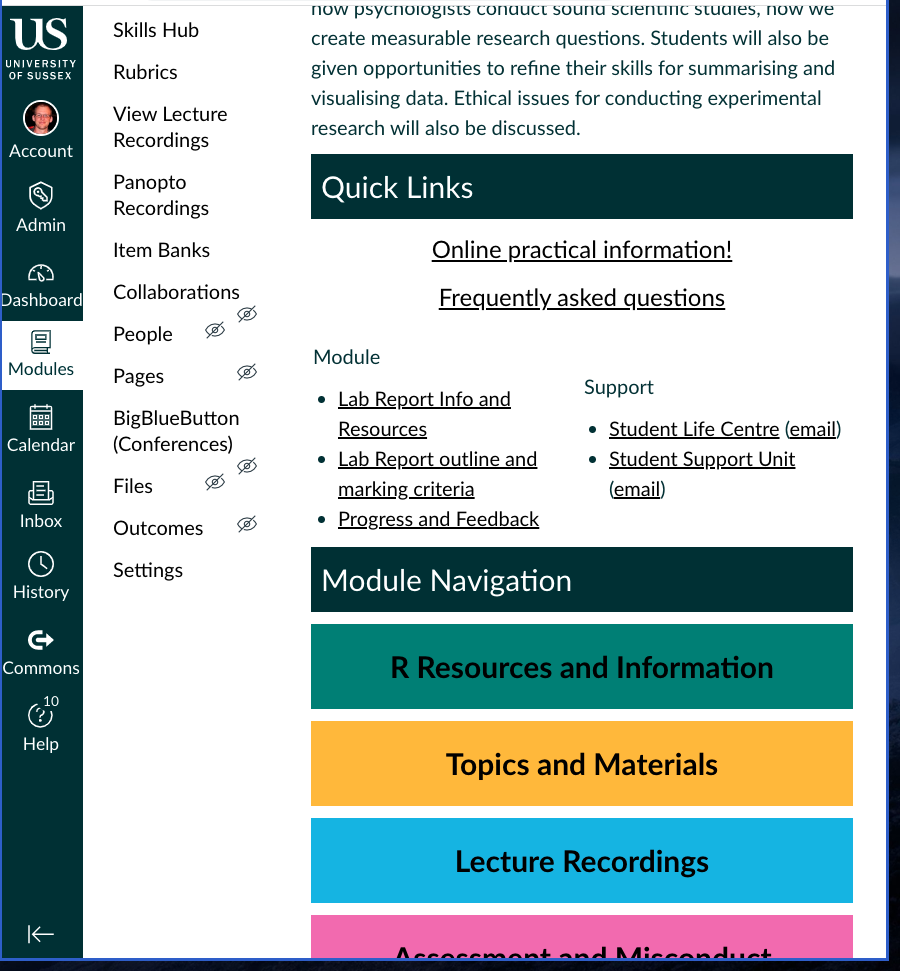
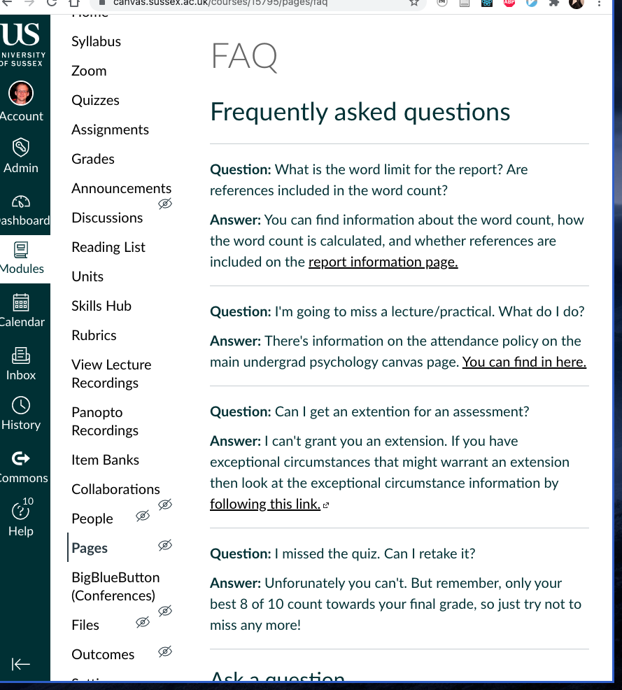

```{r xaringan-themer, include=FALSE, warning=FALSE}
library(xaringanthemer)

style_duo_accent(
  primary_color = "#003b49",
  secondary_color = "#1d4289",
  header_font_google = google_font("Cabin"),
  text_font_google = google_font("Noto Sans", "300", "300i"),
  code_font_google = google_font("Fira Mono"),
  colors = c(
    red = "#d3003f",
    blue = "#1d4289",
    purple = "#3e2f5b",
    orange = "#ff8811",
    green = "#136f63",
    white = "#FFFFFF"
  )
)

xaringanthemer::style_extra_css(
  list(
    ".title-slide" = list(
      "background-image" =
        paste0(
          "url(https://upload.wikimedia.org/wikipedia/commons/thumb/3/34/",
          "University_of_Sussex_Logo.svg/480px-University_of_Sussex_Logo.svg.png)"
        ),
      "background-position" = "95% 95%",
      "background-size" = "180px",
      "border" = "10px solid #013035",
      "background-color" = "#FFFFFF"
    ),
    ".title-slide h1" = list(
      "padding-top" = "0px",
      "font-size" = "60px",
      "text-align" = "left",
      "padding-bottom" = "18px",
      "margin-bottom" = "18px",
      "margin-top" = "0px",
      "color" = "#003b49"
    ),
    ".title-slide h2" = list(
      "font-size" = "40px",
      "text-align" = "left",
      "padding-top" = "10px",
      "margin-top" = "0px",
      "color" = "#003b49"
    ),
    ".title-slide h3" = list(
      "font-size" = "30px",
      "color" = "#26272A",
      "text-align" = "left",
      "text-shadow" = "none",
      "padding" = "0px",
      "margin" = "0px",
      "line-height" = "1"
    )
  )
)
```

```{r, echo=FALSE}
library(metathis)
meta() %>%
  meta_description("Introduction to \"Psychology as a Science\"") %>%
  meta_tag("week" = "01") %>%
  meta_tag("content_type" = "slides")
```

```{r broadcast, echo=FALSE}
xaringanExtra::use_broadcast()
```

## Welcome to Psychology as a Science!


**Plan for Today**

1. Some general housekeeping

2. The structure of research methods in your degree

3. Why do research methods in the first place?

4. The structure of this course

5. The assessments

6. The lecture/practical topics

7. Thinking ahead to the report

---

## General housekeeping

**CANVAS** in your one stop shop for all the information you need about the course

For example:

> I can't make a practical/lecture because X. What do I do?

  Click on "Timetabling and Absences" on CANVAS, and it will have all the information you need.

Make sure you familiarise yourself with CANVAS. Click through all the links on
the main home page for the module and try to read through it all! 

Also look through the main UGrad Psychology CANVAS page. It has stacks of good
information. 

And remember, there's 600 of you, so I won't be able to answer all your emails
as quickly as you might want. Before you email double the **Frequently Asked**
**Questions (FAQ)** on the PAAS Canvas page because the answer to your question
might be there, and you can get an instant answer!

---

.center[]

---

.center[]

---
## Research methods in Psychology

**Psychology as a Science** is the first of a series of research 
methods modules.

Following this, you'll take:

- Analysing Data (next term)

- Discovering Statistics (year 2)

- Quantitative and Qualitative Methods (year 2)

All of these build up to prepare you for the **research dissertation** in your 
final year. But they're also a great way to learn a lot of transferable skills 
that are useful outside of university, for example:

- How to analyse data

- How to make sense of statistics

- Basic computer programming/coding skills 

---

### Psychology as a Science (PAAS)

.blue[Introduction to the research process, including:]

- Introduction to Philosophy of Science

- Approaches to research (quantitative methods and qualitative methods)

- Basic statistical theory

.blue[Introducing to coding using `R`, including:]

- Basics of the `R` language

- Processing data in `R`

- Making plots with `R`

Along the way we'll work with some of the same data that you'll be using for your
.blue[*Cognition in Clinical Contexts*] lab report, and we'll also be drawing some of the
same kinds of plots

---

### Analysing Data (AD)

- Core statistical tests used in Psychology

- More advanced `R`, and using `R` to perform statistical tests

- Your first chance to independently analyse some data

### Discovering Statistics (DS)

- More advanced statistical tests

- Focus on more complex analyses

- More advanced `R` 

---

### Quantitative and Qualitative  Methods (QQM)

- Advanced multivariate statistical techniques 

- Non-statistical approaches such as interviews and discourse analysis

The work you do in these modules will also connect up with other modules:

1. **Analysing Data** with, for example, **Psychobiology**

2. **Discovering Statistics** with, for example, **Developmental Psychology**

3. And **Quantitative and Qualitative  Methods** with, for example, **Social
Psychology**

<br />

.blue[*Research methods doesn't happen in isolation, but it's connected with
everything else you do in your degree*]

---

# Why research methods?

The dominant approach to **training psychologists** is the **scientist practitioner model**

.center[.blue[*Doing research* is seen as integral to this approach!]]

Just like *medical doctors* not only deliver treatments but also *develop*
treatments, the same goes for *psychologists*

As a *psychologist* you want to do *what works* and being able to **read**,
**critique**, and **conduct** research will help you know *what  works* and
allow you to develop *evidence-based care*

Even for those that don't become psychologists research methods is still useful

**Other careers:**

.pull-left[
- Data scientists

- Analyst]
.pull-right[
- Consultant

- Civil service and government
  ]

---

# Parts of PAAS

The module is made up of **three** main activities

1. .blue[Weekly lectures (double lecture in Week 6)]

  - One hour each week.

  - Cover research methods, statistics, and theory

2. .purple[Tutorials/Practical preparation homework]

  - About an hour a week. 

  - Done online or in `R` as preparation for the practical class

3. .green[Practical classes]

  - Two hours a week

  - Hands on experience with `R`

---

## Assessment Structure

For the assessment there's a 50/50 split between .blue[coursework] and the
.green[exam]

Four parts to the course work:

1. **Computer Based Exam** worth 10% due in approximately Wk 8
   
   This will cover the material from the *ethics lecture* in Wk 6

2. **Computer Based Exam** worth 40% (listed on Sussex Direct as due in Wk 11)

  This refers to the 10 weekly quizes. Your top 8 of the 10 will make up your
  final grade. Note that it's just not a single due date, but in reality each
  quiz will need to be completed in a specific week, so make sure you don't
  miss the weekly due dates!

---

## Assessment Structure

3. **Report** worth 40% due in approximately Wk 9 (check *CANVAS* in case you
   have a different due date)

4. **Portfolio** with 10% (listed on Sussex Direct as due in Wk 11)

  This refers to the 20 credits worth of research participation that you're
  required to do as part of the course. To find out more about this follow the
  big yellow link labelled **Research Participation/Sona**.
  
  The due date is the *final day* you can complete research participation. **Don't
  wait until the last week** to do it, because there'll probably be no studies
  left to take part in. .blue[These are easy marks so don't miss out on getting them.]

---

## Why these assessments?

Each of the assessments has a **specific purpose**


**Weekly quizzes**

The **weekly quizzes** are there to make sure you do the **tutorials** and
their content is based on the content of the **tutorials and practicals**. 

Doing the **tutorials** will make you better prepared for the practical classes
that this means you'll get more out of them

I expect *many people* will get 100% for these. They're not there to trip you
up, but to motivate you to work consistently throughout the term.

They're also the only assessment that will cover `R`/**RStudio**

---

## Why these assessments?

**Ethics quiz**

Ethics is super important, and making a seperate assessment for it means that
ethiccs part of the course it given it's own prominent place instead of mixing
it with the rest of the course 

**Report**

In the first half of the course we focus a lot on **study design**. The
**report** give **us** a chance to see how **you think**. 

It's not about *right*/*wrong* answers but a way for you to **demonstrate**
that you've clearly **thought through** the relavent issues.

**Research participation**

We're going to learn about how to design good studies / do good science, but
actually **being a participant** will give you **insights** from **the other
side**

---

## Why these assessments?

**Final exam**

The final exam is the primary means that we'll use to assess your understanding of the **lecture content** 

The exam will only cover material from the **lectures**, because the
practical/tutorial content will be assessed through the weekly quizzes

---

# Lecture topics


| Week | Topic                                                       
|------|------- 
| 1    | Introduction to PAAS                                          
| 2    | Philosophy of Science: What is this thing called "Science"?     
| 3    | Approaches to research: Qualitative and quantitative methods   
| 4    | Quantitative research: Measurement and variables  
| 5    | Open science: The replication crisis, preregistration, and the lab report

???

The first set of lectures will cover *big picture* ideas. These lectures will
probably be most useful in helping you to prepare for the report.

In these lectures we'll talk about issues like:

- What are scientific theories

- What issues do we need to consider when we're measuring things?

- What does it mean to operationalise our variables?

- What are different approaches you can take when conducting a study?

- What are some sources of bias in psychology studies and publishing of
  psychology studies and how might we be able to ameliorate some of these
  biases?

---

# Lecture topics

| Week | Topic                                                       
|------|------- 
| 6    | Samples, populations, and distributions
| 7    | Towards statistical models: Descriptive statistics and the sampling distributions
| 8    | Distributions, functions, transformations 
| 9    | Tables and plots: Concise data summary
| 10   | Introduction to probability theory
| 11   | Recap and exam guide

???

The second set of lectures are all about preparing you for learning about
statistics and working with data.

In these lectures you'll learn the underlying theory of *statistical testing*.
You'll learn how to *reason about statistics and data*, and the relationship
between scientific hypotheses and statistical hypotheses.

Doing statistics isn't like following a recipe. It's **not** about just picking
the **"correct"** statistical tests out of a list. It involving thinking about
what you want to know, why you want to know it, and how statistics can help you
to know it. So we spent a bit of time this term just learning about this
reasoning before you actually learn about statistical tests next term.

---

### Tutorial and practical class topics

| Week | Practical topic                                    | Tutorial topic                                     | Quiz topic                                     |
| -----|----------------------------------------------------| ---------------------------------------------------| -----------------------------------------------|
| 1    | Getting setup, and installing everything           | Introduction to computing                          | No quiz! (survey)
| 2    | Introduction to computing                          | Files, paths, and projects                         | Introduction to computing (practice quiz)      |
| 3    | Files, paths, and projects                         | Intro to R Markdown                                | Files, paths, and projects                     |
| 4    | Intro to R Markdown                                | Basics of R (Writing and running code)             | Intro to R Markdown                            |
| 5    | Basics of R (Writing and running code)             | Objects and data structures                        | Basics of `R` (Writing and running code)       |
| 6    | Objects and data structures                        | Functions and packages                             | Objects and data structures                    |

???

The **tutorials** and **practicals** are also roughly split into two halves. In
the first half, we're going to focus on learning the basics of how
`R`/`RStudio` work. We'll also cover some of the general computer skills that
you'll need to succeed in the course.

A lot of this material will feel very detached from the stuff that you're doing
in your other courses, but that's because we need to get everyone up to the
same basic level of skill/knowledge before we get on to the good stuff.

---

### Tutorial and practical class topics

| Week | Practical topic                                    | Tutorial topic                                     | Quiz topic                                     |
| -----|----------------------------------------------------| ---------------------------------------------------| -----------------------------------------------|
| 7    | Functions and packages                             | Tidy data, and reading data into `R`               | Functions and packages                         |
| 8    | Tidy data, and reading data into `R`               | Wrangling data with `dplyr`                        | Tidy data, and reading data into `R`           |
| 9    | Wrangling data with `dplyr`                        | Summarising data with `dplyr` and pipes `%>%`      | Wrangling data with `dplyr`                    |
| 10   | Summarising data with `dplyr` and pipes `%>%`      | Plotting with `ggplot`                             | Summarising data with `dplyr` and pipes `%>%`  |
| 11   | Plotting with `ggplot`                             | No tutorial                                        | Plotting with `ggplot`                         |
 

???

In the second half of the **tutorials** and **practicals** we'll start doing
the kind of things that real researchers do. We'll start working with actual
data. In fact, we'll work with some of the data that you'll be collecting in
CCC. This will involve processing the data, creating summaries, cleaning and
organising the data, and even plotting the data.


---

# The Report

We'll cover the lab report in more detail in Week 5, but you might want to start **thinking** *about it now*

The lab report is an APA-style research report presenting a **research plan** for an experiment. You'll be given a choice between one of two topics: 


1. Is buying "*green*" products driven by status motives?

2. Do women find men more attractive in conjunction with the colour *red?*

On CANVAS, there are some links to background reading and some examples of
studies that have addressed these or similar questions.

You'll also find more detail about the **exact details** of what's expected for
the report

???

For now, it's a good idea to have a read through the papers on CANVAS, and to
think about an interesting study you could run that address one of those two
questions. 

Although we'll explicitly talk about the report in Week 5, the topics we'll
cover in other weeks will also be relevant. For example, in Week 2 we'll talk
about nature of science itself. In Week 3, we'll talk about different
approaches to research such as qualitative and quantitative approaches. This is
something you'll need to consider in your report. In Week 4, we'll talk about
measurement and variables. Again, for the report you'll need think about these
issues. You'll need think about how you * operationalize variables*—for example,
if you're studying something related to attractiveness then what does it *mean*
to find somebody attractive? How do you measure that? And you'll learn about
concepts like validity. 

---

```{r, echo = FALSE}
qrcode::generate_svg("https://pollev.com/drcolling", filename = "qrcode.svg", size = 100)
```
.center[**Any Questions?**]

.center[]

.center[https://pollev.com/drcolling]

---

## What to do for this week?

- Complete the **Week 1 (Prep for Week 2)** tutorial so you're ready for the
  practical class next week

- Get R/RStudio and OneDrive set up on your personal computer

- Familiarise yourself with Canvas (specifically, the details of the *Lab
  Report*, so that you can start thinking about it early).

