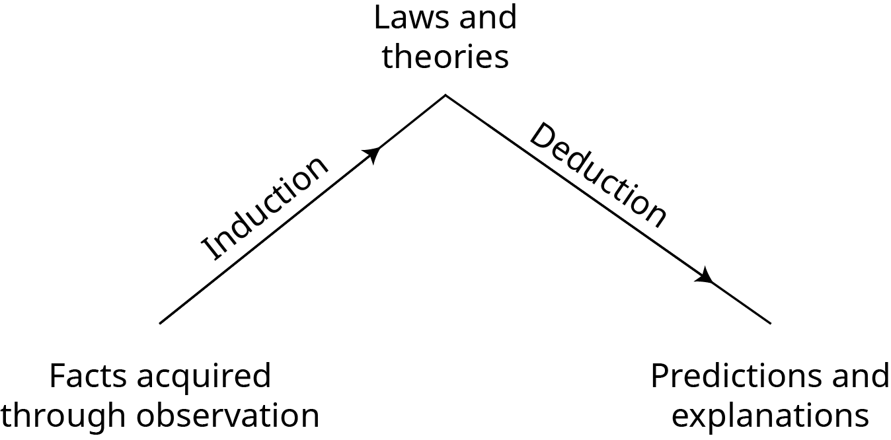
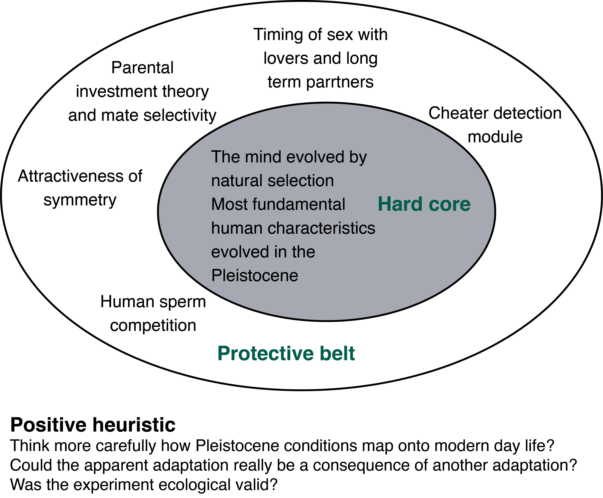

```{r setup, include=FALSE}
knitr::opts_chunk$set(echo = FALSE)
```
```{r, echo=FALSE}
library(metathis)
meta() %>% 
  meta_description("We try to answer the question: 'What is this thing called \"science\"?'") %>%
  meta_tag("week" = "02") %>%
  meta_tag("content_type" = "handout")
```


## Philosophy of Science 

The title of this course is "Psychology as a Science". 
- But what is this thing called "Science"? 
  - Is it a special way of learning about the world?
  - And if it is then what makes it special?
  - How does science _advance_
- And does science give us a true and objective view of the world

We're going to try and tackle a few of these questions in today's lecture. 

The common-sense view might go something like this:
  
  > Science is special because it is knowledge **based on facts**
  
Science is often contrasted with other forms of knowledge that might be based on authority (e.g., coming from celebrities, religious and political leaders), revelation (e.g., personal religious or spiritual experiences) or superstition (e.g., "knowledge of the ancients").

But this raises two questions. First, if science is based on facts, then where do "facts" come from? And once you have the "facts", how do you go about deriving knowledge from these. We'll try and tackle each of these questions in turn. 

## Science as based on facts

The **common-sense view of science** was formalised by two schools of thought: The _empiricists_ and the _positivists_. Together they held a view that went something like this:
  
  > _Knowledge should be derived from the facts of experience_

We can break this idea down into three parts. First, the idea that careful and unbiased observers can directly access facts through the senses/observation. Second, that facts come before and are independent of, theories. And finally, that facts form a firm and reliable base for scientific knowledge.  But is this view true?
  
  A simple story of how the senses work is that there are some external physical causes (light, sound waves etc.) that produce some physical changes in our sense organs (e.g., our eyes) that are then registered by the brain.  This account implies direct and unmediated access to the world through our senses. But this is not actually the case.


The above image could be seen as an old woman or a young woman. Some of you might see one and not the other while some might be able to see be both and even switch between them. The physical causes (the light hitting our eyes) is more-or-less the same for everyone, but you might "see" different things. Although this is just a toy example, it reveals a larger point. Namely, two scientists might "observe" something different even when looking at the same thing. In some fields, being able to make "observations" actually requires training. For example, training in how to observe objects using a microscope, training in how to distinguish different kinds of behaviour or training in how to read an x-ray. So a simple claim that observations are "unbiased" or "straightforwardly given by the senses" seems to be false.

Furthermore, when we think of a "fact" there are two things we could mean. "Fact" could refer to some external state of the world, or it could refer to **statements** about those external states. For example, _the fact that **this university is in East Sussex**_ could refer to this actual university, and its actual being in East Sussex  or it could refer to the statement: "This university is in East Sussex." When we talk about "facts" as the basis for science, we're talking about these statements. (We'll call this type of fact an "observation statement"). Is it possible to make "observation statements" in a way that is free from theoretical assumptions, prior knowledge, or our conceptual framework? That is, can they just enter our brains in an unmediated way?
  
  To unpick this, let's look at an example. Think of a child learning the word apple. First, they might initially imitate the word "apple" when shown an apple by their parent. Next, they might use the word "apple" when pointing to apples. But then one day they might see a tennis ball and say "apple". When this happens the parent would then correct them, and show them that a tennis ball isn't an apple because you can't, for example, bite into it like an apple.

Further errors might result in further corrections with new demonstrations about the properties of apples. As a result, by the time the child can make accurate "observation statements" about the presence of apples they might already know a lot of about the properties of apples (have an extensive "theory of apples"). The same goes for scientists; formulating observation statements might require substantial background knowledge or a conceptual framework to place them in. So observation statements are not completely independent of theory. They're not just out there in the world for us to pick up through the senses. 

However, let's say that we've been able to acquire some facts. Will any old facts do? Again, let's take a simple example. Let's say that you observe that grass grows longer among the cowpats in a field. You think this is because the dung traps moisture that helps the grass grow. Your friend, however, thinks that the grass grows longer among the cowpats because the dung acts as a fertiliser. Observations alone can't distinguish these. To tell which is correct you need *to intervene* on the situation in some way.  For example, you could grind up the dung so that it still fertilises the ground or use something else to trap the moisture.  *Intervening*, for example, through experiment allows you to tell what the _relevant facts_ of your observation are. If science is made of facts, then they must be the _relavent_ facts.

By intervening on the system, we can tell which facts are **relevant**. But _scientific theories_ may play a part in helping to determine what is and isn't relevant. Let us take an example from the history of *cognitive psychology*. In certain kinds of reading tasks psychologists thought it was relevant **that** people made errors, but they didn't think the **exact nature of the errors** was relevant. But after certain kinds of theories were developed (ones based on neural network models) they came to realise that the particular **kinds of errors** (e.g., whether people swapped letters between words) was relevant. Again, observations can't be completely divorced from theories. And, further, experiments will presume the truth of certain theories (e.g., brain imaging experiments assume the validity of certain theories about brain function), which means that experiments and observations are infused with all kinds of theoretical assumptions. 

There is an idea that science is **objective** in a _simple sense_  of the word. That no matter what you believe, the facts are just out "there". But thinking of "objectivity" in this sense is misleading.  Your **conceptual framework**, and **theoretical assumptions**, and even your **knowledge and training** can play **a part** in *what kinds of observations* you can make or *what types of observation statements you can formulate*. "Objectivity" **doesn't mean** making observations free from theoretical assumptions ("the view from nowhere"). The idea of "objectivity" is more complex.

Instead of thinking about "objectivity" in terms of the existence of **atheoretical facts**, we should think of objectivity as:  
1. Relying on **publicly** and independently verifiable methods;  
2. **Recognising** theoretical assumptions;  
3. **Theory/data that are open to revision** and improvement; and  
4. Science free from **avoidable** forms of bias (confounds, cherry-picking data, experimenter bias).

Science is also **objective** in the sense that despite all this, when you make the observations, either the behaviour will happen or it won't, the detector will flash or it won't etc. _Your theory can't make things happen_.

## Deriving theories from facts

The second part of the **common-sense** view of science is that scientific knowledge is **derived** from facts.  Usually, this idea of **derived** means something like **logically derived**. To understand what it might mean to **logically** derive scientific knowledge, we need to know a bit about **logic**.

### Deductive logic

A deductive argument is called **valid** if the conclusions follow from the premises. 

**Example 1**  
  1. All research methods lectures are boring   
2. This is a research methods lecture   
3. (Therefore) this lecture is boring 

In this example, if we accept that (1) and (2) are true, then we have to accept (3) as true. We cannot accept (1) and (2) as true and then deny that (3) is true because we would be contradicting ourselves.

Let us change the example slightly.

**Example 2**  
1. Most research methods lectures are boring  
2. This is a research methods lecture   
3. (Therefore) this lecture is boring   

In our new example, we can accept (1) and (2) as true without accepting (3) as true. That is, (3) does not **necessarily follow** from (1) and (2). This might just be a case of a research methods lecture that isn't boring.

Deduction is only concerned with whether (3) follows from  (1) and (2). It is not concerned with determining whether (1) and (2) are true or false. The argument assumes that (1) and (2) _are_ true, but it doesn't establish their **truth**. 
  
Importantly, an argument can be **valid** while being **false**. Again, let us make a slight change. 

**Example 3**  
1. All pigs can fly  
2. Percy is a pig  
3. (Therefore) Percy can fly.   

This conclusion is **valid**. However, it is also **false** because (1) is false. It is **valid** because if we accept (1) and (2) we have to accept (3). But it is also plainly false because pigs can't fly.

**Logic** only tells us what follows from what. If there is truth in our premises, then there is truth in our conclusions. If our premises are false, then our conclusions will also be false. Deductive logic is **truth-preserving**, but it can't tell us what is true and what is false, because the conclusion is just a *re-statement of the information contained in the premises*.

Because deductive logic just involves **re-statement** of information **deductive logic** can't create new knowledge. So what can we do if we want to create new knowledge?
  
  To create new knowledge, we need a way to go from **particular observations** to **generalisations**. This process is called **induction**.

### Induction

To create new knowledge, we need a way to construct arguments of the following form:
  
**Premises**  
1. Emily the swan is white  
2. Kevin the swan is white  
3. .... the swan is white  

**Conclusion**  
All swans are white

But the problem with arguments like this is that _all the premises may be true and yet the conclusion can be false_. **Maybe** we just haven't observed the one swan that **isn't white**?
  
But surely there are good and bad **inductive** arguments? For example, maybe **more** observations are better than **fewer** observations—but if so, then how many is enough? Maybe it's better when observations are made in many **different contexts**—_but what makes a context different and what makes the differences **relevant**? Different contexts should be **novel** in some sense and changes should not just be **trivial** changes. Maybe another criterion is that there should be no **contradicting observations**—but what about **probabilistic** phenomena? **Clear** and **simple** rules aren't easy to come by. But the bigger problem is **induction can never establish truth**. So how do we ever **prove anything for certain in science?** The short answer is, **we don't**. We can **never be certain** of **truth**.

So where do we go from here? One option is that instead of just **collecting** _confirmations_ we can employ **induction** and **deduction** together.

</img>
  
  This approach would involve something like,  collecting observations and using **induction** to come up with **general laws** and theories from these observations.  We could then use deduction to figure out what **logically follows** from these general laws and theories. This approach nicely captures the idea of **testability**. Our **theories** should make **predictions** about what we **expect to find** and we can **test** these predictions with more observations.

## Deduction and knowing what is **false**

The philosopher _Karl Popper_ also saw trouble with relying on **induction**. He wanted to put science on a firmer logical footing. To do this, he suggested that instead of  **deduction** to figure out what is **true**, scientists could use **deduction** to figure out what is **false**, and he suggested that a key quality of **scientific theories** is that they should be **falsifiable**. 

For _Popper_, theories could come into existence through any means (wild speculation, guesses, dreams, or whatever); however, once a theory has been proposed it has to be **rigorously and ruthlessly tested** by attempting to **falsify** it.

Here is an example of how deduction can work to tell us what is false.  But first an example of induction, just to refresh how it works. 

**Confirmation**  
**Premise:** A swan that was white was spotted in London at time *t*

**Conclusion:** All swans are white. 

The conclusion might be **true** or **false**, but it doesn't **logically** follow from the premise.

And now deduction working to falsify a statement. 

**Falsification**  
**Premise:** A swan, which was not white, was spotted in Australia at time *t*. 

**Conclusion:** Not all swans are white.

The conclusion **logically** follows from the premise, so if the premise is **true** the conclusion is **true**. 

We can't **prove** the claim "_all swans are white_", but we can **reject it.**
  
  Not all theories are equally falsifiable. **Good** theories are *falsifiable*, but **better** theories are **_more falsifiable_**. Let's take a look at three example theories. 

1. Mars moves in an elliptical orbit   
2. Mars and Venus move in elliptical orbits   
3. Planets move in elliptical orbits  

Of these three theories, (1) is the least falsifiable and (3) is the most falsifiable. Why? For theory (1) only an observation of Mars could falsify it. But for theory (3), an observation of Mars, Venus, Saturn, Neptune, or any other yet undiscovered planet would falsify it.

Bad theories are ones that can seemingly accommodate **any observation.** If **two outcomes** are possible and the theory can explain **outcome one** and **outcome two** then this is **bad**, because what then counts as **evidence against the theory?**. **Good** theories are also **broad** in their **_applicability_** but **precise** in their **_predictions_**, because this makes them **more** falsifiable. 

## Encountering a falsifier

Once we have a falsifiable theory, then what happens when you make an observation that falsifies the theory? That is, what do you do when you observe something that **contradicts** the theory you're testing?

In this situation, you have at least two options. One option might be to _abandon the theory_.  But what about _probabilistic  theories_? And what about _auxiliary assumptions_? Remember, theories don't exist in isolation.  Another option might be to _modify or amend the theory_. But are their _better_ ways and _worse_ ways to do this?
  
  
  Let's first think about the situation of probabilistic theories.  Theories in **psychology** tend to be **probabilistic**. They make claims about how things are **on average**, not claims about how things are **in every case**. A probabilistic claim might say something like _on average_ "men are taller than women", but of course there are shorter men and taller women. As a result, a **single** contradictory observation can't falsify a probabilistic claim because we will **sometimes expect** contradictions with probabilistic claims.

Much of what we do with **statistics** is figuring out how to **test** and **specify** **probabilistic claims**. For example, statistics will help us figure out what it means for things to differ **on average**. Or it can help us to figure out how many cases you have to observe before you have **evidence for** a probabilistic claim.  Or to know how many contradictory cases you have to observe before you have **evidence against** a probabilistic claim (that you might previously have believed).

But putting aside the probabilistic nature of claims (or assuming you've seen enough contradictory examples), should these contradictory observations lead you to abandon the theory? Again, any experiment is not testing **one theory in isolation** but also relies on a range of auxiliary assumptions and other support theories. For example, an experiment on memory using brain imaging is also making assumptions about the truth of theories related to physics, brain functioning, **besides** testing the theory about memory).

Therefore, it **may be the case** that what is actually at fault is one of these auxiliary assumptions and not **your theory**.  Telling which part of the **interconnected web** of theories is at fault can be tricky. (Philosophers call this the _Duhem-Quine problem_.) _Popper_ didn't have a good answer on how to figure out where to lay the blame for an _apparent_ falsification. 

But _Popper_ also didn't think that theories should be abandoned _too quickly_. He suggested some _dogmatism_ because at the start scientists might still be figuring out the details, and therefore they might just need to make some _tweaks_ to modify their theories.

## Revising and amending theories

Let's say we do decide to amend a theory, then how do we do this? Let's take a look at a theory, and then think about how to modify it in the face of a falsifier. 

**Theory**: All bread is nourishing   
**Observation:** Bread eaten in a French village in 1951 was not nourishing[^1]
  
One way to modify it might be as follows:
  
**Ad-hoc modification**   
_All bread except bread eaten in a French village in 1951 is nourishing_ 

The problem with this modification is that it has fewer tests: The original theory can be tested by eating any bread. The modified theory can be tested by eating any bread **except** that particular bread. 

But there is a way to make an acceptable modification. It might go something like this:
  
**Acceptable modification**     
_All bread except bread made with flour containing ergot fungus is nourishing_

This modification is acceptable because the modification leads to new tests. You could, for example, test the bread for the presence of the fungus. You could cultivate the fungus and make bread with it and test whether it nourishes. Or you could analyse the fungus for poisons.

[^1]: [https://en.wikipedia.org/wiki/1951_Pont-Saint-Esprit_mass_poisoning](https://en.wikipedia.org/wiki/1951_Pont-Saint-Esprit_mass_poisoning)
  
  
  
  _Popper's_ falsificationism is not without its problems. At least two problems arise because of the focus on **falsifying** theories. First, as we've already discussed, it can be difficult to figure out when to **abandon** theories and when to **amend** theories.  In fact, you might question whether all parts of the **theoretical web** are of the same status? And second, it can be difficult to compare two theories to see which is "better". For example, if you have **Theory  A** and **Theory B** and neither has been falsified, which is the better theory? The one with _more **confirming** observations_? But then won't **trivial theories** always win?
  
  The philosopher _Imre Lakatos_ developed his idea of **research programmes** as a reaction to these two problems[^2].

[^2]: A _similar_ idea was developed by the philosopher _Thomas Kuhn_, but _Kuhn_ used the term **paradigms** for his idea.

## Research programmes

One key aspect of _Lakatos's_ idea of **research programmes** is that not all **parts of a science are on par.** For example, some laws or principles are so fundamental they might be considered a **defining part of the science**. Other parts, in turn, might be more peripheral. _Lakatos_ called these fundamental parts the **hard core** and the more peripheral parts the **protective belt**.

He suggested that the **hard core** is resistant to _falsification_, so when an apparent falsifier is observed the blame is placed on theories in the **protective belt**. **Research programmes** are defined by what is in their **hard core**.

### Hard cores and protective belts

What is in the **hard core** and what is in the **protective belt** might not always be explicit, but these might be some examples: In Cognitive Science the **hard core** might include the theory that mind/brain is a _particular kind of computational system_ and the **protective belt** might include specific theories about how memory works. In the biomedical view of mental illness, the **hard core** might include the theory that mental illness can be explained biochemically and the **protective belt** might include the dopamine theory of schizophrenia. When apparent falsifications occur the **protective belt** is up for revision but the **hard core** stays intact. Falsifying the **hard core** amounts to abandoning the _research programme_.

On _Latakos's_ view, scientists work **within a research programme**, and he splits guidelines for working within a research programme into a **negative** and **positive** heuristic, specifying what scientists ** shouldn't** but also what they **should** do. The _negative heuristic_ includes things like not abandoning the **hard core**. The _positive heuristic_ is harder to specify exactly, but it includes suggestions on how to supplement the protective belt to develop the research programme further—that is, it should specify a **programme of research** (the **research programme** should identify problems to solve).




<caption>Example of a research programme from Dienes (2008)</caption>
  
_Lakatos_ was also interested in comparing **research programmes**, something that is difficult to do on a _strictly_ falsificationist account. He divided research programmes into those that are **progressive** and those that are **degenerating**. Progressive research programmes are coherent (i.e., have minimal contradictions). And progressive research programmes make **novel** predictions that **follow naturally** from the theory and which are confirmed by experiments. Degenerating research programmes are those that have faced so many falsifications that they have been modified to the point of being incoherent. At this point, it's no longer sustainable to carry on modifying the protective belt, and instead, the hard core must be abandoned.

When the hard core is abandoned, then scientists move from one research programme into a new one. Some examples of this in psychology might include    
1. The move from psychological behaviourism to cognitive science,  
2. the move from classical cognitive science to embodied cognitive science,  
3. the move from connectionism to deep neural networks, or  
4. the move from sociobiology to evolutionary psychology.  

But again, what is and isn't a **research programme** isn't always clear, because often the **hard core** and the **protective belt** are left _implicit_ and not made _explicit_.


## Additional reading {.appendix}

If you're interested in Philosophy of Science, a great book to get your started in *What is this thing called science?* [@chalmers2013]. For another book with a more specific psychology focus, you can check out *Psychology as a science* [@dienes2008]. This book also contains more advanced materials on statistics in addition to an introduction to philosophy of science. 

 


