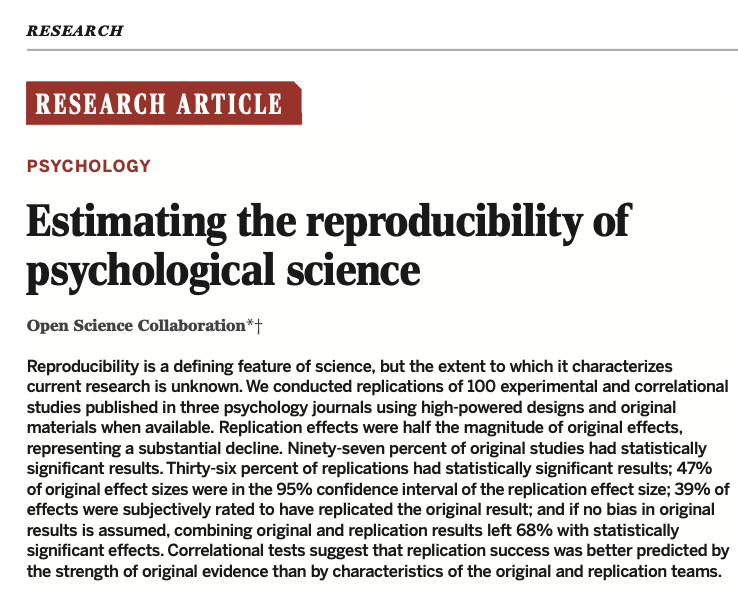
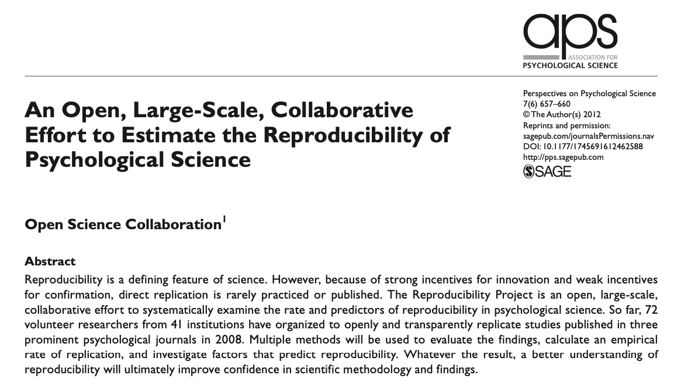
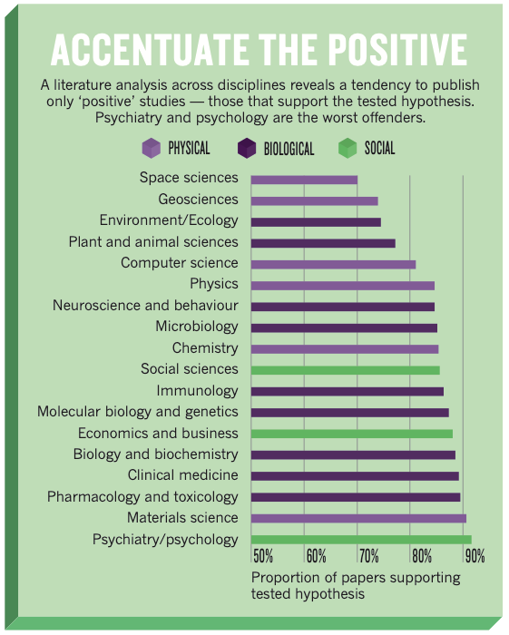
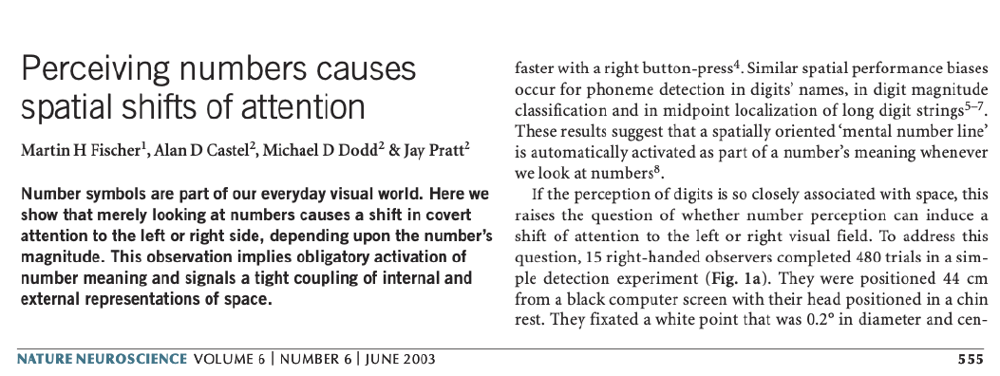
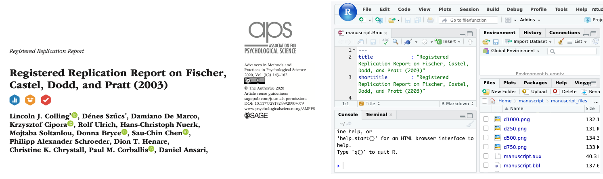

```{r xaringan-themer, include=FALSE, warning=FALSE}
library(xaringanthemer)

style_duo_accent(
  primary_color = "#003b49",
  secondary_color = "#1d4289",
  header_font_google = google_font("Cabin"),
  text_font_google = google_font("Noto Sans", "300", "300i"),
  code_font_google = google_font("Fira Mono"),
  colors = c(
    red = "#d3003f",
    purple = "#3e2f5b",
    orange = "#ff8811",
    green = "#136f63",
    white = "#FFFFFF",
    blue = "#1d4289"
  )
)

xaringanthemer::style_extra_css(
  list(
    ".title-slide" = list(
      "background-image" =
        paste0(
          "url(https://upload.wikimedia.org/wikipedia/commons/thumb/3/34/",
          "University_of_Sussex_Logo.svg/",
          "480px-University_of_Sussex_Logo.svg.png)"
        ),
      "background-position" = "95% 95%",
      "background-size" = "180px",
      "border" = "10px solid #013035",
      "background-color" = "#FFFFFF"
    ),
    ".title-slide h1" = list(
      "padding-top" = "0px",
      "font-size" = "60px",
      "text-align" = "left",
      "padding-bottom" = "18px",
      "margin-bottom" = "18px",
      "margin-top" = "0px",
      "color" = "#003b49"
    ),
    ".title-slide h2" = list(
      "font-size" = "40px",
      "text-align" = "left",
      "padding-top" = "10px",
      "margin-top" = "0px",
      "color" = "#003b49"
    ),
    ".title-slide h3" = list(
      "font-size" = "30px",
      "color" = "#26272A",
      "text-align" = "left",
      "text-shadow" = "none",
      "padding" = "0px",
      "margin" = "0px",
      "line-height" = "1"
    ),
    ".big" = list("font-size" = "40px"),
    "div.footnote" = list(
      "font-size" = ".6em",
      "border-top" = "1px solid #007935",
      "margin-bottom" = "-40px"
    )
  )
)
```

```{r, echo=FALSE}
library(metathis)
meta() %>%
  meta_description(
    paste0(
      "In this lecture we'll talk about \"open science\",",
      " the replication crisis, preregistration,",
      " and the lab report."
    )
  ) %>%
  meta_tag("week" = "05") %>%
  meta_tag("content_type" = "slides")
```

```{r broadcast, echo=FALSE}
xaringanExtra::use_broadcast()
```

<br />


<br />

.big[.center[**It is university policy to recommend mask wearing**]]

<br />

.big[.center[**Masks are available if you need one**]]

---


## Today's lecture

The aim of today's lecture is to provide you with information about the lab
report, including information on the technical details (length, format,
content) and the motivation behind the lab report. 

The lecture will be split into two parts

**Part I** 

- The replication crisis, pre-registration, and open science

**Part II**

- The lab report itself


In the lab report you'll be asked to write a **pre-registration plan** for an
experiment...

But **what** is a **pre-registration plan** and **why** are we writing one?


---

## Some terminology

.blue[]

**Reproducibility**    
A study is reproducible if you can take the original data (and *possibly* the
computer code) and **reproduce** the numbers/statistics reported in the
original journal article. 


 
**Replicability**     
A study is replicable if you can repeat the study using the same methods (e.g.,
experimental design, analysis) to produce a new dataset that produces the same
results as the original study

This lecture will mainly focus on **replicability** rather than
**reproducibility**

.footnote[<sup>†</sup>There isn't universal agreement on these definitions, but these are
the definitions favoured by the American Statistical Association...]

---

## A Spectre if haunting psychology... 

**The spectre of failed replications**

.pull-left[ <a href="./assets/open_science_collab.pdf"></a> ]

.pull-right[ <a href="./assets/open_science_collab_2.pdf"></a> ]

- Several large scale replication attempts have shown that many classic
  findings in the psychological literature **can not** be replicated.

- Some estimates suggest > 50% of finding aren't replicable

- This has prompted some to claim that psychology is in a state of
  _**crisis!**_

???

Milan was one of the people that contributed to the original paper that tried
to estimate replicability of psychological science.

---

## What is the cause of this crisis?

There's likely to be **several** causes of this crisis. These might include:

- How **statistics** and **statistical procedures** are used and abused in
  psychology

- Incentives in the publishing and university system 

- Lack of *statistical power*<sup>1</sup>

- Lack of clearly defined theories in psychological science

These causes probably aren't independent but are likely to be interconnected
and related to each other.

When we designed the psychology methods courses at Sussex, many of these issues
were in the forefront of our minds.

In this lecture, I'll focus on the causes that are most relevant in motivating
the design of the lab report.

.footnote[<sup>1</sup>You won't learn about statistical power in this course,
but you will in upcoming courses.]

---

## Bias in publishing

.pull-left[If we look specifically at the published literature in psychology
we'll notice something odd

The **vast majority** of published papers in psychology journals report
findings that **support** the *tested hypothesis*

**But how is this possible?**
<small>
- Maybe psychology researchers as psychic and they always test hypotheses than
  turn out to be true...   
- Maybe the hypotheses they're testing a *trivial*...   
- Maybe there is some sort of **bias** in publishing...   
- Or maybe they only report the results at support their hypothesis   

</small>
]

.pull-right[
<a href="./assets/bad_copy.pdf"></a>
]

---

## Bias in publishing

One source of **bias in publishing** of psychology studies is that **journal
  editors** and **peer reviewers** might not want to publish studies when they
  don't like the results!

- This might **especially** be the case when it comes to **famous** or
  **influential** theories.

- If a new study **doesn't find support** for a *famous or influential theory*
  then editors/reviewers might be *more likely* to suspect there's *some kind
  of problem with the new study*

.center[But if this is a **problem**, then what is the **solution**?]

.center[One solution that has been proposed is **pre-registration**]

The idea of pre-registration can be covered in popular media. For example, it's
been written about in The Guardian on several occasions: [article
1](https://www.theguardian.com/science/blog/2013/jun/05/trust-in-science-study-pre-registration);
[article
2](https://www.theguardian.com/science/head-quarters/2014/may/20/psychology-registration-revolution);
[article
3](https://www.theguardian.com/science/sifting-the-evidence/2013/may/15/psychology-registered-replication-reports-reliability);
[article
4](https://www.theguardian.com/lifeandstyle/2016/nov/27/the-psychology-behind-a-nice-cup-of-tea).

---

## Pre-registration and combating bias

Pre-registration can get around publication bias by making editors and
reviewers accept studies for publication **before the results are known**

But it also has other benefits...

- Pre-registration can also get around certain kinds of **experimenter** and
  **statistical** biases 

It is **very easy** for researchers to engage in certain practises that
**invalidate** certain statistical procedures...

- Running a statistical test, looking at the result, collecting more data,
  re-running the statistical test... rinse, repeat.. until you find the desired
  result

- Collecting data under many many conditions and **only reporting the
  conditions** that produce the desired result

---

## Pre-registration and combating bias

**Preregistration** means that **before** conducting a study, researchers plan
their study in detail

1. Specifying the theory they plan to test and all of their hypotheses 

  - This means they can't **change their hypothesis** to make it fit whatever
    their data happened to show (think about *falsification* and infinitely
    flexible theories!)
	
  - They can't cherry-pick their data or engage in subtle procedures to make
    the data fit their hypotheses 

2. By  outlining their plans in detail, reviewers are able to judge

	- Whether the methods are scientifically rigorous
	
	- Are likely to produce clear (rather than ambiguous results)
	
And they have to do this all before seeing the results, which might otherwise
bias their decision


---

## Pre-registration in action...

.center[]


In 2003 a paper was published claiming to show that *merely looking at numbers*
would cause a *shift in attention* to either the left or right side of space
depending on whether the number was big (6–10) or small (1–4).

- This finding was **very influential** with more that 700 subsequent studies
  citing this finding or building on it

- There were some published studies that tried to replicate it. Most of the
  published studies showed **successful** replications (i.e., they supported
  the original claim) and very few **published** studies failed to replicate it

???

The original study was very small (it only had a sample size of 19 across two
experiments), but it was published in a very high profile journal, which might
explain why it was so influential. 

---

### But is it true?

- If you spoke to people at scientific conferences then many researchers would
tell you that they **couldn't** successfully replicate the effect...

- But this wasn't reflected in the **scientific literature** where most published
papers on the effect showed that it could be replicated and where scientists
continued to cite the original finding *believing it to be true*

.center[**But why?**]

- The original finding was published in an extremely prestigious journal
  (Nature Neuroscience) and it quickly became influential...

- This means it probably got accepted as something like an **established fact**

---

### Overturning established findings...

Once a finding is accepted as like an **established fact** then journal editors
and reviewers might be reluctant to publish studies that don't support the
original finding... 

If something is **established fact** and a new study comes along overturning
that fact then what is more likely?

1. The established fact is wrong?

2. There's something wrong with the new study?

If there's a bias in publishing (which definitely seems to be the case in
psychology) then it can be hard to tell, because things can become established
facts too easily because findings running counter to these *established* don't
get published

---

### Getting around publishing bias

If there is a bias for publishing certain findings (i.e., findings that support
established findings) then what is the solution?

.blue[.center[Agreeing to publish studies before the results are known!

That is, **pre-registration**!
]]

<br />
<br />

In one form of **pre-registration** known as a **registered report** you
actually **submit** the **plan** to a journal before you run the study

- The journal **reviews the plan** and agrees to publish the study when it's
  done provided that you do the study exactly how you said you would

- This means you can't *deviate* from your plan and editors and reviewers can't
  reject your study if they don't like the findings


---

### An example registered report

- In 2017 I put together a **pre-registration** that involving a **replication
  attempt** of the original 2003 attentional cuing finding and some additional
  experiments to attempt to understand the mechanism that produced the effect
  (that is, if I could replicate it!)<sup>1</sup>

- I then approached a journal **with this plan** to see if they were willing to
  publish the study if I did it according to the plan

- The plan was sent our for review to be checked and then the journal agreed
  that they would 

- I then gathered together 30+ psychological scientists from 17 universities
  around the world and we ran the experiment on over 1300 participants (nearly
  100 times the original sample size!)

.center[.blue[What did we find?]]

.footnote[<sup>1</sup>That is, we wanted to do more than just a
**replication**. We wanted to try **replicate** the effect but we also wanted
to try **improve** the methods as much as possible.]

---

### An example registered report


.center[]

- We found **absolutely no evidence** for the original finding...

- And we found **no evidence** that the **additional manipulations**, that people
thought might *modulate the size of the attentional cuing effect*, modulated
the size of the effect...

- Now psychological scientists can move on from this finding and no longer accept
it as **established fact**, but a lot of resources might have been wasted
studying this non-existent effect.

- And this finding is by no means a unique case! There's likely to be many
**zombie findings** in psychology


???

Although we're mainly talking about replication here, I should also note
something about reproducibility. When I published the study I also published
the R Studio project, including all the R Markdown files that produce the
statistical results and the plots and figures in the paper. This means anybody
can download the project and re-run it and check that everything was done
correctly. In addition to training you guys to do better science by teaching
you about replication and the pre-registration we also how to teach you how to
do reproducible science by teaching you R, R Studio, and R Markdown. 

---

## The lab report 

The lab report is designed to be part of your training to do **better science**
by introducing you to the idea of **pre-registration!**

- The lab report will present a *research plan* for an experiment 

- The expected length with be around 1000–1500 words (with a maximum allowable
  length of 2000 words)

The research plan will address one of two questions 

1. Is buying "green" (i.e., environmentally friendly) products driven by status
   motives?

2. Do women find men more attractive in conjunction with the colour red?

Links to two studies that have addressed this question can be found [on
Canvas](https://canvas.sussex.ac.uk/courses/15795/pages/report-information-and-resources)

---

### Structure of the lab report

The **lab report** will be written in the **style** of a **journal
article**<sup>1</sup>, but with only three sections: An **introduction**, a
**methods** section, and a **strengths limitations** section

**Introduction**
 
1. Thesis statement: What is your research question?

2. Background: What is the context for the research question, and what do we already know?

3. Hypothesis: Based on this background, what do you expect to happen in your experiment?

.footnote[<sup>1</sup>Take not of the style of the journal articles you read
for your research and try and emulate the style]

---

### Structure of the lab report

**Method**  

1. Participants: Who will take part in the research?  

2. Materials: What kind of tests or measures will be administered, and how do
   they work?

3. Procedure: What instructions will be given to participants, what will
   participants do, and will the tasks be administered in a specific order?

4. Design: What variables will be included? Will it be a between-groups or
   within-subject design?   

---

### Structure of the lab report

**Strengths and Limitations (Discussion)**

1. What are the strengths of your design: For example, will it be able to tell
   you something about *causation*?

2. What will the results *not* be able to tell you about your research
   question?

3. Will this study need a follow-up study?

???

The plan doesn't need to contain details about the *statistical* analyses that
you'll perform as these will not yet have been covered. Similarly, you don't
need to specify precisely *how many* participants you will aim to include in
your study. Instead, you will just need to give the characteristics of the
participants—for example, whether they will be male or female, university
students, or recruited from the general public. All this information is also on
CANVAS.


---

### Introduction 


Your **introduction** will give the background to your research question.

Things you should consider include:

- Why are you studying this? Why is it important?


- What previous work has been done on this topic?


- What are your **hypotheses**?


- How does your **hypothesis** relate to the **research design**?


---

### Methods / Study plan

In the **methods**/**study plan** section, you'll describe how you plan to do
the study.


Things you should consider include:

- Who will the **participants** be? Specific gender or background? How will
  they be selected?


- What **materials** or **stimuli** will you use? Will you show specific kinds
  of pictures? Have particular types of cues?


- What kind of **design** will you use? Will participants be split into groups
  or not?


- What are your **independent** and **dependent** variables and how were they
  operationalised?


- What **procedure** will you use to collect the data? Will you test
  participants in groups or individually? In a lab or the field?


---

### Strengths and limitations

In the **Strengths and limitations** section you'll reflect on some of the
**strengths** and **weaknesses** of your study idea.

Things you should consider include:

- What are the **advantages** of your study design over others? Does your
  design allow you to say more about **causes** or **mechanisms**?


- What are some of the **weaknesses**? How would it be improved? Does it need a
  follow-up experiment?

---

### The research questions

The two options for topics are:


1. Is buying "*green*" products driven by status motives?

2. Do women find men more attractive in conjunction with the colour *red?*


You'll be designing a study to address one of these questions, but don't just
say you're going to do **exactly** the same thing as one of papers listed on
CANVAS


On CANVAS, there are some links to background reading and some examples of
studies that have addressed these or similar questions...


To do well, you'll need to read more than just the papers on CANVAS

**How many more?**

- It's not about a number! You need to read enough to provide **adequate**
  context for your question

- People with the highest grades last year cited around 10 papers, but just
  having lots of citations didn't guarantee a good mark!


---

### Things to keep in mind...


**Defining your dependent and independent variables**

- What are you **measuring** and what are you **manipulating**

**Operationalising variables**

- How will you define exactly what you're going to be measuring and
  manipulating


**Design**

- Will your study involve examining multiple groups (a *between-subjects*
  design) or only one group (a *within-subjects* design)

---

### Things to keep in mind...

**Confounds**

- Are there any nuisance variables that you need to control for?

- For example, variable that might vary systematically with your **IV** and
  influence your **DV** but are not the thing you're actually interested in
  manipulating

-  For example, if you're interested in differences in memory recall
  performance between **males and females** but it so happens that all your
  **males** are elderly while all your **females** are young then this is an
  example of **age** being a **confound**

---

## Keep your study simple!

Thinking of some **brilliantly unique study** is really difficult, so instead
focus on the basics

1. Read the papers on CANVAS and look for any _obvious limitations_ (the
   authors might even mention them!)
  
2. Think of a **small change** you can make to address that limitation
  
3. Or think of a **small change** you can make to the papers on CANVAS to **extend** them
  
The markers are looking for how well you understand the **topics covered in
this course**

This means they want to know things about **design**, **variables**,
**measurement**, **operationalisation**, **confounds**, **causation**, and
**research methods**. 

Focus on getting these things right!

---

## Formatting, citations, etc

There's a link on CANVAS to [Prof Andy Field's lab report writing
guide](http://www.discoveringstatistics.com/repository/writinglabreports.pdf)

This contains lots of useful information about how to structure a lab report,
how to cite your sources, and how to write reference lists. 

**Read this!** It will be **super useful**

The references and report should be in **APA-Style**. The [Purdue Online
Writing
Lab](https://owl.purdue.edu/owl/research_and_citation/apa_style/apa_formatting_and_style_guide/general_format.html)
is a great resource for APA style, so it's worth checking out!


---

## Good luck!

And don't worry if you find the lab report **difficult**. Everyone will find it
difficult!

For most of you this will be your first experience doing something like this,
but you'll only learn how to do it by doing it!

If you need help with your writing and research skills then check out the
[Study Skills](https://canvas.sussex.ac.uk/courses/12684/pages/study-skills)
link on Canvas.


### And finally!

Don't forget about the weekly quizzes!

There's still a lot of people not doing them!


And a quick survey...

---
class: center, inverse
background-image: url("./assets/feedback.jpeg")
background-size: contain  


