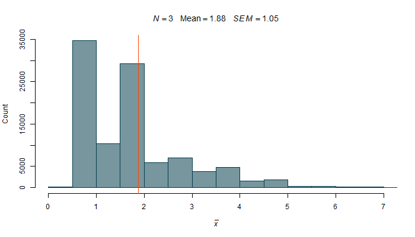

```{r setup, include=FALSE}
library(metathis)
meta() %>%
  meta_tag("content_type" = "handout",
           "week" = "07")

knitr::opts_chunk$set(echo = FALSE)

library(tidyverse)
library(plotly)
library(cowplot)

options(scipen=999)

set.seed(420)

## source code for knitr_hooks, plot_theme, tasks, quizzes
## after library(ggplot)!
source("../../sheet_setup.R")
source("../../quizzes.R")

ggplot2::theme_set(
  ggplot2::theme_get() +
    theme(plot.title = ggtext::element_markdown(face = "plain", size = "13"))
)
xaringanExtra::use_panelset(in_xaringan = F)
```

# Introduction

In [Lecture\ 4](https://paas.netlify.app/lectures/lec04/handout) we started talking about how quantitative methodology deals with measurable things (variables) and aims to explain and predict the world around us by modelling relationships between these things.
The models of the relationships are mathematical/statistical in nature and they are based on numeric descriptions of variables.
In other words such a model is essentially an equation with the predicted (dependent/outcome) variable on one side and predictor (independent) variables on the other.

When we're learning statistics, we're learning how to create these models and how to find the right equation that captures the relationships between the variables that we are modelling as accurately as possible.
To be able to start formulating statistical models, we first need to understand how we can use maths to describe basic properties of things.
This is the task of the first part of this lecture.

# Describing things with maths

We already know that variables are any characteristics whose values differ (vary) in the population.
They differ in their range and distribution as well as _from population to population_.
Take, for instance, temperature in degrees Celsius (centigrade).
Air temperature on Earth ranges from about &minus;90&deg;C to about 60&deg;C with a fairly _symmetrical distribution_ where, most of the time, the temperatures are relatively mild.
However, temperature produced by humans has a much larger range. In laboratory conditions, scientists have produced temperatures as low as about &minus;273&deg;C and as high as ~5.5 trillion &deg;C!
Obviously, most of the temperatures produced by humans are neither this hot nor this cold with the bulk of them in the tens, hundreds, maybe thousands of degrees, making the distribution _positively skewed_ (with a long right tail).
Similarly, as discussed in [Lecture\ 6](https://paas.netlify.app/lectures/lec06/handout#processes-giving-rise-to-normal-distributions), height in humans is _normally_ distributed, while the distribution of wealth is, once again, heavily _skewed_ to the right.
To reiterate, not only two different variables but even _the same variable_ (*e.g.*, temperature) in different populations can have wildly different ranges and distributions.

:::{.warn}
It's really important to understand that the term population, in the context of quantitative research and statistics, **does not only refer to people**! Yes, we can use the term to refer to all people, kittens, or plants but it's a much broader concept. We can also apply it to intangible, abstract, even hypothetical things and events, such as songs, games of chess, or possible outcomes of elections.
:::


# Central tendency and spread

There are numerous ways of describing variables and their distributions mathematically.
The most basic way in which we can do it is in terms of **central tendency** and **spread**.
By central tendency, we mean the "average" value of a variable, *i.e.*, where the _"most typical"_, or **central** value is located along the possible range of values.
Spread, on the other hand, refers to how much _variability_ there is in the individual values of the variable in the sample or population, *i.e.*, how much the values are **spread** along the range of values
  
There are various measures of both central tendency and spread, each with its advantages and disadvantages.
What's important to understand is that, no matter the particular measure, all of them are mathematical _abstractions_.
They provide useful information about the variables at hand but they can't really tell us the whole story.
This may sound like a drawback but it isn't really.
If we want to model relationships between variables in generalisible ways, we have to engage in some degree of abstraction.
In fact we're often interested in finding the simplest models that still do a relatively good job at describing and predicting the world.

## Measures of central tendency

Measures of central tendency tell us about the _"most typical"_ value of a variable.
What "most typical" or _average_ means, however, is up to debate.
For example, look at Figure\ \@ref(fig:salary-plot) below.
It shows average annual salary in US dollars on a sample of 78 countries.
Each bar of this plot represents the number of countries in a given salary bracket (\$0-\$10k, \$10-\$20k, ...).


```{r salary-plot, dpi=300, fig.height=2.5, fig.cap="Average national annual salary [source: https://www.worlddata.info/average-income.php]", panel=TRUE}
salary <- read.csv("assets/world_salary.csv")
salary %>% ggplot(aes(x = yearly)) +
  geom_histogram(binwidth = 10000) +
  labs(x="Annual salary in USD", y = "Count")
```

The distribution is heavily right-skewed, with a lot of countries, where people only get paid on average less than \$30,000 per year and with a handful of countries where people make on average more than 100,000 US dollars.
Given this distribution, what should be considered _most\ typical_ salary bracket?
The one with the highest number of countries in it?
If so, that would mean that the most typical salary on this planet is between \$10k and \$20k, or about £7,300 - £14,600 per year.
Or should we maybe pick the value where half the countries have a lower average salary and half have a higher one?
Choosing this option leads to an estimate of the most typical salary of \$12,855 (about £9,342) based on our sample data.

As you can see, the question of what should be considered average or most typical is a legitimate one.
Different measures of central tendency provide different answers to this question
Let's talk about the three main kinds of average: the mode, the median, and the arithmetic mean.

### Mode

The **mode** is a term that refers to the most frequent value in the distribution.
It is exactly the kind of "average" we discussed above, when we said that the most typical salary on this planet is between \$10k and \$20k a year.
The easiest way to spot the mode is to just plot your variable on a _histogram_ the way we did in Figure\ \@ref(fig:salary-plot) and look for the tallest bar.

A distribution of a variable can have one or more modes.
If it only has one, it's referred to as a **unimodal** distribution.
A **bimodal** distribution is one with two modes and a distribution with three or more modes is usually called **multimodal**.
Take a look at Figure\ \@ref(fig:mode-plot).
In panel **A** is a sample of 7,000 observations of a normally distributed variable.
Because the normal distribution is **bell-shaped and symmetrical**, it only has one mode. The most likely values are in the middle and the tails include values that happen less often.
The plot in panel **B** shows a histogram of a sample of  8,000 observations of a bimodal variable.
Finally, in panel **C**, we have a histogram of 20,000 observations sampled from a _uniform_ distribution, where each value is equally likely to be observed.
This is a special kind of multimodal distribution where each value is the mode!

```{r mode-plot, dpi=300, fig.height=3, fig.cap="Examples of a (A) unimodal, (B) bimodal, and (C) multimodal distribution.", panel=TRUE}
set.seed(1234)
tibble(var = c(rnorm(7000, 0, 1.8), 
               c(rnorm(4000, -2), rnorm(4000, 1.5)), # bimodal
               rep(seq(-7, 7, length.out = 40), each = 500)), # unif
       group = rep(LETTERS[c(1:3)], c(7000, 8000, 20000))) %>%
  ggplot(aes(var)) +
  geom_histogram(bins = 41) +
  labs(x = "Variable", y = "Frequency") +
  facet_wrap(~group)
```

:::{.warn}
The mode is the only measure of central tendency we can apply to data measured at the **nominal/categorical** level.

When it comes to truly **continuous** variables, such as height, they are likely all multimodal.
After all no two people are _exactly_ equally tall and so every person's height is the mode of the distribution.
For that reason, the mode is not often used with continuous variables measured at the **interval** or **ratio** levels.
:::


### Median

The **median** is the second kind of average we talked about [above][Measures of central tendency]; the point at which half of the distribution lies below it and half lies above it.
To find the median, we first need to sort our data from smallest to largest and then find the mid-point.
For instance, let's say we roll a 6-sided die 5 times and get:

:::{.dice}
{data-external="1"}
{data-external="1"}
{data-external="1"}
{data-external="1"}
{data-external="1"}
:::

To calculate the median, let's do the two steps:

1. Sort data from smallest to largest: 1, 1, 3, 4, 6
1. Find the mid-point: We have five observations so the third one in the sorted sequence is the mid-point.

So, out of our 5 rolls of the die, the median is 3 (and the mode is 1).
If we added one more roll and it came out, let's say {.inline-dice data-external="1"}, the sorted sequence would be: 1, 1, 3, 4, 4, 6.

If the number of observations is even, the median is half-way between the two mid-points.
In this case, the median is half-way between 3 and 4, at 3.5.


Figure\ \@ref(fig:salary-sorted) below shows the annual salary in USD per each of the countries in the data set, sorted from lowest to highest.
Notice, that this time, we're not grouping countries in salary brackets and looking at how many there are in each one as was the case in Figure\ \@ref(fig:salary-plot).
Here, each bar represents a country.

Because we have an even numbers of countries ino our dataset (78), there are two mid-points.
These are highlighted in orange in the plot below.
To get the median annual national salary, we need to find the value half-way between the average salary in Romania and Venezuela, which in this data set turns out to be \$`r prettyNum(median(salary$yearly), big.mark = ",")`.


```{r salary-sorted, warning=FALSE, fig.height=3.5, fig.cap="Average national annual salary per country sorted from lowest to highest [source: https://www.worlddata.info/average-income.php]"}
# salary %>%
#   ggplot(aes(fct_reorder(country, yearly, min), yearly)) +
#   geom_bar(stat = "identity") +
#   labs(x = "Country", y = "Average annual Salary in USD")

salary <- salary %>% mutate(country = fct_reorder(country, yearly, min))

plot_ly() %>%
  add_trace(type = "bar",
            x = salary$country,
            y = salary$yearly,
            marker = list(
              color = c(rep(default_col, 38),
                        "orangered", "orangered",
                        rep(default_col, 38))
              )
            ) %>% 
  layout(xaxis = list(title = "Country", showticklabels=FALSE, color = default_col),
         yaxis = list(title = "Average annual salary in USD", color = default_col),
         paper_bgcolor = bg_col,
         plot_bgcolor = bg_col,
         showlegend = FALSE,
         autosize = F, width = 650, height = 280) %>%
  config(displayModeBar = F,
         responsive = TRUE)
```

<aside>
Hover over bars to see the name of the country and the value of average annual salary.

If plots are not showing, just refresh the page.
</aside>

:::{.r-box}

Fortunately, `R` can do all of this for us so that we don't have to calculate the median manually. Let's say we have a `tibble` called `salary` in our `R` environment that looks like this:

```{r}
salary[1:10, ]
```

To get the median of the `yearly` column, all we need to do is:

```{r, echo=T}
median(salary$yearly)
```
:::

<aside>
Click to expand
</aside>

:::{.warn}
In order to be able to calculate a meaningful median, the variable in question must be measured on **at least the ordinal level**!
:::

### (Arithmetic) Mean

The arithmetic **mean**^[There are other kinds of mean, such as harmonic or geometric but, generally speaking, when someone just say "mean", they are referring to the arithmetic mean] is what most people mean by *average*.

:::{.warn}
There is a difference between the **population mean** and the **sample mean**.
We can never know the mean of the population because it is impossible to measure all instances of a variable.
For that reason, the best thing we can do is calculate the mean of our sample and make _inferences_ about the likely value of the population mean, as discussed in [Lecture\ 6](https://paas.netlify.app/lectures/lec06/handout#the-relationship-between-samples-and-populations).

To distinguish between these two, we use the Greek letter $\mu$ /mew/ for population mean and $\bar{x}$ /x-bar/ for sample mean.

In fact, we usually use Greek letters for **population parameters** (characteristics) and Latin letters for **sample statistics**.
:::

It's calculated by adding up all the values and dividing the sum by the number of values you added up.

The formula that describes this operation for a _sample_ of _N_ observations of a variable **x** is:

$$\bar{x}= \frac{\sum_{i=1}^N x_i}{N}$$

Let's break it down:

As we already know $\bar{x}$ is the sample mean.
The symbol that vaguely looks like E is the capital Greek letter _sigma_ and denotes **sum**:

$\sum_{i=1}^N x_i$ simply means _"add all the $x_i$ together starting from $i=1$ all the way to $i=N$, where $N$ is the number of observations of the variable $x$"_:

$$\sum_{i=1}^N x_i = x_1+x_2+x_3+\cdots +x_N$$

To illustrate this summation operation, let's imagine we have a set of observation of a variable $x$, let's say, 4, 5, 4, 10, 0.
There are five observation of $x$, and so $N=5$.
So how to we add all of these values?
Well, we simply take the 1^st^ value (4), add to it the 2^nd^ value (5), then the 3^rd^ value (4), then the 4^th^ value (10), and finally the last, 5^th^ value (0).
In symbolic terms that's: $x_1 + x_2 + x_3 + x_4 + x_5$ or $4 + 5 + 4 + 10 + 0$.

If we had 10 values to add, we would go on until we added $x_{10}$.
And so for any $N$ observations, we need to add $x_1 + x_2 + x_3 + ... + x_N$.
Instead of writing things out laboriously like this, we can just replace the counter subscripts $1, 2, 3 ... N$ with an index variable $i$ and say that we'll start at $i = 1$, add $x_i$ and then do the same for $i=2$, $i=3$, and so on until we get to $i=N$. Once the do, we will have added up all the values in $x$.

That's exactly what the expression $\sum_{i=1}^N x_i$ means: set $i$ to one and start adding up $x_i$ for each value of $i$ all the way to $i=N$.

\ 

Once we've added all the observations, all that's left to do is divide the sum by $N$, the number of observations.

:::{.r-box}
Of course, we don't have to do it manually. `R` to the `R`esque!

```{r, echo=TRUE}
mean(salary$yearly)
```
:::

:::{.warn}
In order to be able to calculate a meaningful mean, the variable in question must be measured on **at least the interval level**!
:::

### Mean Vs Median

Both of these measures have their advantages and disadvantages.
The mean has a proper _algebraic_ formula which means that we can do all sorts of maths (and stats) with it, such as use calculus.
There is no such formula for the median and so the range of mathematical tools we can apply to it is more limited.
For that reason, most, although not all, of the statistical methods we will be learning are based on the mean.
Don't worry though, we won't do the calculus ourselves!

Compared to other measures of central tendency, _means taken from different samples of the same population are **relatively similar to each other**_. If, on the other hand, we calculated medians of different samples from the same population, there would be more variability in the values we'd obtain.

However, it's not all just rainbows and butterflies with the mean.
Unfortunately, the mean is relatively **sensitive to extreme values**.
This means that, no matter the size of the sample, adding a single sufficiently small or large value can shift the mean to an arbitrary value!
This makes it not a great measure of the centre for variables with very skewed distributions.

For example, the mean of the numbers 5, 3, 1, 7, 10, and 4 is `r mean(c(5, 3, 1, 7, 10, 4))` but if we add 1,000,000 to the numbers, the mean will shoot up to the value of `r prettyNum(mean(c(5, 3, 1, 7, 10, 4, 10e6)), big.mark=",")`.
Conversely, if we add &minus;1,000,000 instead, we'll get a mean of `r prettyNum(mean(c(5, 3, 1, 7, 10, 4, -10e6)), big.mark=",")`.

The median is not this sensitive: if we calculate the medians in these three cases, we get, 3.5, 4, and 3, respectively.

Use the [interactive visualisation below](#loc-pread-app) to explore these characteristics of the mean and the median.
Add a few points, turn on the mean and median switches and then drag one of the points left and right to see what happens with the calculated values.

<iframe id="desc-viz" class="viz app" src="https://and.netlify.app/viz/desc" data-external="1" style="height:547px;"></iframe>

<aside>
Click inside the plotting region to add single points.
The +5 button adds five points sampled at random from the normal distribution.

You can drag the points around and select multiple points by clicking and dragging from an empty space.
Selected points can be moved around as a group.

Clicking on an existing point removes it from the plot.
Clicking on a point from a selected group removes the entire group.

You can toggle between measures of central tendency (location) and spread using the switch.
</aside>

```{r}
quiz_vec <- c(34, 5, 42, 3.14, -18.5, 0.4, 5)
```

```{r, quiz=TRUE}
cat("<h3>Check your understanding #1</h3>\n\nMini quizzes like this one are designed for you to test yourself on the material you just read about. Some of the questions are fairly straight-forward, others require a little bit of thinking. Nevertheless, you should be able to answer all of them correctly so, if you get a question wrong, make sure you go back to the relevant section.")

mcq(
	q = "What is the only measure of central tendency that can have multiple values in a single sample?",
	options = c("Mode", "Arithmetic mean", "Median", "Range")
)

cat("<br>Here's a bunch of numbers:\n\n", paste(gsub("-", "&minus;", quiz_vec), collapse = ", "))

saq(
	q = "What is the mode of these numbers?",
	correct = names(which.max(table(quiz_vec)))
)

saq(
	q = "What is the median of the same bunch of numbers?",
	correct = median(quiz_vec)
)

saq(
	q = "What is their mean?",
	correct = mean(quiz_vec)
)

mcq(
	q = "Which of these measures will change most if we add &minus;577 to our numbers and recalculate them?",
	options = c("Arithmetic mean", "Median", "Mode", "Impossible to tell")
)

mcq(
	q = "In a normal distribution, which of these measures will have the largest value?",
	options = c("Arithmetic mean", "Median", "Mode", "They are all the same"),
	correct = 4
)

mcq(
	q = "In a positively skewed unimodal distribution, which of these measures will have the largest value?",
	options = c("Arithmetic mean", "Median", "Mode", "They are all the same")
)

mcq(
	q = "Which of these measures corresponds to the 50<sup>th</sup> percentile irrespective of the shape of the distribution in question?",
	options = c("Arithmetic mean", "Median", "Mode", "Impossible to tell"),
	correct = 2
)
```


## Measures of spread


The mode, median, and mean tell us about the central point of a variable's distribution but they don't tell us how spread the data are around this point, *e.g.*, how much **variability** there is in the variable.

Look at Figure\ \@ref(fig:spread-hist) below:
It's perfectly possible for two distributions to be centred around the same point but have very different amounts of variability.
Both of the distributions in the plot have a mean=0 but, as you can see, the values of one are spread out much more widely than the values of the other one.

```{r spread-hist, fig.height = 3, fig.cap="Histogram of two distributions with equal means but different spread. *N*=5,000 in each case.", panel=TRUE}
df <- tibble(x = c(rnorm(5000), rnorm(5000, 0, 3)),
             dist = rep(1:2, each = 5000))
df %>%
  ggplot(aes(x = x)) +
  geom_histogram(data = filter(df, dist == 1),
                 fill = second_col, bins = 40, alpha = .5) +
  geom_histogram(data = filter(df, dist == 2),
                 fill = default_col, bins = 40, alpha = .5) +
  labs(x = "Value", y = "Count")
```

This is why, in addition to measures of central tendency, we also need measures that tell us about the spread, or _dispersion_, of a variable.
Once again, there are several measures of spread available and we'll talk about five of them:

- Range
- Inter-quartile range
- Deviation
- Variance
- Standard deviation

You can visualise all of them (except for variance) using the [interactive visualisation](#loc-pread-app) above. Just flip the switch from "Location" to "Spread" to reveal more options.

### Range

The range of a variable is simply the distance between its smallest and largest values.
For instance, if we gather a sample of 100 participants and the youngest one is 17 years old, while the oldest one is 67, the range of the age variable in this sample is 67&minus;17=50 years.

This measure is not without its merits but has a couple of issues.
Firstly, it is _extremely_ **sensitive to outliers** (unusually small or large values).
Perhaps 99 of the participants in the example above a between 17 and 21 years old and it only takes a single 67-year-old to inflate the range.
Secondly, because of the way it's calculated, the range **doesn't tell us anything about the shape of the distribution**.
It can only tell us how far the minimum and maximum values are from one another.

:::{.warn}
Despite that, it's useful to look at the ranges of all the variables in your data just to see if they make sense.
:::

:::{.r-box}
Once again, there's no need to calculate things manually; The computer is happy to do it for us.

To get the range, just subtract the minimum of a vector from its maximum:

```{r, echo=TRUE}
max(salary$yearly) - min(salary$yearly)
```

The `range()` function simply gives you the minimum and maximum of a vector:

```{r, echo=TRUE}
range(salary$yearly)
```
:::

### Inter-quartile range

The inter-quartile range or IQR, is the distance between the 1<sup>st</sup> and the 3<sup>rd</sup> quartile of a distribution.
You may be familiar with the term _percentile_.
Percentiles are just points along the range of a variable that divide the data into 100 groups, each with equal number of observations.
For example, the first percentile is a value of a variable, at which 1% of the observations lie below it and 99% lie above it.
So, if you are told that your exam result is in the 93^rd^ percentile, that means, that you scored better than 93% of the people who sat the exam.
Quartiles are like this but instead of 100 groups, they split the observations into just 4 groups.
The first quartile is the same as the 25^th^ percentile.
The second quartile is the 50^th^ percentile, AKA the median, and so on...

In other words, IQR is the range of the inner (bulk) 50% of the variable.
One benefit of the IQR, compared to the range is that it's **not at all sensitive to extreme values**.
On the flip-side, this is a bit of a mixed blessing because the IQR **completely disregards the outer half of the data** and provides no information about how spread this half is.
What's good about it is that, even if two variables have the same range, the one that's more spread out will have a larger IQR that one where the vast majority of the points are tightly packed in the middle.
Have a look for yourself! Using the [applet](#loc-pread-app) above, add a few points to the plot and turn on IQR.
Then, leaving the largest and smallest value as they are, play around with the spread of the other points and observe how the IQR changes.

:::{.r-box}
Of course, there's an `R` way of calculating IQR:

```{r, echo=TRUE}
IQR(salary$yearly)
```
:::

### Deviation

Both the range and the IQR work by looking at the distance between only two observations in the entire variable.
That's fine for some situations but both of these are very rough measures of variability in the data.
To get a more fine-grain indicator of spread, we could calculate the distance of every value in the variable from its centre.
For reasons that are outside of the scope of this lecture (but are explained in the [Extra box](#sq-abs-dev) below), it's reasonable to calculate **the distance of every point from the mean**.
This is known as **deviation**:

$$x_i - \bar{x}$$
where $x_i$ is every single data point.

Because we are calculating this for every data point, there are as many deviations as there are values in our variable. To get a _single_ measure, we could add up the deviations. However, there are a couple of problems with this approach.

One is that if we just add the numbers up, the sum of deviations gets bigger with bigger samples. That's not good because even big samples can have small amount of variation, while smaller samples can vary a lot. We want our measure of spread to be able to capture this.

For the second, admittedly bigger, problem, go back to the [applet](#loc-pread-app) and put two points on the plot. Then, turn on "Deviation" and "Values".

\ 

Honestly, do it...

\ 

\ 

As you can see, they add up to zero. That is not a coincidence: Add another point to see that it's still true. After all, mean is _by definition_ the mid-point of the data so the combined distance of smaller values from it is the same as the combined distance of those larger than the mean.

We get around the problem of deviations adding up to 0 by taking the square of the deviations before adding them up, because the square of a negative number is a positive number and so we'll only be adding up positive numbers.
Go back to the [visualisation](#loc-pread-app) and switch on "Deviation" and "Squares" and play around with a few points to get an intuition for what squaring deviations does.

:::{.warn}
The sum of squared deviations is called the _**S**um of **S**quares_ and its formula is:

$$\text{SS} = \sum_{i=1}^N (x_i - \bar{x})^2$$

Again, this simply means _"take the square of the deviation of every value of your variable from the mean and add those squared values up."_
:::

:::{.extra #sq-abs-dev}
OK, but why squares and not absolute values?

That is an excellent question!

To start unpacking the answer, it's important to realise that **it is not obvious why we should calculate deviations from the mean** and not from some other point.
Why not the mode instead?
Or why not from some other point altogether?

Instead of explaining why, let's instead calculate the deviation from _every point along the number line_.

To make things more manageable, let's do this for just a handful of observations.
Let's say, we have a variable $d$ that contains the numbers &minus;4, 0, 8, 10, and 14.
The mean of this variable is 5.6 and its median is 8.

The sum of squared deviations from the mean is:

$\begin{aligned}\text{SS}&=\sum_{i=1}^N (d_i - \bar{d})^2\\&=(d_1 - \bar{d})^2 + d_2 - \bar{d})^2 +(d_3 - \bar{d})^2 +(d_4 - \bar{d})^2 +(d_5 - \bar{d})^2\\&=(4 - 5.6)^2 + (0 - 5.6)^2 +(8 - 5.6)^2 +(10 - 5.6)^2 +(14 - 5.6)^2\\&=-9.6^2 + (-5.6)^2 + 2.4^2 + 4.4^2 + 8.4^2\\&=92.16 + 31.36 + 5.76 + 19.36 + 70.56\\&=219.2\end{aligned}$

OK, so the sum of squares with respect to the mean of our data $d$ is 219.2.
Let's now see what the number is when we calculate the deviances from some other point $x$,for example &minus;5, instead of the mean.
Why not do it in `R`?

```{r, copy=TRUE}
x <- -5 # point from which to calculate deviations
d <- c(-4, 0, 8, 10, 14)
deviations <- d - x
deviations # let's see...
squares <- deviations^2
squares
sumSq <- sum(squares)
sumSq
```
Right, so taking the sum of squared deviations from our point $x=-5$ yields a larger value (781) than SS with respect to the mean (219.2).

To see what the values of SS are when we calculate them with respect to *any point* on the number line, we need a **function**.
A function is a procedure that takes some input and produces some output.
Let's define a function of $x$, called $f(x)$, that will perform the sum of squares calculation for our data $d$ with respect to any value of $x$ that we give it:

$f(x) = \sum_{i=1}^N (d_i - x)^2$

We can write this function in `R`:

```{r, copy=TRUE}
# create f(x)
sumSq <- function(x) {
  d <- c(-4, 0, 8, 10, 14) # define variable d
  sum((d - x)^2) # return sum of squares with respect to x
}
# use the function for x = -5
sumSq(-5)
```

We can now create a plot of our function $f(x)$.
Let's put a range of possible values of $x$ on the x-axis, for example all points between &minus;5 and 15.
And on the y-axis, let's plot the output of $f(x)$, the sum of squares with respect to the given value of $x$.

The applet below shows this plot with an interactive feature.
Use the slider to _slowly_ change the value of $x$ to watch how the output of the function changes.

<iframe id="dev-viz" class="viz app" src="https://and.netlify.app/viz/dev" data-external="1" style="height:696px;"></iframe>

The plot of the function shows us a few interesting things:

1. The value of $f(x)$ drops and then rises again
1. It reaches it's minimum at $x = \bar{d}$, the mean of $d$
1. The point $x = \bar{d}$ is also the **only** point where $f(x)$ produces a value that **corresponds to a single value of $x$**. For all other points along the number line there's another point that has the same value of $f(x)$

:::{.warn}
Taken together, these points are a good reason for choosing the mean of a variable as the point from which to calculate the sum of squares.
Conversely, the sum of squares is a function that has the handy property of being **minimised at the mean**.

**_This is why we use the sum of squared deviations from the mean as basis for variance_**
:::

If you go back to the interactive plot and flip the switch to sum of _absolute_ deviations, $\sum_{i=1}^N |d_i - x|$, you'll see that the function has a different shape.
It's not always symmetrical and, instead of being smooth, it has these sharp _inflexion points_ that correspond to $x = d_i$.
Most importantly, this function is **minimised at the median**, not the mean.
:::

And as for the problem arising from the fact that the sum of deviations gets bigger as we're adding more points, we can get around that by dividing the sum of squares by the number of values, *N*.
This _average squared deviation_ from the mean is called **variance**.


Just like with the mean, we need to distinguish between _population variance_ and _sample variance_.
Population variance is a fixed value -- it is what it is -- but, unfortunately, we can never know its actual value because we can't observe the entire population.
All we can do is collect data from a sample and calculate sample variance.


**Population variance**, $\sigma^2$ /sigma squared/, is exactly what we talked about above: the average squared deviation from the mean.
The **population mean**, $\mu$, is subtracted from each value in the variable and the result is squared.
Then, all of these squared deviations are added up to produce the sum of squares.
Finally, the sum of squares is divided by $N$, the number of values in the population.

The formula for population variance then is (notice the $\mu$ for the **population mean**):

$$\sigma^2 = \frac{\sum_{i=1}^N (x_i - \mu)^2}{N}$$

:::{.warn}
Notice that the formula is quite similar to the formula for the mean.
That's because variance is basically the **mean squared deviation** of the variable.
:::

**Sample variance**, $s^2$, is calculated in a very similar way, just with two differences.
Firstly, we use the **sample mean**, $\bar{x}$, instead of the unknown population mean.
Secondly, we divide the sum of squares by $N-1$, instead of $N$.
This is shown in the formula for sample variance:
$$s^2 = \frac{\sum_{i=1}^N (x_i - \bar{x})^2}{N - 1}$$

The reason for why we use $N - 1$ instead of $N$ is quite technical but without it, the sample standard deviation would be _biased_: it would produce values that are too small more often than they are too large.
For the technical details, see [Bessel's correction](https://en.wikipedia.org/wiki/Bessel%27s_correction).

:::{.r-box}
To get variance of a numeric vector (in this case the `yearly` column of the `salary` tibble) in `R`, we can simply do:

```{r, echo=TRUE}
var(salary$yearly)
```
:::

### Standard deviation

Variance is a good measure of dispersion and it is widely used.
In fact, most of the statistical tests we will be using are based around variance.
However, there is one minor inconvenience about this measure when it comes to interpretability: it's measured in *squared units*!
For example, if salary is measured in US dollars, *s<sup>2</sup>*<sub>salary</sub> is expressed in USD<sup>2</sup>, whatever those may be.

Fortunately, the solution to this problem is easy: we can simply take the square root of variance.
This is called the **standard deviation**.
Just like with variance, there is **population** standard deviation, $\sigma$, and **sample** standard deviation, $s$ or $SD$.

$$\sigma = \sqrt{\sigma^2} = \sqrt{\frac{\sum_{i=1}^N (x_i - \mu)^2}{N}}$$ 

$$s = \sqrt{s^2} = \sqrt{\frac{\sum_{i=1}^N (x_i - \bar{x})^2}{N - 1}}$$

:::{.warn}
You can think of _SD_ as a measure of the differences of a set of scores from their mean.
If variance is the mean _squared_ deviation in the variable, standard deviation is the **mean deviation**.
:::

:::{.r-box}
Of course, there is an `R` command to calculate the standard deviation:

```{r, echo = T}
sd(salary$yearly)
```
:::

A nice property of the standard deviation is that it scales proportionally to units of measurement.
From the `R` output above you can see that the standard deviation of average national annual salary in our sample is `r round(sd(salary$yearly), 2)`.
Now, salary is measured in US dollars.
If, however, we measured salary in 1000s of USD, _s_<sub>salary1000</sub> would be **proportional** to _s_<sub>salary</sub>: it\ would be (`r round(sd(salary$yearly) / 1000, 2)`, as opposed to `r round(sd(salary$yearly), 2)`.

```{r, quiz=TRUE}
cat("<h3>Check your understanding #2</h3>")
    
saq(
	q = paste0("For the same numbers as before (", paste(gsub("-", "&minus;", quiz_vec), collapse = ", "), ") calculate thir range."),
	correct = diff(range(quiz_vec))
)

mcq(
  "Without checking, is this value going to be smaller or larger than their interquartile range?",
  c("Larger", "Smaller", "The same", "Impossible to tell without calculating")
)

saq(
	q = "What is the interquartile range of these numbers?",
	correct = IQR(quiz_vec)
)

mcq(
  "Which yields a larger value, the formula for population variance (<i>&sigma;</i><sup>2</sup>) or for the sample variance (<i>s</i><sup>2</sup>) if applied to the same numbers?",
  c("Sample variance", "Population variance", "They are the same", "Depends on the numbers")
)

saq(
	q = "Treating our numbers as a <b>random sample</b> from a population, what is their standard deviation?\n\nGive answer to 2 decimal places",
	correct = round(sd(quiz_vec), 2)
)

mcq(
  "Which of the following variables will have the smallest variance?",
  c("First year psychology undergrads", "University students", "All people", "Children")
)
```

# From sample to population

Now that we are familiar with the basic ways of describing variables using measures of central tendency and spread, let's take a step back and look at the bigger picture.
As stated in the [introduction][Introduction], we do quantitative research because we want to make claims about the world in general.
We do this by taking a sample of the world and exploring it using statistics.

:::{.warn}
Perhaps the most important thing about quantitative research and statistics is that _we don't actually care all that much about samples, **we care about populations**._
However, we cannot measure the entire population so we have to make do with samples.
And so we end up making claims about the world based on what we know from the sample
:::

The problem with samples, as discussed in [Lecture\ 6](https://paas.netlify.app/lectures/lec06/handout#processes-giving-rise-to-normal-distributions), is that **we cannot be sure that our sample accurately represents the population**.
Because of that, there's always **uncertainty** associated with any empirical claims we make based on a sample of data.

:::{.important}
Statistics is the science of uncertainty
:::

```{r scrabble-data}
scrabble <- tibble(
  tiles = rep(c("A", "E", "I", "O", "U", "N", "R", "L", "T", "S",
                "D", "G", "M", "C", "B", "P", "F", "H", "V", "W",
                "Y", "K", "J", "X", "Q", "Z", "[BLANK]"),
              c(12, 9, 9, 8, 6, 6, 6, 4, 4, 4, 4, 3, 2, 2, 2, 2, 2, 2, 2, 2, 2, 1, 1, 1, 1, 1, 2)),
  points = rep(c(1, 2, 3, 4, 5, 8, 10, 0),
               c(68, 7, 8, 10, 1, 2, 2, 2))
  )
```

Let's illustrate this point on the example of a game of [Scrabble](https://en.wikipedia.org/wiki/Scrabble).
In this vocabulary-based word game, you place tiles with letters on a board to form words. Every tile has a point value and you are awarded points based on the tiles you use in the words you create. 
A full set of Scrabble tiles contains `r nrow(scrabble)` tiles with a mean tile value of `r mean(scrabble$points)` points and a _SD_ of `r round(sd(scrabble$points), 2)`.

Figure\ \@ref(fig:scrabble-plot) shows a histogram of tiles by their point value in a full set.

```{r scrabble-plot, fig.cap="Distribution of Scrabble tiles by point value."}
scrabble_plot <- scrabble %>% group_by(points) %>% tally()
scrabble_plot$labels <- scrabble %>%
  group_by(points, tiles) %>%
  tally() %>%
  group_by(points) %>%
  mutate(labels = paste(tiles, collapse=", ")) %>%
  pull(labels) %>%
  unique()

plot_ly(width = 650, height = 240) %>%
  add_trace(type = "bar",
            x = scrabble_plot$points,
            y = scrabble_plot$n,
            text = scrabble_plot$labels,
            hoverinfo = 'text',
            color = I(default_col)) %>%
  layout(xaxis = list(title = "Points",
                      color = default_col,
                      tickmode="array",
                      tickvals=0:10,
                      ticktext=0:10),
         yaxis = list(title = "Number of tiles",
                      color = default_col),
         paper_bgcolor = bg_col,
         plot_bgcolor = bg_col,
         showlegend = FALSE,
         autosize = F,
         margin = list(t = 10, b = 5)) %>%
  config(displayModeBar = F)
```

<aside>
Hover over bars to see which tiles are worth the given number of points.
</aside>

For the purpose of this example, let's consider the set of 100 tiles our **population**.
At the beginning of a game, all tiles are placed in a green bag and each player picks seven tiles _at random_.
Each player's pick constitutes one **sample**.
Now if you've ever played Scrabble, you'll know that sometimes it just so happens that you pick only vowels whcih are all worth a single point and sometimes you get only the high-value Zs, Qs, Ks, or Ws.
This happens due to _statistical fluctuation_ related to **random sampling**.
However, most often, you pick a mix of low-score and high-score tiles that is roughly similar to the distribution in \@ref(fig:scrabble-plot).

Try it out for yourself using the interactive visualisation below!
First, press the <kbd>Draw</kbd> button to pick seven tiles _at random_ from the bag.
The point value is shown on each tile except for the blank tiles worth zero points.
When you do, you'll see the mean of the points of the sampled tiles appear below the tiles.
Although we don't know what the value of the mean of the seven tiles will be, chances are it will _not_ be the same as the population mean (1.87).
Remember, this is due to randomness in sampling!

Do it and come back...

\ 

\ 

Now, press <kbd>Draw</kbd> again to get another selection of seven tiles and check the mean.
See? it's different again!
<br>And again.
<br>And again..
<br>And again...

\ 

\ 

OK, here comes the cool bit.
Flip the switch below the tiles to display a histogram of the means of the samples of seven tiles you've drawn so far.
The purple vertical line in the background shows the **population mean**, $\mu=1.87$.
The dashed blue line, on the other hand shows the mean of this distribution: the mean of the means of the 7-tile samples...
<br>Meta, right?

\ 

\ 

And now the finale.

Press the <kbd id="play">&#x23F5;&#xFE0E;</kbd> button to start sampling and resampling automatically.
Each time, the new sample mean will get added to the distribution in the plot below.
If you want, you can use the slider to speed things up.

Have a go and when you're ready, read on.

<iframe id="scrabble-app" class="app" src="https://mivalek.github.io/viz/scrabble.html" height="700px" scale="70%" data-external="1"></iframe>

<aside>
#### Interactive visualisation of the sampling distribution of the mean

**Controls:**

1. <kbd>Draw</kbd> randomly picks seven tiles from the bag.
1. <kbd>&#x23F5;&#xFE0E;</kbd> / <kbd>&#x23F8;&#xFE0E;</kbd> triggers and pauses automatic resampling.
1. When you push <kbd>&#x23F5;&#xFE0E;</kbd> , a speed slider appears. You can use it to control the speed of the animation.
1. Switch under the tiles reveals/hides a histogram of means from samples.
1. <kbd>Reset</kbd> , well... resets things.

Purple vertical line shows the **population mean** of the scrabble tiles, $\mu=1.87$. The light-purple ribbon around the line shows **&pm;1 standard error of the mean**, $SEM=0.69$.

Dashed blue line shows the mean of the distribution and gets updated every time a sample is drawn. Notice how it eventually overlaps the purple line.
</aside>

OK, I hope you've got a nice tall distribution going there.
You can pause the animation or let it run.
It will pause itself when the tallest bar hits 10,000.

:::{.warn}
There are a few **very important** things to notice about this distribution:

- Its shape has relatively quickly stabilised
- It looks much **more normal** (symmetrical and bell-shaped) that the population distribution (in Figure\ \@ref(fig:scrabble-plot))
- Its mean (the dashed blue line) is now **identical to the population mean** (purple line)
:::

An idealised version of this distribution is called the **sampling distribution of the mean**.

## Sampling distribution

:::{.warn}
The sampling distribution is the distribution of a statistic (*e.g.*, the mean) based on **all possible samples of a given size taken from the same population**

_Sampling distribution is_ **NOT** _the distribution of the sample!_
:::

In our Scrabble example, it's the distribution of the means of **all possible 7-tile draws**.

The sampling distribution of a statistic has some really interesting and useful properties:

The first one is that its mean of the sampling distribution is equal to the population value of the calculated statistic

  - The mean of the sampling distribution of **the mean** _is equal to the population mean_
  - The mean of the sampling distribution of **variance** _is equal to population variance_

The second one is that, in the case of the sampling distribution **of the mean** (but not necessarily other parameters), its shape gets _more and more normal_ (bell-shapes and symmetrical) as the size of the sample increases.
In the [applet above](#scrabble-app), we only sampled seven tiles.
That's definitely not a large sample.
But already, you can discern an emerging bell-like shape despite the population distribution, shown in Figure\ \@ref(fig:scrabble-plot), being very much not normal.
Figure\ \@ref(fig:clt) shows how the shape of the sampling distribution of the mean _approximates_ the normal distribution as sample size (*N*) goes from 3 to 100.
Notice how the mean, indicted by the vertical orange line, stays at pretty much exactly the value of the population mean $\mu=1.87$, as per the paragraph above.

```{r clt, fig.cap="the sampling distribtuion gets more and more normal as sample size gets larger.", cache=T, fig.width=8}

```

## Standard error

Finally, the standard deviation of the sampling distribution, called the **standard error (_SE_)**, gets smaller as _N_ gets bigger.
You can see that in Figure\ \@ref(fig:clt): the spread of the distributions gets smaller as the sample size that each of the sampling distributions is derived from gets bigger.
In fact, there is a formula for the **standard error** that tells us how much spread there is in the sampling distribution.

:::{.warn}
To reiterate, the standard error, _SE_, is **the standard deviation of the sampling distribution**.

For the standard error **of the mean** (*SEM*), the formula is:

$$SEM=\frac{\sigma}{\sqrt{N}}$$
:::


Because of the relationship between variance ($\sigma^2$) and standard deviation ($\sigma$), this is the same as: $SEM=\sqrt{\frac{\sigma^2}{N}}$

This formula tells you two important things.
Firstly, _SE_ of the mean **gets bigger the more variability there is in the population**.
That why there's the population standard deviation ($\sigma$) in the _numerator_ of the formula.
This makes sense if you think about it.
If, let's say, mean annual salary doesn't change much from country to country, every sample you pick from the population is going to be very similar.
As a result, the sampling distribution of the mean of these samples will not be very spread out and so the _SE_ will be relatively small.
Conversely, if the mean national annual salary varies a lot between countries, as is the case in this world, then we can expect to draw samples whose means will differ (vary) a lot.
In that case, the _SE_ will be larger.

Secondly, as mentioned above, _SE_ of the mean gets smaller as sample size, $N$, gets bigger.
That is why there's the $N$ in the _denominator_ of the formula.
You saw this in Figure\ \@ref(fig:clt) where the spread of the sampling distribution of the mean gets smaller and smaller as we change the sample size that the given sampling distribution is based on.

In the salary example, based on our sample of 78 countries, the _SEM_ is equal to \$3,747.23.
That means that if we took _all the possible samples_ of 78 countries from the population of all countries on Earth^[There are about 200 countries but it's a complicated geopolitical mess], the majority of the sample means -- in fact about 68% of them -- would be within &pm;1 _SEM_ from the **true population mean**.
We can be sure of that, even though we don't know what the true population mean is!


\ 

:::{.warn}
The standard error tells us how much variability there is in the sampling distribution of a given statistic.
In other words, it tells us how much we can expect the statistic we are calculating to differ from sample to sample. Often, we use _SE_ of the mean but it can be calculated for                                                                                                                                                                                                                                                                                                                                        any other statistic.
:::

The standard error of the mean for samples of seven Scrabble tiles is about 0.69, which tells us that most 7-tile samples will be within the range from $\mu - 0.69$  to $\mu + 0.69$.
In this rather rare example, we actually know the mean population score because we know the values of each of the 100 Scrabble tiles: $\mu=1.87$.
So we know that most 7-tile samples will have means ranging from 1.18 to 2.56.
If you look at the sampling distribution in the [Scrabble applet](#scrabble-app), you'll see that this is true.

This is why _SE_ is considered a **measure of uncertainty** about our estimates.

\ 

:::{.warn}  
**The concepts of the sampling distribution and standard error will be of crucial importance later, when we are talking about testing hypotheses and statistical modelling**
:::

```{r, quiz=TRUE}
cat("<h3>Check your understanding #3</h3>")

mcq(
	q = "Which of these samples will yield the least reliable estimate of the population mean?",
	options = c("Small sample with a lot of variability", "Small sample with little variability", "Large sample with a lot of variability", "Large sample with a little variability")
)

mcq(
	q = "Which is larger, variability in the sample or variability of an estimate based on that sample?",
	options = c("Variability in the sample", "Variability of an estimate", "They are the same", "Depends on the sample")
)

mcq(
	q = "What is the relationship between the mean and its standard error?",
	options = c("There is no relationship", "As one gets bigger, the other increases too", "As one gets bigger, the other one gets smaller", "Depends on the variance in the sample")
)
```

:::{.box}
# Recap

In this lecture, we learned how to describe distributions ("shapes of variables") using maths.
We talked about measures of _central tendency_ and measures of _spread_ of variables.

Central tendency refers to the **mid-point** of a variable.
We discussed three types of "average":

- **Mode**: the most frequent value
- **Median**: the mid-point if we sort our values from smallest to largest
- **Mean**: the centre of the distribution, such that the combined distances (deviations) of all the points add up to zero. 

Spread refers to the **amount variability** in the variable.
We talked about several measures of spread:

- **Range**: the distance between smallest and largest value in the variable
- **IQR**: the distance between the 1^st^ and 3^rd^ quartile
- **Variance**: the average _squared_ deviation in the variable
- **Standard deviation**: the average deviation in the variable

Each measure has its properties, benefits, and drawback and is useful in different situations.
You need to be aware of these.

\ 

After talking about the descriptive measures, we considered the bigger picture.

We talked about how when doing quantitative research, we don't really care about samples, we care about populations.
However, we have to rely on on samples because we don't have access to populations.
Different samples have different properties\ (*e.g.*,\ means) even though they are sampled from the same population.

The sampling distribution is the distribution of **a given statistic from all possible samples of the same size drawn from the same population**.

The standard deviation of the sampling distribution is the **standard error**.
It quantifies the variability of a statistic from sample to sample and therefore the uncertainty about the relationship between the sample statistic\ (*e.g.*,\ $\bar{x}$) and the population parameter\ (*e.g.*,\ $\mu$).
Two important properties of the standard error are:

- The larger the sample, the smaller the _SE_
- More variable populations lead to larger *SE*s
:::


