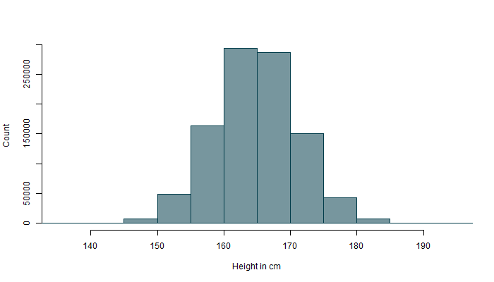
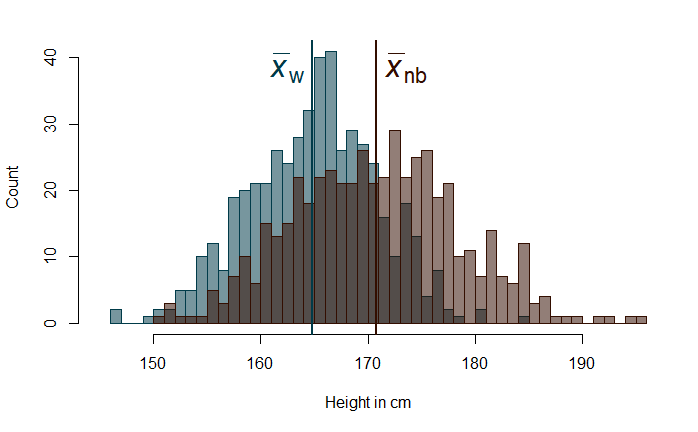

```{r setup, include=FALSE}
knitr::opts_chunk$set(echo = FALSE, global.par = TRUE, warning=FALSE, message=FALSE, fig.height = 3, dpi = 300)
options(scipen=999)
set.seed(420)

knitr::opts_hooks$set(
  panel = function(options) {
    if (isTRUE(options$panel)) {
      options$eval = TRUE
      options$echo = TRUE
      options
    }
  }
)

knitr::knit_hooks$set(
  panel = function(before, options, envir){
    if (isTRUE(options$panel)) {
      options$echo=TRUE
      if (before) {
        '.codePanel['
      } else ']'
    }
  }
)

library(tidyverse)

bg_col <- "#fdfdfd"
theme_col <- "#003568"
default_col <- '#464b61'
second_col <- "#3d755b"

par(mar = c(5, 2, 2, 1) + 0.1,
    bg = bg_col)

source("../../plot_theme.R")

xaringanExtra::use_panelset()
```


```{js}
<!-- message to display at the bottom of slides when ?live=true -->
slideMessage = "<span>Ask questions at </span><a href = 'pollev.com/milanvalasek890'>pollev.com/milanvalasek890</a>"
plotsToPanels()
live()
```


```{r}
library(metathis)
meta() %>% 
  meta_description("In this lecture we will start thinking about variables in terms of distributions. We will see how we can perform simple arithmetic operations, such as addition and multiplication on entire variables to perform linear transformations. We'll discuss one transformation in particular, the z-transformation, and see how it's used to standardise the values of a variable. Finally, we will talk about how we can use simple maths to compare groups on a measured variable of interest.") %>%
  meta_tag("week" = "08") %>%
  meta_tag("content_type" = "slides")
```

## Overview

[**The shape of things**](#shape)
- Histograms
- The normal curve

[**Transformations**](#transform)
- Functions
- The _z_-transform

[**Comparing things with maths**](#compare)
- Comparing groups
- Comparing scores across groups
- Comparing scores across variables

---

name: shape

## The shape of things

For the purpose of this lecture, we will only be talking about _continuous_ variables!

- The vast majority of the measured heights are roughly in the 155-175 centimetre range
- The distribution is roughly symmetrical around its mean and has the shape of a bell characteristic of a _normal distribution_
  - The shape isn't perfectly smooth in a finite sample

```{r hist, fig.height=4, out.width="60%", panel=TRUE}
# data for plots
df_plot <- tibble(x = rnorm(500, 164.8, 6.2),
                  y = rnorm(500, 171.1, 7.9))
df_plot %>%
  ggplot(aes(x)) +
  geom_histogram(colour = "#003568", fill = "#00356888") +
  labs(x = "Heigh in cm", y = "Count")
```
.small[_Fig 1_ Distribution of height on a sample of 500 women. This is not real data.]

---

## Histograms

- Height is a continuous variable so no two people are the **exact same** height
- To plot the variable on a histogram, we have to assort the values into _bins_.
  - Each bar on the histogram represents the number of people whose height falls within a given range

```{r bad-hist, out.width="90%", panel=TRUE}
# create plot and store in object p1
p1 <- df_plot %>%
  ggplot(aes(x)) +
  geom_histogram(colour = "#3d755b", fill = "#3d755b88", bins = 5) +
  labs(x = "Heigh in cm", y = "Count") +
  ggtitle("A")
p2 <- df_plot %>%
  ggplot(aes(x)) +
  geom_histogram(colour = "#003568", fill = "#00356888", bins = 200) +
  labs(x = "Heigh in cm", y = "") +
  ggtitle("B")
library(patchwork)
# put plots side by side
p1 + p2 # requires patchwork
```

.small[_Fig 2_ Histograms with (A) too few bars to see the distribution in enough detail and (B) too many bars.]

---

## Ideal curves

- If we could collect an infinite number of observations, we could make the bins _infinitely_ narrow

- This would give us an idealised shape of the normal distribution: **the normal curve**.

- **Because we will mostly be talking about continuous normal variables, we can visualise them as this kind of curve**

```{r, layout="l-body-outset", out.width="70%"}

```
.center[.small[_Fig 3_ From histogram to an idealised shape.]]

---

## The normal distribution

- We can describe key properties of a variable using measures of _central tendency_ and _spread_

- In a normally distributed variable, **the majority** (about 68%) of all the values are concentrated **within &pm;1 standard deviation to either side of the mean**

- The larger the standard deviation, the more spread out the variable is

---

## The normal distribution

<iframe class="app" src="https://and.netlify.app/viz/norm_dist.html" height=550px scale=70%></iframe>

---

## The normal distribution

- Mean and standard deviation are **independent of one another**

- Neither shifting the mean, not changing the standard deviation of a distribution doesn't change its _fundamental shape_

  - **Relative position of the individual points on the line with respect to each other does not change**!
  
  - It is still true that about 68% of values are within &pm;1 standard deviation from the mean

---

## Same shape, different scale

<br>

```{r scale, fig.height=4, fig.width=10, panel=TRUE}
p1 <- df_plot %>%
  ggplot(aes(x/100)) +
  geom_histogram(colour = "#3d755b", fill = "#3d755b88") +
  labs(x = "Heigh in m", y = "") +
  ggtitle("B")
p2 <- df_plot %>%
  ggplot(aes(x)) +
  geom_histogram(colour = "#003568", fill = "#00356888") +
  labs(x = "Heigh in cm", y = "Count") +
  ggtitle("A")
p2 + p1
```

.small[_Fig 4_ Histograms of participants heights measured in (A) centimetres and (B) metres.]

---

name: transform

## Transformations

(From now on we'll be talking about **sample mean**, $\bar{x}$, and **sample standard deviation**, $SD$)

- How do we change $\bar{x}$ and $SD$ without changing the shape of the variable?

  - Only changing the values of a selection of observations will alter the shape of the distribution - _not good_!
  
- We can decide to switch our measurement unit of height from centimetres to feet and inches but we have to do it **consistently for all observations**

- This _preserves the relationships between individual observations_!

---

## Functions

Let's play a game!

---

## Functions

- **CONGRATS!** You have just discovered the  _identity_ function: $f(x) = x$

- A transformation is just a mathematical function that takes an input and returns an output (just like a function in `R`)

- For example the _second power_: 2<sup>2</sup> = 4, 3<sup>2</sup> = 9, 4<sup>2</sup> = 16 and so on

- We can think of this operation as a function that takes an input, $x$ and returns the output $x^2$.

$$f(x)=x^2$$

---

## Graph of _f(x)_

<iframe id="transform" class="app" src="https://and.netlify.app/viz/transform.html" height=570px></iframe>

---

## Centring and scaling

- Addition **shifts** the values of $x$ up and down along the y-axis, **while keeping the distances between points unchanged**

- Multiplication, **spreads or "squishes"** the values of $x$ along the y-axis

- When addition and multiplication are applied to variables, they are referred to as **centring** and **scaling**, respectively.

---

## Centring

.small[
- Centring is the **subtraction** of a fixed value from each observation of a variable

- You can technically centre a variable by subtracting _any_ value from it but the most frequently used method is **mean-centring**:

$$f(x) = x - \bar{x}$$

- Mean-centring **does not alter the shape of the variable, nor does it change the scale at which the variable is measured**
]

```{r height-centred, fig.height=3.3, fig.width=10, out.width="90%", panel=TRUE}
p1 <- df_plot %>%
  ggplot(aes(scale(x, scale = FALSE))) +
  geom_histogram(colour = "#3d755b", fill = "#3d755b88") +
  labs(x = "Deviation from mean height in cm", y = "") +
  ggtitle("B")
p2 <- df_plot %>%
  ggplot(aes(x)) +
  geom_histogram(colour = "#003568", fill = "#00356888") +
  labs(x = "Heigh in cm", y = "Count") +
  ggtitle("A")
p2 + p1
```
.small[_Fig 5_ Histograms of participants heights: (A) raw data (B) mean-centred.]

---

## Scaling

.small[
- Scaling is the **division** of each observation of a variable by a fixed value
- This has the effect of stretching or squishing the entire variable _in the direction of the x-axis_
- The most frequent method of scaling variables is by their **standard deviation**:

$$f(x) = \frac{x}{SD(x)}$$
]

```{r height-scaled, fig.height=3.5, fig.width=10, panel=TRUE}
p1 <- df_plot %>%
  ggplot(aes(x / sd(x))) +
  geom_histogram(colour = "#3d755b", fill = "#3d755b88") +
  labs(x = "Height in ???", y = "") +
  ggtitle("B")
p2 <- df_plot %>%
  ggplot(aes(x)) +
  geom_histogram(colour = "#003568", fill = "#00356888") +
  labs(x = "Heigh in cm", y = "Count") +
  ggtitle("A")
p2 + p1
```
.small[_Fig 6_ Histograms of participants heights: (A) raw data (B) scaled by *SD*.]


---

## The _z_-transform

<iframe id="z-transform-app" class="app" src="https://and.netlify.app/viz/standard.html" height=570px></iframe>

---

## The _z_-transform

.small[
- First mean-centring and then scaling a variable by its _SD_
- AKA, **standardisation**.


$$z(x) = \frac{x - \bar{x}}{SD(x)}$$
- Shape of the variable remains intact and the relative differences between any two values in the variable are preserved
  - **Standardisation is a linear transformation** (like addition and multiplication)
]

```{r height-z, fig.height=3.3, fig.width=10, out.width="90%", panel=TRUE}
p1 <- df_plot %>%
  ggplot(aes(scale(x))) +
  geom_histogram(colour = "#3d755b", fill = "#3d755b88") +
  labs(x = "*z*-score", y = "") + # R markdown syntax - *z*
  ggtitle("B") +
  # enable use of Rmd in labels
  theme(axis.title.x = ggtext::element_markdown())
p2 <- df_plot %>%
  ggplot(aes(x)) +
  geom_histogram(colour = "#003568", fill = "#00356888") +
  labs(x = "Heigh in cm", y = "Count") +
  ggtitle("A")
p2 + p1
```

.small[_Fig 7_ Histograms of participants heights: (A) raw data (B) _z_-transformed data.]

---

### _z_-scores

```{r}
x <- df_plot$x
y <- df_plot$y
```

- Values of a standardised/_z_-transformed variables

- **Distance from the mean in units of standard deviation**.

- This interpretation is **independent of the actual value of _SD_** in the original variable!

- A person with a _z_-score of 1 will be _one_ SD _taller than average_: `r round(mean(x), 2)` + (1 &times; `r round(sd(x), 2)`) = `r round(mean(x) + sd(x), 2)` cm.

- Someone with a _z_-score of -0.8 will be 0.8 _SD_ **shorter** than the average person in the sample: `r round(mean(x), 2)` + (&minus;0.8 &times; `r round(sd(x), 2)`) = `r round(mean(x) - .8 * sd(x), 2)` cm.

---

exclude: ![:live]

.pollEv[
<iframe src="https://embed.polleverywhere.com/discourses/IXL29dEI4tgTYG0zH1Sef?controls=none&short_poll=true" width="800px" height="600px"></iframe>
]

---

name: compare

## Comparing groups

We can compare groups by asking how different are the groups _on average_.

```{r, out.width="65%"}

```
.smol[_Fig 8_ Comparing distributions of heights in a sample of women (green) and non-binary people (brown). Data are not real.]

$$\begin{aligned}diff_\text{height}&= \bar{x}_\text{w} - \bar{x}_\text{nb}\\&=`r round(mean(x), 2)` - `r round(mean(y), 2)`\\&=`r round(mean(x) - mean(y), 2)`\end{aligned}$$

---

## Comparing across groups

Nyari is a 172 cm tall woman; Karim is a 179 cm tall non-binary person

What if we wanted to know how their heights compare **relative** to their groups/populations?

We can use _z_-scores: $z(x) = \frac{x - \bar{x}}{SD(x)}$

```{r tab-1}
tibble(grp = c("Women", "Non-binary"), mean = c(mean(x), mean(y)), sd = c(sd(x), sd(y))) %>%
    kableExtra::kable(digits = 2, col.names = c("", "\\(\\bar{x}\\)", "\\(SD\\)"), align = "lcc") %>% kableExtra::kable_styling()
```

```{r, echo = T}
(172 - 164.98) / 6 # Nyari
(179 - 170.74) / 7.74 # Karim
```


---

## Comparing across variables

- We could use the same principle to compare values on **of variables measured on any scale**

- Nyari earns £38,400 per year here in the UK
- She just got a job offer in Germany with an agreed salary of EUR 4,270 per month.
- Is she going to be relatively better off if she takes the job?

- Average _annual_ wage in the UK is £37,428 (_SD_ = 4,266)
- Average _monthly_ wage in Germany is EUR 3,880 (_SD_ = 351.6)

```{r, echo=TRUE}
(38400 - 37428) / 4266 # Nyari's UK salary z-score
(4270 - 3880) / 351.6  # Nyari's German salary z-score
```

---

exclude: ![:live]

.pollEv[
<iframe src="https://embed.polleverywhere.com/discourses/IXL29dEI4tgTYG0zH1Sef?controls=none&short_poll=true" width="800px" height="600px"></iframe>
]

---

## Recap

- We often think about the distributions of variables in terms of the normal curve

- Mean and _SD_ reflect the position and spread of this curve

- **Transformations** are mathematical functions we can use to manipulate variables

- Some transformations, such as centring or scaling, don't change the relative distances between individual values of a variable.

  - These are **linear** transformations

- Others, such as _exponentiation_ (_e.g._, x<sup>2</sup>) do change the proportions of the transformed variables

  - These are **non-linear** transformations

---

## Recap

- The _z_-transform, AKA **standardisation**, is a two step transformation consisting of _first_ mean-centring the variable and then scaling it by its _SD_

- It converts the values of any variable into units of _how far the value is from the mean of the whole variable in terms of numbers of standard deviations_

- We can compare group averages by _subtracting the means of the groups_

- We can use _z_-scores to compare values of variables **measured on different scales or in different units**

---

class: last-slide weekend
background-image: url("../../end.jpg")
background-size: cover
