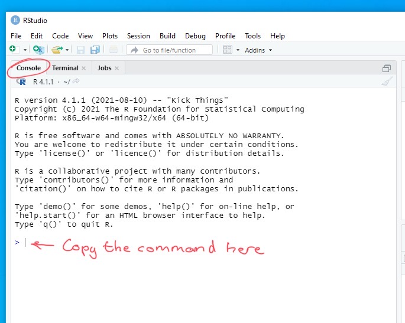

```{r xaringan-themer, include=FALSE, warning=FALSE}
library(xaringanthemer)

style_duo_accent(
 primary_color = "#003b49",
  secondary_color = "#1d4289",
  header_font_google = google_font("Cabin"),
  text_font_google   = google_font("Noto Sans", "300", "300i"),
  code_font_google   = google_font("Fira Mono"),
  colors = c(
  red = "#d3003f",
  purple = "#3e2f5b",
  orange = "#ff8811",
  green = "#136f63",
  white = "#FFFFFF",
  blue = "#1d4289"
 )
)

xaringanthemer::style_extra_css(
  list(".title-slide" = list("background-image" =
 paste0(
  "url(https://upload.wikimedia.org/wikipedia/commons/thumb/3/34/",
  "University_of_Sussex_Logo.svg/480px-University_of_Sussex_Logo.svg.png)"),
  "background-position" =  "95% 95%",
  "background-size" = "180px",
  "border" = "10px solid #013035",
  "background-color" = "#FFFFFF"
  ),
 ".title-slide h1" = list(
  "padding-top" = "0px",
  "font-size" = "60px",
  "text-align" = "left",
  "padding-bottom" = "18px",
  "margin-bottom" = "18px",
  "margin-top" = "0px",
  "color" = "#003b49"
 ),
 ".title-slide h2" = list(
   "font-size" = "40px",
   "text-align" = "left",
   "padding-top" = "10px",
   "margin-top" = "0px",
   "color" = "#003b49"
 ),
 ".title-slide h3" = list(
   "font-size" = "30px",
   "color" = "#26272A",
   "text-align" = "left",
   "text-shadow" = "none",
   "padding" = "0px",
   "margin" = "0px",
   "line-height" = "1")
 ),
)


```

```{r, echo=FALSE}
library(metathis)
meta() %>%
  meta_description("Getting started...") %>%
  meta_tag("week" = "01") %>%
  meta_tag("content_type" = "practical-slides")
```

# Plan for today

**Getting set up**

- What is `R` and `RStudio`?

- Installing all the software we'll need

**Study design**

- A brain-storming session in groups

**Preview for next week**

- Introduction to next week's **tutorial**/**homework**


---

<!--intro start -->

# But first, introductions...

.pull-left[
**Dr Lincoln Colling** l.colling@sussex.ac.uk


]

.pull-right[

- Originally from South Africa, but did my undergrad and masters at the University of Auckland, New Zealand (the home of the **R** statistics program!)

- Did my PhD in Australia in Neuroscience, Philosophy, and Experimental Psychology

- Since finishing my PhD, I've held research positions in Australia, The Netherlands, Hungary, and Cambridge in the UK.

- I've just started by third year at Sussex

]


---

# But first, introductions...

.pull-left[
**Dr Danielle Evans** danielle.evans@sussex.ac.uk


]


.pull-right[

- Did my BSc in Forensic Psychology at the University of Portsmouth and my MSc in Psychological Research Methods at the University of Essex

- Completed my PhD in Psychology here at Sussex investigating all things 'mathsy'

- Following my PhD, I've spent most of my time teaching **R** & all the super cool things you can do with it

- I've been at Sussex for a little while now, but this is my second year teaching here 

]

<!-- intro end -->
---

# Introducing R and R RStudio

.pull-left[]

???

**R** is a free software environment for doing statistical computing and
graphics

--

.pull-right[]


???

But the interface for **R** isn't very user friendly for novices! It can be
intimidating to use, ugly, and it is difficult to access a lot of the
information that you might need.

---

# Introducing R and R RStudio


.pull-left[]

???

Instead of using **R** by itself, we use a second bit of software called **R Studio**.

--

.pull-right[]

???

 **R Studio** makes using a **R** a little more user friendly. **R Studio** has
 a lot of extra built in functionality. This includes an editor for writing
 your code, a graphics window for viewing your graphs and figures, and a data
 viewer for viewing any data that you might be working with. You can use **R**
 without **RStudio**, but because **RStudio** interfaces with **R**, to use
 **RStudio** you must first install **R**.

 We'll get around to orientating ourselves in **RStudio** soon but first you're
 probably wondering why you're learning **R** in the first place

---

<!-- starting R start -->

# Getting set up

- Using **R Studio** on campus is a little different to how you'd use it on
  your personal computer 

- There's a special way of starting it, and there's a special place where you
  need to store your files

- For the smoothest most hassle-free experience you need to make sure you follow
the instructions **carefully**

<br />

.center[.blue[*And remember, the computers in these labs haven't been used for over a year!*

*So things might be a bit slow to get going today*]]


???

Patience will be one of the great *transferable skills* you learn from this
course!

---

## Saving and accessing your files

When you're using the lab computers you save all your work on **OneDrive**

.pull-left[]

.pull-right[

- You first need to login to your Sussex **OneDrive** my clicking on the OneDrive
  icon on the task bar and entering your login details 

- You can also download the **OneDrive** app onto your home computer so that you
  can access your work from off campus
]

<br />

Whenever you come into to use the lab computers you should always make sure
you're sure that you're signed into **OneDrive** before doing anything else.

After if you've signed in once then you *should* be automatically signed in but
you should always double check

---

## Starting R Studio on Campus

.center[</img>]

Double click the **software hub** icon to get started

---

**Starting R Studio on Campus**

.center[</img>]

Find the RStudio icon  and click **Launch**

If the launch icon is greyed out and says .blue[Authorisation needed] then just
wait a sec or click the refresh icon  

???

Give the students a chance to start RStudio on their computers

---

## Installing the packages we need

The last step to get everything set up for the course is to *install the
"packages"* we need... 


We'll learn more about what packages are in the coming weeks, but for now you
can just following the instructions:


---

## Installing the packages we need

<small> Copy and paste the text below into **RStudio** in the "console" window:
<pre><code>
source("https://files.mindsci.net/install.r")
</pre></code>
</small>

.center[]

<small>You can also find the comment on the Week 1 Canvas page</small>

---

<!-- starting R end -->
# Practical task

The aim of the practical task today is to get us .blue[*thinking*]
.blue[*about*] .blue[*science*] so we're going to do a little brain-storming
session
