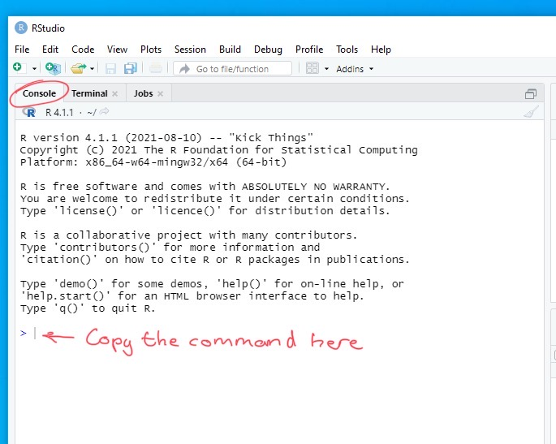
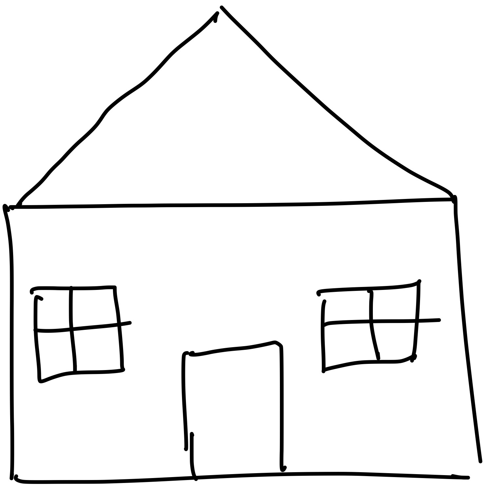
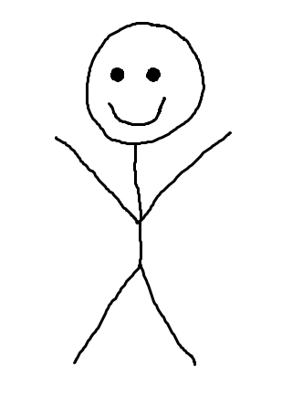

```{r xaringan-themer, include=FALSE, warning=FALSE}
library(xaringanthemer)

style_duo_accent(
 primary_color = "#003b49",
  secondary_color = "#1d4289",
  header_font_google = google_font("Cabin"),
  text_font_google   = google_font("Noto Sans", "300", "300i"),
  code_font_google   = google_font("Fira Mono"),
  colors = c(
  red = "#d3003f",
  purple = "#3e2f5b",
  orange = "#ff8811",
  green = "#136f63",
  white = "#FFFFFF",
  blue = "#1d4289"
 )
)

xaringanthemer::style_extra_css(
  list(".title-slide" = list("background-image" =
 paste0(
  "url(https://upload.wikimedia.org/wikipedia/commons/thumb/3/34/",
  "University_of_Sussex_Logo.svg/480px-University_of_Sussex_Logo.svg.png)"),
  "background-position" =  "95% 95%",
  "background-size" = "180px",
  "border" = "10px solid #013035",
  "background-color" = "#FFFFFF"
  ),
 ".title-slide h1" = list(
  "padding-top" = "0px",
  "font-size" = "60px",
  "text-align" = "left",
  "padding-bottom" = "18px",
  "margin-bottom" = "18px",
  "margin-top" = "0px",
  "color" = "#003b49"
 ),
 ".title-slide h2" = list(
   "font-size" = "40px",
   "text-align" = "left",
   "padding-top" = "10px",
   "margin-top" = "0px",
   "color" = "#003b49"
 ),
 ".title-slide h3" = list(
   "font-size" = "30px",
   "color" = "#26272A",
   "text-align" = "left",
   "text-shadow" = "none",
   "padding" = "0px",
   "margin" = "0px",
   "line-height" = "1")
 ),
)

xaringanExtra::use_editable(expires = 1)
```

```{r, echo=FALSE}
library(metathis)
meta() %>%
  meta_description("Introduction to computing and algorithmic thinking...") %>%
  meta_tag("week" = "02") %>%
  meta_tag("content_type" = "slides")
```

# Plan for today

- Short Q&A

**Getting set up**

- Installing all the software we'll need

**Algorithmic thinking**

- Practical Task on algorithmic thinking

---

exclude: ![:online]

# Getting set up

- Using **R Studio** on campus is a little different to how you'd use it on
  your personal computer 

- There's a special way of starting it, and there's a special place where you
  need to store your files

- For the smoothest most hassle-free experience you need to make sure you follow
the instructions **carefully**

<br />

.center[.blue[*And remember, the computers in these labs haven't been used for over a year!*

*So things might be a bit slow to get going today*]]

???

Patience will be one of the great *transferable skills* you learn from this
course!

---

exclude: ![:online]

## Saving and accessing your files

When you're using the lab computers you save all your work on **OneDrive**

.pull-left[]

.pull-right[

- You first need to login to your Sussex **OneDrive** my clicking on the OneDrive
  icon on the task bar and entering your login details 

- You can also download the **OneDrive** app onto your home computer so that you
  can access your work from off campus
]

<br />

Whenever you come into to use the lab computers you should always make sure
you're sure that you're signed into **OneDrive** before doing anything else.

After if you've signed in once then you *should* be automatically signed in but
you should always double check

---

exclude: ![:online]

## Starting R Studio on Campus

.center[</img>]

Double click the **software hub** icon to get started

---

exclude: ![:online]

**Starting R Studio on Campus**

.center[</img>]

Find the RStudio icon  and click **Launch**

If the launch icon is greyed out and says .blue[Authorisation needed] then just
wait a sec or click the refresh icon  

???

Give the students a chance to start RStudio on their computers

---

exclude: ![:online]

## Installing the packages we need

The last step to get everything set up for the course is to *install the
"packages"* we need... 


We'll learn more about what packages are in the coming weeks, but for now you
can just following the instructions:


---

exclude: ![:online]

## Installing the packages we need

<small> Copy and paste the text below into **RStudio** in the "console" window:
<pre><code>
source("https://files.mindsci.net/install.r")
</pre></code>
</small>

.center[]

<small>You can also find the command on the Week 2 Canvas page</small>


---


# Practical task

Computers are **dumb** but people are **smart**

- This means that we need to be **super explicit** when we give instructions to
computers 

- Things that might seem easy **need** to be broken down into **simple steps**

We don't usually do this when we give instructions to **other people** because
**people** have common sense, they can understand context, they can *infer*
things when information/instructions are missing

**In todays's practical task** we're going to see how this works, so we can

1. Understand the nature of the problem itself

2. Get practice solving it!

---

## Practical task instructions

For the practical task we're going to split into **groups of 5** 

1. One person from the group is going to .green[*play the role of the computer*]

2. And the other group members will .blue[*play the role the programmers*]

The task will be for the .blue[*programmers*] to give instructions to the
.green[*computer*] on how to draw a simple picture

<br />

.center[I'll get the .green[*computers*] to close their eyes now so that they
don't see the task]

---
exclude: ![:hidden]

## The task

The task will be to draw a simple house... something along the lines of this:

.center[]


---

exclude: ![:hidden]

## The task 2.0

This time, the task will be to draw this stickman:

.center[]

**Keep in mind how clear & specific you need to be from the last task!**

---

# Attendance 

<br>

.middle[
.center[

## Attendance pin.can-edit[: ]


<br>
<br>
<br>
<br>
<br>
<br>
<br>

**Go to www.sussex.ac.uk/mobile OR use the SussexMobile app to input the pin**

]]

---

# Tasks for next week

- Take the practice quiz on [Canvas](). This is based on the content of
  tutorial 1

- Complete the second PAAS tutorial on
  [Canvas](https://paas.netlify.app/tutorials/02/). This will form the basis of
  Quiz 2, which you'll do next week

