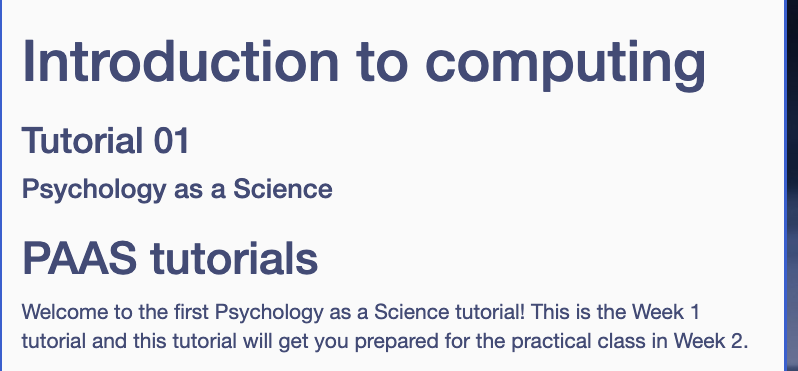
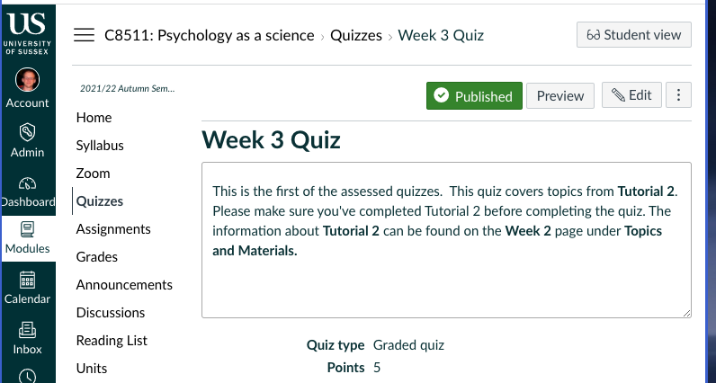
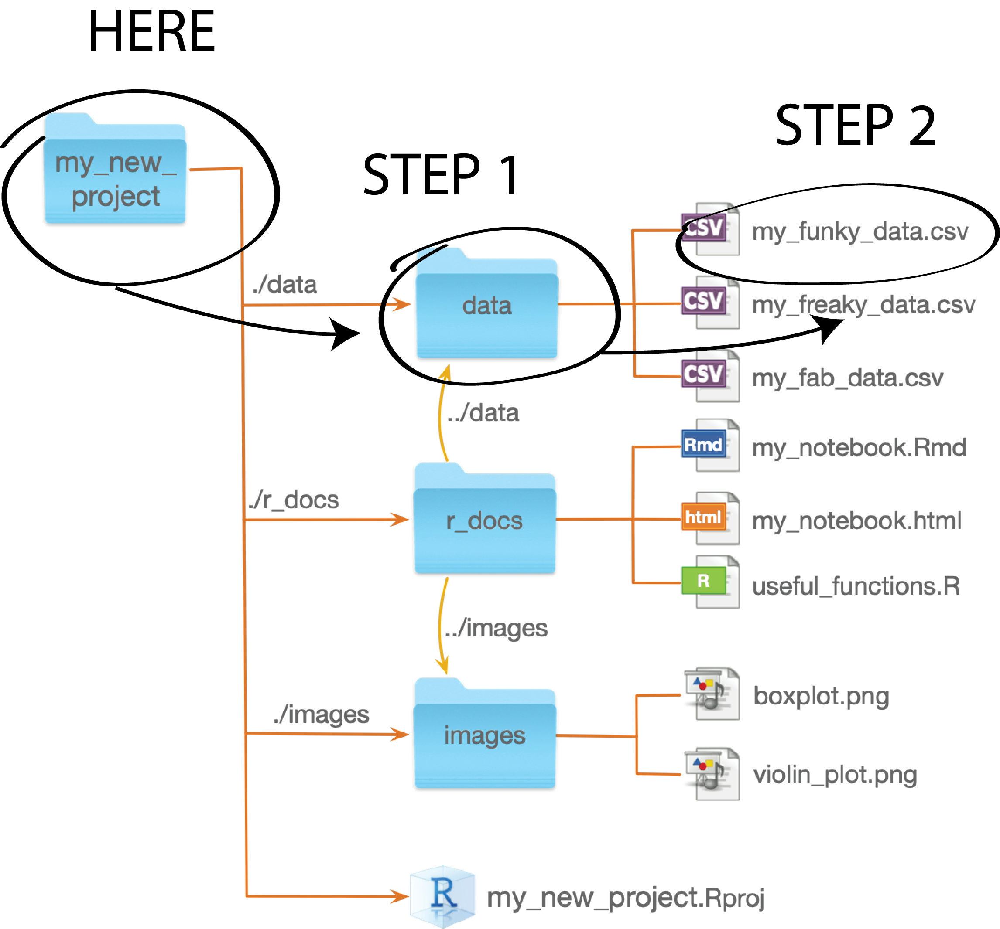

```{r xaringan-themer, include=FALSE, warning=FALSE}
library(xaringanthemer)

style_duo_accent(
  primary_color = "#003b49",
  secondary_color = "#1d4289",
  header_font_google = google_font("Cabin"),
  text_font_google = google_font("Noto Sans", "300", "300i"),
  code_font_google = google_font("Fira Mono"),
  colors = c(
    red = "#d3003f",
    purple = "#3e2f5b",
    orange = "#ff8811",
    green = "green",
    white = "#FFFFFF",
    blue = "blue"
  )
)

xaringanthemer::style_extra_css(
  list(
    ".title-slide" = list(
      "background-image" =
        paste0(
          "url(https://upload.wikimedia.org/wikipedia/commons/thumb/3/34/",
          "University_of_Sussex_Logo.svg/",
          "480px-University_of_Sussex_Logo.svg.png)"
        ),
      "background-position" = "95% 95%",
      "background-size" = "180px",
      "border" = "10px solid #013035",
      "background-color" = "#FFFFFF"
    ),
    ".title-slide h1" = list(
      "padding-top" = "0px",
      "font-size" = "60px",
      "text-align" = "left",
      "padding-bottom" = "18px",
      "margin-bottom" = "18px",
      "margin-top" = "0px",
      "color" = "#003b49"
    ),
    ".title-slide h2" = list(
      "font-size" = "40px",
      "text-align" = "left",
      "padding-top" = "10px",
      "margin-top" = "0px",
      "color" = "#003b49"
    ),
    ".title-slide h3" = list(
      "font-size" = "30px",
      "color" = "#26272A",
      "text-align" = "left",
      "text-shadow" = "none",
      "padding" = "0px",
      "margin" = "0px",
      "line-height" = "1"
    ),
    ".big" = list("font-size" = "40px")
  )
)


xaringanExtra::use_editable(expires = 1)
```

```{r, echo=FALSE}
library(metathis)
meta() %>%
  meta_description("Working with R Project files") %>%
  meta_tag("week" = "03") %>%
  meta_tag("content_type" = "slides")
```


# Introduction

The practical today is focused on **two** main concepts 

1. Quick Q&A

2. Recapping the Quiz/Tutorial/Practical Structure

1. Files, folders, and paths!

2. **R Project** files

In short, it is all about how to keep things **organised** so that you, and
your computer, can find the files you need to find!

---

## Recapping the Quiz/Tutorial/Practical

Apart from Lectures the other two main tasks you need to do each week are the
**Tutorial** and **Practial** classes


**Tutorials**

- These are activities you do at home **before** the practical class.

- They're linked on the weekly CANVAS pages under the heading **Tutorial** (or
from Week 4 they've been accessed from RStudio under the **Tutorials** pane)

- The **Quizzes** are based on the **Tutorial** from the **previous week**.

  + i.e., The **Week 2** tutorial is used to get the content for the **Week 3**
    quiz 

- You have the week leading up to the **Week 3** practial to do the **Quiz**
  because the **quizzes** are there to make sure you do the tutorial **before**
  coming to class 

 <small>You also have a few days after, but this is so I can remind you because
 people forget when they get busy. This isn't the window in which you should do
 the quiz.</small>

---

## Recapping the Quiz/Tutorial/Practical

**Tutorials**

Each tutorial starts off by telling you which practical class it is designed as
prep for



---

## Recapping the Quiz/Tutorial/Practical

**Quizzes**

Each **quiz** starts off by telling you which tutorial it is based on



---

## Recapping the Quiz/Tutorial/Practical

*Why not give a week after the practicals to do the quiz?*

Because would mean a single topic would be spread out over three weeks, and you'd
be working on multiple topics each week!

**Example**

Week 1: 

- Tutorial on **Intoduction to computing**
Week 2:

- Pratical on **Introduction to computing**
- Tutorial on **Files, paths, and projects**

Week 3: 
- Quiz on **Introduction to computing** 
- Practical on **Files, paths, and project**
- Tutorial on **Introduction to R Markdown**

---

## Recapping the Quiz/Tutorial/Practical

The current stucture means you only have to focus on one thing at a time.

**Example**

Week 3

*In the days leading up to the practial*
- Do tutorial for Week 3 prep (labelled Week 2 tutorial)

- Do quiz on tutorial material

- Do pratical exapanding on topic covered in tutorial 

*In the days after the pratical*

- Do tutorial that preps you for the following weeks practical / quiz


---

## Recapping the Quiz/Tutorial/Practical

But the **the most important reason** why this stucture is used is:

- Having the weeek **leading** up to the pratical being the week in which you
can do the quiz means that you have to do the tutorial **before** the practical

If we gave you the week after then you would only need to do the tutorial after
the pratical


- The **tutorial** is preparation and helps you get the **most** out of the
pratical class

- The **quiz** is your motivation to actually do the **tutorial**

Think of it as a *quiz to make sure that you've "done the reading" before coming to class*

---


## Files and folders

When we have **files** on our computer we usually just think about **file names**

But **file names** actually come in two parts. The .blue[file name] and the .green[file extensions]


<div style="font-size:1.5em;line-height:2em"><code style="color:blue">my_script</code><code style="color:green">.R</code></div>

<div style="font-size:1.5em;line-height:2em"><code style="color:blue">my_document</code><code style="color:green">.Rmd</code></div>

<div style="font-size:1.5em;line-height:2em"><code style="color:blue">my_project</code><code style="color:green">.Rproj</code></div>

<div style="font-size:1.5em;line-height:2em"><code style="color:blue">my_data</code><code style="color:green">.csv</code></div>

**.green[file extensions]** are very important because they tell you what **type** of file it is 

---

## Common file extensions

There are a few common file extensions you'll come across when working in `R`

- `.R` for R Script files that hold code/instructions for `R` to run (although
  we won't deal with them much this year)

- `.Rmd` for R Markdown files that hold code and text (e.g., documents we're
  writing)

- `.Rproj` for R Project files

- `.csv` for data files (<u>C</u>ommas <u>S</u>eperated <u>V</u>alues)

---

### Why is it important to **recognise** file extensions?

1. So you don't save over things you're not meant to 
  - e.g., once a file with a `.Rproj` has been created, you never touch that file again

2. So you can open files in the correct way

  - Sometimes when you download a file from the internet your web browser might
    add something to the extension (often `.txt`)

  - If you open what you **think** is an R Markdown file (`.Rmd`) but your web
    browser has remained it to `.Rmd.txt` then it'll look weird in **R Studio**
  
3. We'll try get into the habit of organising files by **type** so we need to
   recognise the type!

---

## Folders and paths 

.pull-left[</img>]
.pull-right[Each file on your computer has a **location**

The **path** specifies the location]

<br>
**two examples of file paths**  (absolute paths)

<span style="font-size:.95em">`c:/Users/Lincoln/My Documents/my_new_project/my_new_project.Rproj`</span>

<span style="font-size:.95em">`/Volumes/HD/Users/lincoln/Documents/my_new_project/my_new_project.Rproj`</span>

---

### Relative paths 

Paths are **long** and **confusing** and _**full**_ paths (aka **absolute** paths) are specific to **our
computer**

So instead, we're going to learn how to specify the location of files
**relative ** to a specific place—**here**

.pull-left[]
.pull-right[Our **R Project file** (the one with the `.Rproj` extension) will always be our **here**

Writing out a **relative path** is now just about writing out the **steps from
here** with a `/` between each step ]

---

### Relative paths: an example

.pull-left[]
.pull-right[

**Step 1**  
Go from **here** to folder called **data**

write step 1 as: `data`

**Step 2**  
Go from **data** folder to file called **my_funky_data.csv**

write step 2 as: `my_funky_data.csv`
]

<br>
Put **step 1** and **step 2** together and separate them with `/`

write the relative path as: `data/my_funky_data.csv`

---

### Why the jargon?

- In Psychology as a Science, we'll only ever work with **relative paths**. 

- Relative paths are just the set of steps to get to a file from a
*pre-specified* location (the folder holder our R Project file)

.center[So why the jargon of **relative paths** and **absolute paths**]


In short, because you might hear these terms in other courses or other contexts
so having a reference you can turn back to for help understanding the jargon 
might be useful!

---

## Keeping things organised 

We'll always adopt a **consistent** folder **structure** in our project. This will help us stay organised and it'll make it easier for us to find our files. 

.pull-left[
**Basic folder structure**
```
.
├── data
├── r_docs
├── scripts
└── week_03.RProj
```
]
.pull-right[
The basic folder structure will include:
- a `data` folder for our data
- a `r_docs` folder for our documents
- a `scripts` folder for our `R` scripts (we won't really be using this folder this year, but it's good to get in the habit)
]

<br>
After you create your **R Project** you can create your **folder structure** through the files pane.

---

## Getting to know the files pane

.pull-left[

Clicking the **New Folder** button allows you to create new folders
]

--

.pull-right[

Once the folders have been created you'll see them in the **Files pane**]

---

## Getting to know the files pane


You'll be able to use your **Files** pane to **find files**, to **rename** files, and to **open** files...

---

## Plan for today 

_What you should already have done_: Created an **R Studio** project file
according to the instructions in the **tutorial**

- Opening your project file

- Creating/checking you have the correct folder structure 

- Exercises on **writing out file paths**

- Saving files from the internet, checking them and putting them in the correct
  place, and checking that they have correct file extension

- Closing everything back down again

We'll be working through the worksheet linked on the **Week 3** page.

---

# Attendance 

<br>

.middle[
.center[

## Attendance pin.can-edit[: ]


<br>
<br>
<br>
<br>
<br>
<br>
<br>

**Go to www.sussex.ac.uk/mobile OR use the SussexMobile app to input the pin**

]]

---


