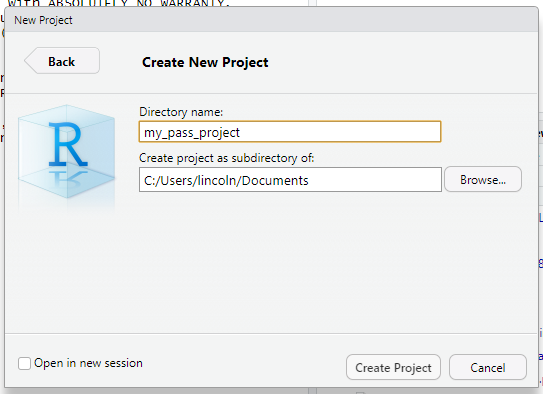
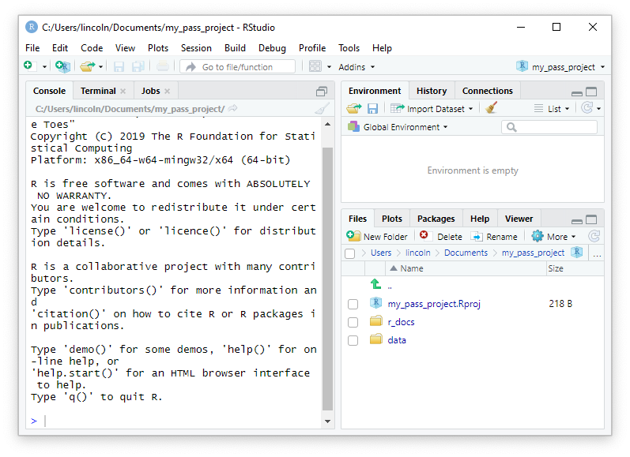

```{r setup, include=FALSE} 
knitr::opts_chunk$set(echo = TRUE)
require(tidyverse)
require(metathis)

```  


```{r, echo=FALSE}
meta() %>%
  meta_description("In this practical we’ll learn about how to work with R Project files, how to organise our files, and how to specify file paths") %>%
  meta_tag("week" = "03") %>%
  meta_tag("content_type" = "worksheet")
```

 
```{css echo=FALSE}
.pathquestion {
            outline: none;
            padding-bottom: 5px;
          line-height: 1.5em;
          height: 3em;
          
        }
        
.pathquestion input {
  font-size: 1.2em;
  outline: 0;
  height: 2em;
  border-width: 0 0 2px;
  border-color: grey;
  width: 25em;
  font-family: 'Fira Mono', monospace;
}

.main-container {line-height: 180%}

.pathquestion {
            outline: none;
            padding-bottom: 5px;
          line-height: 1.5em;
          height: 3em;

        }

.pathquestion input {
  font-size: 1.2em;
  outline: 0;
  height: 2em;
  border-width: 0 0 2px;
  border-color: grey;
  width: 25em;
  font-family: 'Fira Mono', monospace;
        }


kbd {
    padding: 2px 4px;
    font-size: 90%;
    color: rgb(var(--font-col));
	background-color: #EFEFEF;
    border-radius: 3px;
    box-shadow: none;
    border: solid 1px;
}

#header {
  flex: 0 0 50px;/*or just height:50px;*/
  margin-top: 50px;
  line-height:2em;
  margin-top: 0em;
  background-color:#F8F8F8;
  width:100%;
  margin-bottom:50px;
  position:fixed;
  left:0;
  right:0;
  top:0;
  z-index:1030
}

#header h1 {
      padding-left: 15px;
      padding-right: 15px;
      padding-bottom: 10px;
      max-width: 680px;
      margin-right: auto;
      margin-left:  auto;

}

.infobox .body {
  display: block;
  border: solid;
  padding: 1em;
  border-width: 1px;
  background-color: #FBF8F8;
  border-radius: 5px;
  max-width: 680px;
}

mark {
  font-weight: bold;
}

body {
 margin-top: 80px;
}
.main-container {
      padding-left: 15px;
      padding-right: 15px;
      display: flex;
      max-width: 680px;
      margin-right: auto;
      margin-left:  auto;
      flex-direction: column;}

   .btn {
        padding: 0;
        margin-right: 1em;
    }


  .copy-button {
      width: 7em;
  }
    .btn-primary {
        background-color: black;
        border-color: black;
        padding-left: 1em;
        padding-right: 1em;
        z-index: -4;
    }


.hint summary {
  font-weight: bold;
  line-height: 3em;
  font-size: 1.1em;
}

@import url('https://fonts.googleapis.com/css2?family=Fira+Mono:wght@400;500;700&family=Montserrat:ital,wght@0,100;0,200;0,300;0,400;0,500;0,600;0,700;0,800;0,900;1,100;1,200;1,300;1,400;1,500;1,600;1,700;1,800;1,900&display=swap');


body {font-family: 'Montserrat', sans-serif;}
code {font-family: 'Fira Mono', monospace;}

.answertext {
  line-height: 150%;
  padding-left: .5em;
}

.answer {
  line-height: 150%;
}

.question{
  padding-top: 1em;
}

```

## About today's practical
    
In the last tutorial you learned about how you can use **R Project Files** to
keep your work organised. You should have already created a **Project file**
before this practical, but this is also the first task we're going to start off 
with today.

If you need help with creating a Project then open the info box below.

::: {.hint label="Creating an R Studio Project [Info Box]" type="infobox"}

## Creating a new [RStudio]{.RR} project
    
To create a new project go to menu and select **File** > **New Project...**

```{r, fig.cap="Steps for creating a new project", out.width="75%", fig.align='center', echo=FALSE, alt="some alternative text"}
knitr::include_graphics("assets/new_project.png")
```
     
     
```{r, fig.cap="The New Project dialog box", out.width="75%", fig.align='center', echo=FALSE}

```
    
You'll enter the name of your project in the box labelled **Directory name:**.
You can click on <kbd>Browse...</kbd> and navigate to where you want your
project folder to be located. 

There are a few useful conventions for naming your projects:

1. The name should be meaningful 

2. You should stick to names with numbers, letters, and `_`. Avoid special
   characters and letters like `#`, `@`, `!`, `ü`, `ß` etc.

3. It's also best to use all lower case for project file names.


For this session, let's call our project `week_03`

When working in the Lab computer, then you **must place** your project folder
inside your **OneDrive** folder. Once you've selected your OneDrive folder,
click on <kbd>Create Project</kbd> to actually create your project.    

**RStudio** will restart the session and you should now be working in your new
project. If you're in your project then you should be able to see the **project
name** in the top left corner of the **RStudio** window.   

:::
\

By the end of the practical you will be able to:

1. Open your project

1. Create a folder structure in your project folder

1. Identify the location of a file relative to your project file
 
1. Download a file from the internet and place it in your project folder 


## Opening your project file

For this course, when working on the lab computers we will **always** be
storing our project folders inside our **OneDrive** folders. 

This means that you should all have a folder structure that looks something like this:

```
OneDrive - University of Sussex
└── psych_methods
    └── paas
        ├── week_01
        ├── week_02
        └── week_03
            ├── data
            ├── r_docs
            ├── scripts
            └── week_03.RProj
```

\

- Open your project through **R Studio menu**
  
  1. Open **R Studio**
  
  2. Go to **File** > **Open Project...**
  
  3. Navigate to your project folder 
  
  4. Click **Open**

  
Before you start working, you should always make sure that you've opened your project correctly and that you've opened the correct project. Once your project is open you should be able to see the **project name** in the top left corner of the **RStudio** window.  Make sure that you can see `week_03` in the corner before continuing. 
    
## Creating a folder structure in your project folder

We won't be keeping many files in the main project folder. Instead we'll be creating a few sub-folders to help keep everything organised. 

Our most basic folder structure will look like the diagram below.

```
.
├── data
├── r_docs
├── scripts
└── week_03.RProj
```

The easiest way to create new folders in **R Studio** is through the **Files** pane. It's a good idea to familiarise yourself with the **Files** pane.

```{r, fig.cap="A project folder with subfolders in the Files pane", out.width="100%", fig.align='center', echo=FALSE}

```

There's three buttons in the *Files pane* that you'll find very useful.

1. The <kbd>New Folder</kbd> button
  - This is for creating **new folders**. 
  
  - If you haven't created your `data` and `r_docs` folder yet then click this button to create these folders 
  
  - Make sure that you can see both folders inside your root project folder
  
2. The <kbd>More</kbd> button 

  - This button is useful for finding your root project folder
  
  - If you've used the files pane to navigate into a sub-folder or away from your project folder then you can use the <kbd>More</kbd> button to quickly find your way back to your root project folder.
  
  - Clicking on <kbd>More</kbd> will open a little menu. If you select <kbd>Go To Working Directory</kbd> from this menu than you'll go back to your root project folder
  
  
3. The <kbd>Rename</kbd> button

  - This is used to renaming files
  
  - To rename a file first click on the check-box next to the file you want to rename and then click on the <kbd>Rename</kbd> button
  
  - Renaming files is useful in case you download a file and the **extension gets changed** (which can happen with some web browsers)


## Finding the path to a file {#finding_a_path}

One of the most important things that you can learn is how to accurately describe the path to a file. 

Write out the path from **here**

<pre><code>here
├── data
│   <mark>└── data.csv</mark>
├── r_docs
└── week_03.RProj
</code></pre>
<path>data/data.csv</path>

<pre><code>here
├── data
│   └── data.csv
├── images
│   <mark>└── me.png</mark>
├── r_docs
└── week_03.RProj
</code></pre>
<path>images/me.png</path>


<pre><code>here
├── data
│   └── data.csv
├── images
│   └── me.png
├── r_docs
│   <mark>└── my_r_doc.Rmd</mark>
└── week_03.RProj
</code></pre>
<path>r_docs/my_r_doc.Rmd</path>

<pre><code>here
├── data
│   └── data.csv
├── images
│   └── me.png
├── r_docs
│   ├── my_r_doc.Rmd
│   └── supporting_files
│     <mark>  └── appendix.Rmd</mark>
└── week_03.RProj
</code></pre>
<path>r_docs/supporting_files/appendix.Rmd</path>

<pre><code>here
├── data
│   └── my_data_file.csv
├── images
│   ├── pictures_of_me
│   │   └── pic.jpg
│   └── pictures_of_my_dog
│     <mark>  └── my_dog.png</mark>
└── week_01.Rproj
</code></pre>
<path>images/pictures_of_my_dog/my_dog.png</path>

Write out the path relative to the **R Project file**. These are tricker 
you'll need to find the starting point yourself.

<pre><code>.
└── rprojects
    └── week02
        └── week_02_project
            ├── data
            ├── rdocs
            │   <mark>└── my_doc.Rmd</mark>
            └── week_02_project.Rproj
</code></pre>
<path>rdocs/my_doc.Rmd</path>

<pre><code>.
└── SussexUniversity
    └── PAAS
        └── Rprojects
            ├── Rprojects.Rproj
            └── data
                ├── data
                │   <mark>└── data.csv</mark>
                └── documents
                    └── my_doc.Rmd
</code></pre>
<path>data/data/data.csv</path>

<pre><code>.
└── my_uni_work
    └── week03
        ├── r_docs
        │   <mark>└── my_doc.Rmd</mark>
        └── week03.Rproj
</code></pre>
<path>r_docs/my_doc.Rmd</path>

## Saving data files from the internet     

The next thing we'll do is save a data file from the internet. Sometimes we'll provide links to files in the practical worksheets and sometimes we'll place files on **Canvas** for you to download. 

```{r include=FALSE}
# create a data file
tibble::tibble(
  id = sprintf("%.3d", 1:10),
  colour = if_else(runif(10, 0, 1) == 1, "blue", "red"),
  height = runif(10, 145, 210) %>% floor()
) -> colour_data
colour_data %>%
  readr::write_csv("assets/colour_data.csv")
colour_data %>%
  mutate(colour = if_else(colour == "blue", "pizza", "hamburgers")) %>%
  mutate(price = height / 102.24) %>%
  select(-height) %>%
  magrittr::set_colnames(c("id", "food", "price")) %>%
  readr::write_csv("assets/food_data.csv.txt")
```


Before we start downloading data files, we should learn a little bit about data files. We can recognise data files by their file extension. In this course, all the data files we'll be using will have the file extension `.csv`. Look out for the `.csv` extension whenever you're working with data files.

Let's start by downloading two files directly from this page.

Let us first download the file `r xfun::embed_file("assets/colour_data.csv", text = "colour_data.csv")`

Depending on how your web browser is set up the file might directly download to your **downloads** folder, or you might get a dialog box asking you where you want to save it. If you get a dialog box, make sure you **save** the file. Don't try to open the file in **Excel** or **Numbers**

Once the file is saved on your computer you'll want to make sure you move it to the correct spot in your project folder for this week. 

When it comes to moving files between folders an easy way to do it is:

1. Open **two Finder/File Explorer** windows 

2. In one window navigate to your **downloads** folder

3. In the other window navigate to your data folder in this weeks project folder. 

  - e.g.,  `One Drive > psych_methods > paas > week_03 > data`
  
4. Drag the file called `colour_data.csv` from one window to the other!


Once you've down this you can check whether you've done it correctly by going to the **Files** pane in **Rstudio** and checking whether you can see the file in the correct place. 


Now we'll try another file. 

Download the file [food_data.csv](assets/food_data.csv.txt)

Again, depending on how your web browser is set up this file might automatically download or you might get a dialog box asking you to save it somewhere. However, it's also possible that the file opens in your web browser!

What do you do if this happens? 

In your web browser go to: 

1. **File** > **Save Page As** (or **File > Save As** in Safari) or just
   hit

   <kbd>ctrl</kbd> + <kbd>s</kbd> (Windows)

   <kbd>⌘</kbd> + <kbd>s</kbd> (MacOS).

  - **Firefox**: Make sure **Format** is set to **Plain Text Document**

  - **Chrome**: Make sure **Format** is set to **text**

  - **Safari**:  Make sure
    **Format** is to to **Page Source**

2. Now you can directly save the file into your data folder

  - `One Drive > psych_methods > paas > week_03 > data`
  
Once you've done this you can check whether the file is in the right place by going to the **Files** pane in **Rstudio** and checking as before. 

Do you notice anything strange about this file? 

<reveal>That's right! The file extension is `.csv.txt` and not `.csv`</reveal>  

Do you know how to fix this problem?

<reveal>
<div>
You can fix it by going to the **Files** pane:    

1. Clicking on the check box next to the file  

2. Clicking on **Rename**, deleting the `.txt` off the end of the filename, and then clicking OK.</div>
</reveal>

Let's go ahead and fix it!
   
## Create, save, close, and open
  
Let's now try create a new **R Markdown** file. We haven't learned about them yet, so don't worry if you don't understand what these files are for. 

To create a new **R Markdown** file, go to the menu and select

<kbd>File</kbd> > <kbd>New File</kbd> > <kbd>R Markdown...</kbd>

Then just click <kbd>OK</kbd>

This file has been create, but it hasn't been saved. To **save** it, you can use the shortcut key <kbd>ctrl</kbd> + <kbd>s</kbd> (Windows) or <kbd>command</kbd> + <kbd>s</kbd> (MacOS). or you can click on the button that looks like a floppy disk 💾. 
  
This file belongs in you `r_docs` folder. Give it a name. We'll use the same rules with name by only using names with numbers, letters, and `_`. Avoid special characters and letters like `#`, `@`, `!`, `ü`, `ß` etc. This file is now save, so you can close this file. You can also now close **R Studio**.


**Remember**, you never need save your **Project file**. You only ever need to save the any of the `.R` or `.Rmd` files that you're working on.
             
## Test your understanding {.quiz}

```{r echo=FALSE}
library(niceQuiz)
quiz(
  caption = "",
  question(
    "What is the extension of an R Project file?",
    answer("`.project`"),
    answer("`.Rproj`", correct = TRUE),
    answer("`.R`"),
    answer("`.Rmd`")
  ),
  question(
    "Which folder should you use to store data files?",
    answer("`datafiles/`"),
    answer("`R/data/`"),
    answer("`data/`", correct = TRUE),
    answer("`documents/r_data`")
  ),
  question(
    "When you want to open a file in R Studio you should...",
    answer("Double click on it in Finder / File Explorer"),
    answer("Use the R Studio Files pane to open it", correct = TRUE)
  ),
  question(
    "What is the extension for data file?",
    answer("`.cvs`"),
    answer("`.dat`"),
    answer("`.csv`", correct = TRUE)
  )
)
```


