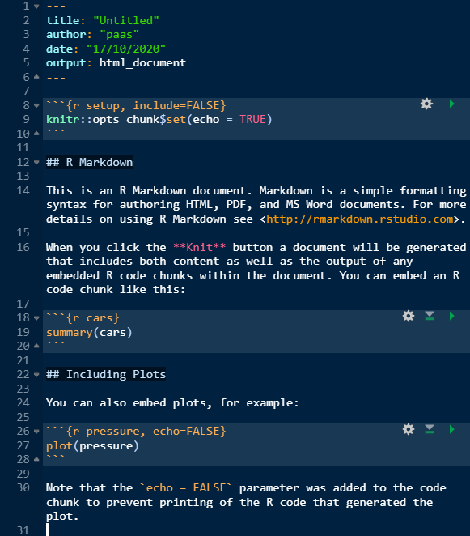
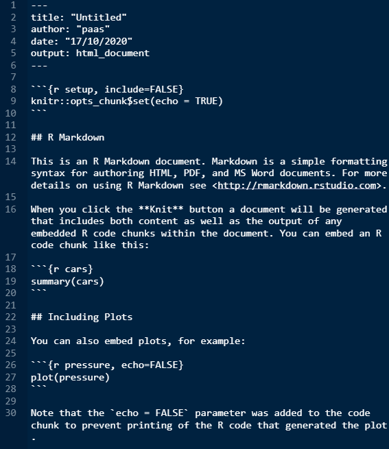

```{r xaringan-themer, include=FALSE, warning=FALSE}
library(xaringanthemer)

style_duo_accent(
  primary_color = "#003b49",
  secondary_color = "#1d4289",
  header_font_google = google_font("Cabin"),
  text_font_google = google_font("Noto Sans", "300", "300i"),
  code_font_google = google_font("Fira Mono"),
  colors = c(
    red = "#d3003f",
    purple = "#3e2f5b",
    orange = "#ff8811",
    green = "green",
    white = "#FFFFFF",
    blue = "blue"
  )
)

xaringanthemer::style_extra_css(
  list(
    ".title-slide" = list(
      "background-image" =
        paste0(
          "url(https://upload.wikimedia.org/wikipedia/commons/thumb/3/34/",
          "University_of_Sussex_Logo.svg/",
          "480px-University_of_Sussex_Logo.svg.png)"
        ),
      "background-position" = "95% 95%",
      "background-size" = "180px",
      "border" = "10px solid #013035",
      "background-color" = "#FFFFFF"
    ),
    ".title-slide h1" = list(
      "padding-top" = "0px",
      "font-size" = "60px",
      "text-align" = "left",
      "padding-bottom" = "18px",
      "margin-bottom" = "18px",
      "margin-top" = "0px",
      "color" = "#003b49"
    ),
    ".title-slide h2" = list(
      "font-size" = "40px",
      "text-align" = "left",
      "padding-top" = "10px",
      "margin-top" = "0px",
      "color" = "#003b49"
    ),
    ".title-slide h3" = list(
      "font-size" = "30px",
      "color" = "#26272A",
      "text-align" = "left",
      "text-shadow" = "none",
      "padding" = "0px",
      "margin" = "0px",
      "line-height" = "1"
    ),
    ".big" = list("font-size" = "40px")
  )
)


xaringanExtra::use_editable(expires = 1)
```

```{css, echo = FALSE}
pre {
  background: #eee;
  padding: 20px;
}
```

```{r setup, include=FALSE}
knitr::opts_chunk$set(eval = FALSE)
```

```{r, echo=FALSE}
library(metathis)
meta() %>%
  meta_description("Introduction to R Markdown") %>%
  meta_tag("week" = "04") %>%
  meta_tag("content_type" = "slides")
```


## Plan for today

- Q&A about last week's tutorial and practical

- Intro to R Markdown
  - Basic markdown
  - The YAML header

- Attendance

- Worksheet tasks

---

## What is R Markdown


- R Markdown (Rmd) is `R`'s version of markdown
  
- Markdown is just a language for writing documents **using only plain text**

- Unlike WYSIWYG editors, it separates *form* from *content*

- Rmd combines markdown with `R` code
  - Lets you put results of `R` code directly into your documents
  - Tables, plots, analysis results

- You can use it to create all sorts of things
  - text documents
  - web pages
  - blogs
  - presentations
  - dissertation
  - teaching materials (like we do)

---

## Basic markdown

<small>

.pull-left[
# Level 1 heading

## Level 2 heading

### Level 3 heading, etc..

This is **bold**. 

This is *italics*.

You can also do ~~strikethrough~~.
]

.pull-right[
<pre>
# Level 1 heading

## Level 2 heading

### Level 3 heading, etc..

This is **bold**.

This is *italics*.

You can also do ~~strikethrough~~.
</pre>
]

</small>

---

## Basic markdown

<small>

.pull-left[
One line break doesn't 
do anything.


For a new paragraph

we need two line breaks.

- this is
- an *unordered*
- or bullet point list
    - it can have
    - multiple levels

1. this is
1. an *ordered*
1. list
    1. also with
    1. multiple levels
]

.pull-right[
<pre>
One line break doesn't
do anything.


For a new paragraph

we need two line breaks.

- this is
- an *unordered*
- or bullet point list
    - it can have
    - multiple levels

1. this is
1. an *ordered*
1. list
    1. also with
    1. multiple levels
</pre>
]

</small>

---

## YAML header (rhymes with camel)

- Every R Markdown file starts with the YAML header

- **ALWAYS** "fenced-off" by ` --- ` _on either side!

- The YAML header contains meta-data about the Rmd file including

    - The `title`
    - The `output` type
    - Can also include other fields like `author`, `date`, and `subtitle`


<br />
**Example YAML header**  
```
---
title: "My first R Markdown"
author: "Me"
date: "01 April 2021"
output: html_document
---
```

---

## The body of the Rmd file

The body of the Rmd file can contain both **text** and **R Code**


````

# Some text

This is some text in the Rmd file. This is just the same *kind*
of thing that you'd write in an word document. Following this, 
there'll be some R Code.

```{r}`r ''`
knitr::include_graphics(here::here("images/nicolas_cage.png"))
```
````


- The bit between the ` ```{r}`r ''` ` and ` ````r ''` ` is R Code

- We haven't learned what this R Code does yet, but you might notice a bit that
  looks like a file path. It looks like a file path, because it is a file path


---

## Learning Rmd

- Always compare source (.Rmd) and outcome (.html, .docx, .pdf)

- Pay attention to details
  - Spaces matter
  - Line breaks matter
  
- Use online resources!
  - [R Markdown cheat sheet](https://raw.githubusercontent.com/rstudio/cheatsheets/master/rmarkdown-2.0.pdf)

  - [R Markdown: The Definitive Guide](https://bookdown.org/yihui/rmarkdown/)

- Make your own cheat sheet
  - Make a list of things as you learn them

---

## `.Rmd` files

- Just plain text files

- The `.Rmd` file extension tells RStudio that this plain text file contains R Markdown

- RStudio will make it look nice for you and give you additional options

- **If you open a R Markdown file in RStudio and the text is all the same colour, the file probably doesn't have the correct `.Rmd` file extension!**
  - If so, you can edit the file name manually

---

## `.Rmd` vs `.txt`

.pull-left[

]

.pull-right[

]

---

## Knitting a document

- **R Markdown** documents don't look very pretty, but there is a way to turn it
into a pretty document.

- This process of going from **R Markdown** to **pretty document** is called
  **knitting**

.pull-left[
.center[]
]

.pull-right[
.center[]
]


To **knit** an **R Markdown** document into something pretty click on the **Knit** button


---

.center[]

**Knitting** your **R Markdown** document turned it into a **"knitted"** document.

If you haven't had a chance to **knit** a document yet then you'll get a chance
in the **practical worksheet**

---

# Attendance 

<br>

.middle[
.center[

## Attendance pin.can-edit[: ]


<br>
<br>
<br>
<br>
<br>
<br>
<br>

**Go to www.sussex.ac.uk/mobile OR use the SussexMobile app to input the pin**

]]

---

## Today's worksheet

In today's worksheet we'll be going through some of the following tasks:

- Creating and **R Studio** project

- Creating the standard set of sub-folders

- Writing some **markdown**

- Knitting our documents

- Downloading and organising files

- Working with **file paths**

---

### Running the tutorial for next week

.center[]

If you can't see the **Tutorial** pane go to **View > Tutorial** 

---

### The quiz

If you haven't completed the **Week 4** quiz then make sure to do it after this
class.

Remember that the Quiz closes on Saturday, and if you miss the deadline then
you won't get a second chance!


