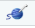

```{r setup, include=FALSE} 
knitr::opts_chunk$set(echo = TRUE)
require(tidyverse)
require(metathis)
``` 


```{r, echo=FALSE}
library(metathis)
meta() %>%
  meta_description("Getting started...") %>%
  meta_tag("week" = "01") %>%
  meta_tag("content_type" = "practical-worksheet")
```

```{css echo=FALSE}
body {
 margin-top: 80px;
}
.main-container {
      padding-left: 15px;
      padding-right: 15px;
      display: flex;
      max-width: 680px;
      margin-right: auto;
      margin-left:  auto;
      flex-direction: column;}

   .btn {
        padding: 0;
        margin-right: 1em;
    }


  .copy-button {
      width: 7em;
  }
    .btn-primary {
        background-color: black;
        border-color: black;
        padding-left: 1em;
        padding-right: 1em;
        z-index: -4;
    }


.hint summary {
  font-weight: bold;
  line-height: 3em;
  font-size: 1.1em;
}

@import url('https://fonts.googleapis.com/css2?family=Fira+Mono:wght@400;500;700&family=Montserrat:ital,wght@0,100;0,200;0,300;0,400;0,500;0,600;0,700;0,800;0,900;1,100;1,200;1,300;1,400;1,500;1,600;1,700;1,800;1,900&display=swap');


code {font-family: 'Fira Mono', monospace;}

.answertext {
  line-height: 150%;
  padding-left: .5em;
}

.answer {
  line-height: 150%;
}

.question{
  padding-top: 1em;
}

```


\


Welcome to the fourth PAAS practical! This week, we will practice the basics of
**R Markdown** (Rmd) so you can get some hands-on experience with this
extremely versatile and powerful tool. 

By the end of this practical you will know:

  - A little about markup languages

  - Basic text formatting using R Markdown

  - How to generate HTML documents in RStudio


There's **a lot** of tasks on this worksheet. The worksheets will usually
contain a lot of tasks. In fact, most of the worksheets will contain more task
that I except you to be able to complete in the practical, so don't worry if
you don't finish them all. Just work through them at your own pace and,
remember, you can always return to them later. The practicals are all about
giving you a helpful environment in which to **learn** and **practice** your
new skills.

<span class="ex"></span>


First off, we'll create a new **R Studio** project. You can call it **prac_04**
if you'd like.

If you're stuck with how to create an **R Studio** project then refer back to
the **Info Box** at the start for [**Practical
3**.](https://paas.netlify.app/practicals/03/worksheet/)

After you've created your project make sure you create a **r_docs** and
**data** subfolder. For today, we'll also create an **images** subfolder.

#### Tip: Checking that you're in a project

It's always a good idea to make sure you're in the project you think you're in.
Do you do this by checking that the project name is displayed in the top right
corner of the **R Studio** window. In the example below see that **week_04**,
the name of the project, is in the top right corner. In your **R Studio**
window, check that this text matches the name of the project you just created.


<span class="ex"></span>

Next, create a new **R Markdown file**, and save it into the **r_docs** folder
you created in the previous step. When you save it, you can name the file
`my_second_r_doc.Rmd`{.file} if you'd like. 

Again, if you're stuck with creating an **R Markdown** file then check out the
end of [**Practical 3**.](https://paas.netlify.app/practicals/03/worksheet/)

<span class="ex"></span>

Now that you have an **R Markdown** file, try **knitting** it! To **knit** your
document click the  button or hit
<kbd>Ctrl</kbd>+<kbd>Shift</kbd>+<kbd>K</kbd> on Windows, or
<kbd>⌘</kbd>+<kbd>Shift</kbd>+<kbd>K</kbd> on MacOS.


<span class="ex"></span>

Now that we've made sure that we can **knit** the document, we're going to try
editing it. We'll start simple by editing the YAML header. We'll edit both the title, 
and the author of the YAML header.

Change the `title`{.yaml} field to give your document a title. If you already
gave it a title in one of the previous tasks, then change the title to
something else. 

Change the `author`{.yaml} field to your name. 

And finally, add a `date`{.yaml} field with today's date.

If I (Lincoln) was doing it, then it might look something like this.

<pre><code>---
title: "My R Markdown document"
author: "Dr Lincoln J Colling"
date: "1 April 2021"
---</code></pre>

Once you've made the changes, **knit** the document again to see how the output changes


<span class="ex"></span>

For the next task we're actually going to write a little markdown. Before we start, 
delete everything in your .Rmd file except for the YAML header. Once you've done this
try **knitting** the document again. Now you should nothing except for the **title**, 
**author**, and **date** you set in the previous task.

#### Tip: Markdown basics

Let's refresh the basics of **markdown** before we start writing some of our own.

<pre><code>
# This is level 1 heading (main heading)

## This is level 2 heading (subheading)

### This is level 3 heading

#### And so on...

</code></pre>

<pre><code>
- Single dash and space after a blank line creates bullet points.
   - Lists can be nested by indenting using *white spaces*.
   - The exact number of the spaces you need to use can vary
   - but it's always _at least two_.
      - Deeper and deeper... (at least two more spaces!)
</code></pre>

<pre><code>
- Sometimes you'll see something other that a single dash
  + For example, you can also use a single plus sign
      * Or a single asterisk
</code></pre>

<pre><code>
1. This is an ordered list
1. It is numbered
1. You can just use 1 and R with automatically increment the number
</code></pre>

<pre><code>
a. You can also use letters instead of numbers
a. You can just use a. and R will automatically increment the letter
</code></pre>

<pre><code>
This is *italics*.

This is **boldface**.

This is ~~strikethrough~~.

This is ^superscript^.

This is ~subscript~.
</code></pre>


<pre><code>
A single line break
doesn't do anything.

More than one line break...
</code></pre>

<span class="ex"></span>

Now that we have a nice blank document let's add some text. 

If your document, write a small piece reflecting on what you've learned so far
in Psychology as a Science, and a little bit about how you've found the course.
Nobody is going to read this, so feel free to be as honest as you'd like.

Here are the criteria for the document:

- Use at least two levels of headings
- Write text in paragraphs
- Use **boldface** and _italics_
- Include some a list (either number or with bullet points)

<span class="ex"></span>

For the next task, you'll need to download an **R Markdown** file and move it
into your **r_docs** folder. Remember, you need to move it into the 
**r_docs** folder using Finder/File Explorer. 

You can download the **R Markdown** by clicking on the following link: `r xfun::embed_file("./doc_with_image.Rmd", text = "doc_with_image.Rmd")`

#### Tip: Using the files pane

You can open your **project folder** in Finder/File Explorer using the
**Files** pane. To do this, following the steps below: 

1. Make sure your **Files** pane is showing your **project folder**. To do this
   click on:   
  **More** > **Go To Working Directory**

This makes sure your **files pane** is pointing at your **project folder**

  

2. Then open the folder by going to:  
   **More** > **Show Folder in New Window**

This opens the folder currently open in the **Files** pane in a Finder/File
Explorer instance

  


<span class="ex"></span>

Now that you've downloaded **R Markdown** above you can download the following
two images.

1. Link to `r xfun::embed_file("./nicolas_cage.png", text = "image of Nicolas Cage")`
2. Link to `r xfun::embed_file("./john_travolta.png", text = "image of John Travolta")`

These images should go into the **images** subfolder of your project folder.


<span class="ex"></span>

Now you should've downloaded the **R Markdown** file and the two image files,
and you should've put them in the correct place. To **open** the **R Markdown**
file, find in the **files** pane of **R Studio**, and click on it to open it. 

Now that the file is open, you should be able to **knit** it. Go ahead and do
that now!

If you've done everything correctly then the **knitted** document **should**
contain **an image**. If your output **doesn't** contain an image then make
sure all your files are in the right place. 

Your folders/files should look something like this (assuming your project is
called **prac_04**).

<pre><code>.   
├──📁r_docs
│   ├──my_second_r_doc.Rmd 
│   └──doc_with_image.Rmd
│  
├──📁images
│   ├──nicolas_cage.png
│   └──john_travolta.png
│  
└── prac_04.Rproj
</code></pre>


<span class="ex"></span>

Look inside the `doc_with_image.Rmd`{.file} file, and find the part that looks like
this:


<pre><code>
```{r}`r ''`

knitr::include_graphics(here::here("images/nicolas_cage.png"))

```
</code></pre>

Don't worry if you don't understand what this means right now. It's a bit of
**R** code, and we haven't learned any **R** code yet! But, you might recognise
part of it.

The part that says `images/nicholas_cage.png` should look familiar
from last week. It should look like a **file path**. 

This is because it **is** a file path! It's a file path that gives directions
to the image file containing the picture of Nicolas Cage. 

See if you can change it so that instead of pointing at the image of Nicolas
Cage it points at the image of John Travolta instead.

Once you've done this, **knit** the document again and see whether the image
has changed to an image of John Travolta.


\

\

```{js, echo = FALSE}
let i = 1;
document.querySelectorAll(".ex").forEach(x =>{
  x.innerHTML = "<h3>Task " + i + "</h3>";
  i++;

  })
```

