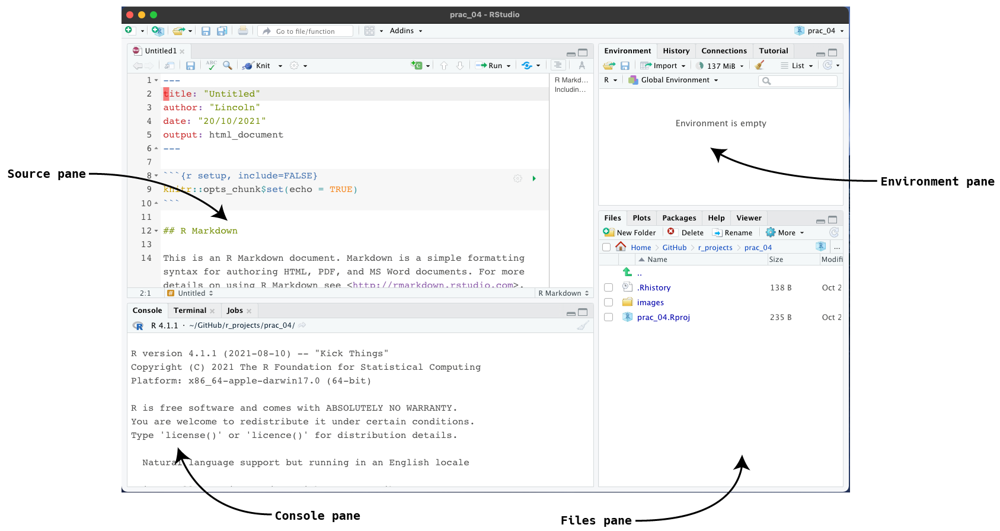
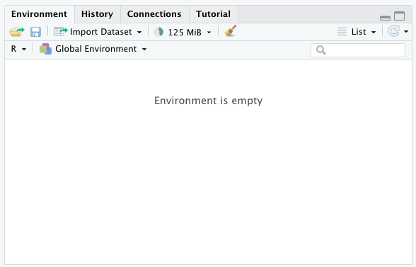
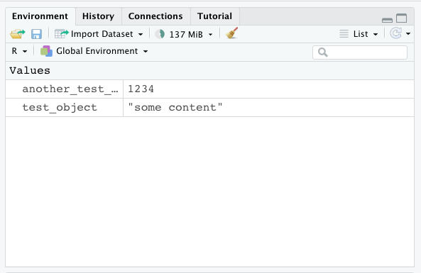
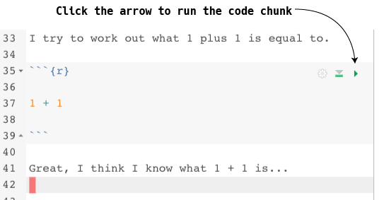
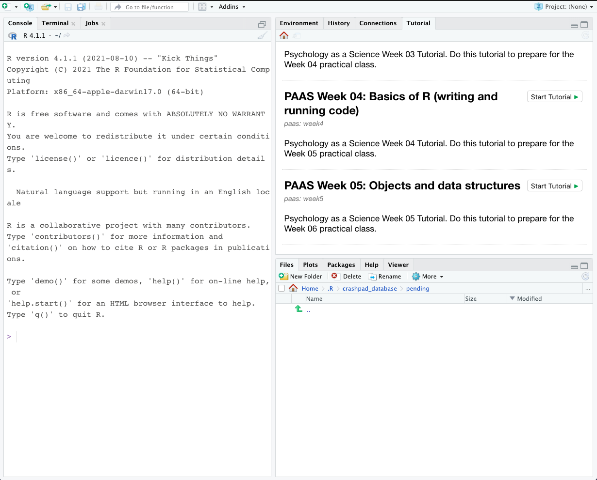

```{r xaringan-themer, include=FALSE, warning=FALSE}
library(xaringanthemer)

style_duo_accent(
  primary_color = "#003b49",
  secondary_color = "#1d4289",
  header_font_google = google_font("Cabin"),
  text_font_google = google_font("Noto Sans", "300", "300i"),
  code_font_google = google_font("Fira Mono"),
  colors = c(
    red = "#d3003f",
    purple = "#3e2f5b",
    orange = "#ff8811",
    green = "green",
    white = "#FFFFFF",
    blue = "blue"
  )
)

xaringanthemer::style_extra_css(
  list(
    ".title-slide" = list(
      "background-image" =
        paste0(
          "url(https://upload.wikimedia.org/wikipedia/commons/thumb/3/34/",
          "University_of_Sussex_Logo.svg/",
          "480px-University_of_Sussex_Logo.svg.png)"
        ),
      "background-position" = "95% 95%",
      "background-size" = "180px",
      "border" = "10px solid #013035",
      "background-color" = "#FFFFFF"
    ),
    ".title-slide h1" = list(
      "padding-top" = "0px",
      "font-size" = "60px",
      "text-align" = "left",
      "padding-bottom" = "18px",
      "margin-bottom" = "18px",
      "margin-top" = "0px",
      "color" = "#003b49"
    ),
    ".title-slide h2" = list(
      "font-size" = "40px",
      "text-align" = "left",
      "padding-top" = "10px",
      "margin-top" = "0px",
      "color" = "#003b49"
    ),
    ".title-slide h3" = list(
      "font-size" = "30px",
      "color" = "#26272A",
      "text-align" = "left",
      "text-shadow" = "none",
      "padding" = "0px",
      "margin" = "0px",
      "line-height" = "1"
    ),
    ".big" = list("font-size" = "40px")
  )
)


xaringanExtra::use_editable(expires = 1)
```

```{css, echo = FALSE}
pre {
  background: #eee;
  padding: 20px;
}
kbd {
    padding: 2px 4px;
    font-size: 90%;
    color: rgb(var(--font-col));
	background-color: #EFEFEF;
    border-radius: 3px;
    box-shadow: none;
    border: solid 1px;
}
```

```{r setup, include=FALSE}
knitr::opts_chunk$set(eval = FALSE)
```

```{r, echo=FALSE}
library(metathis)
meta() %>%
  meta_description("Writing and running code in R Studio") %>%
  meta_tag("week" = "05") %>%
  meta_tag("content_type" = "slides")
```


## Plan for today

- Q&A about last week's tutorial and practical

- Writing and running code in **R Studio**

  - Navigating R Studio

  - Using the **console**

  - The **environment** pane

  - Writing code in **R Markdown** 

    - The **environment** and **knitting**

- Attendence

- Worksheet tasks

---

## Writing and running code

You've already had a chance to explore **R Studio**, specifically the **Files**
and **Source** pane, but it's worth refreshing

- The **Files** pane for working with files (e.g. finding files, renaming files etc)

- The **Source** pane for editing **R Markdown** files and **R Script** files

And today we'll also learn about:

- The **Console** pane for immediately running code / testing code snippets

- The **Environment** pane for browsing objects that we've created

---

### Navigating R Studio



.center[The main panes we'll be using today]

---

## Using the **Console**

- Whenever you type code into the **Console** it runs as soon as you hit
  <kbd>Enter&nbsp;↩</kbd>

- This makes it useful for running **one off** bits of code (e.g., *installing
  packages* like we did at the start of term)

- When the **Console** is ready to accept commands then the **Command prompt**
  looks like a `>`

.center[<img width="70%" src="data:image/png;base64,iVBORw0KGgoAAAANSUhEUgAAAq0AAAFrCAYAAAD7BbCfAAABSWlDQ1BJQ0MgUHJvZmlsZQAAKJFjYGASSSwoyGFhYGDIzSspCnJ3UoiIjFJgf8LAySDAwM2gy8CWmFxc4BgQ4ANUwgCjUcG3awyMIPqyLsgs3QfN39Qamwt8nJT3X/4nx4KpHgVwpaQWJwPpP0CckVxQVMLAwJgCZCuXlxSA2B1AtkgR0FFA9hwQOx3C3gBiJ0HYR8BqQoKcgewbQLZAckYi0AzGF0C2ThKSeDoSG2ovCPB556cn5in45udlluQXEXAwqaAktaIERDvnF1QWZaZnlCg4AkMpVcEzL1lPR8HIwMiAgQEU5hDVn4PAYckotg8hlr+EgcHiGwMD80SEWNIUBobtbQwMErcQYirzGBj4WxgYth0qSCxKhDuA8RtLcZqxEYTNY8/AwHr3///PGgwM7BMZGP5O/P//9+L///8uBpp/m4HhQCUAXTZigEeObgcAAABWZVhJZk1NACoAAAAIAAGHaQAEAAAAAQAAABoAAAAAAAOShgAHAAAAEgAAAESgAgAEAAAAAQAAAq2gAwAEAAAAAQAAAWsAAAAAQVNDSUkAAABTY3JlZW5zaG90eLNyewAAAdZpVFh0WE1MOmNvbS5hZG9iZS54bXAAAAAAADx4OnhtcG1ldGEgeG1sbnM6eD0iYWRvYmU6bnM6bWV0YS8iIHg6eG1wdGs9IlhNUCBDb3JlIDUuNC4wIj4KICAgPHJkZjpSREYgeG1sbnM6cmRmPSJodHRwOi8vd3d3LnczLm9yZy8xOTk5LzAyLzIyLXJkZi1zeW50YXgtbnMjIj4KICAgICAgPHJkZjpEZXNjcmlwdGlvbiByZGY6YWJvdXQ9IiIKICAgICAgICAgICAgeG1sbnM6ZXhpZj0iaHR0cDovL25zLmFkb2JlLmNvbS9leGlmLzEuMC8iPgogICAgICAgICA8ZXhpZjpQaXhlbFhEaW1lbnNpb24+Njg1PC9leGlmOlBpeGVsWERpbWVuc2lvbj4KICAgICAgICAgPGV4aWY6VXNlckNvbW1lbnQ+U2NyZWVuc2hvdDwvZXhpZjpVc2VyQ29tbWVudD4KICAgICAgICAgPGV4aWY6UGl4ZWxZRGltZW5zaW9uPjM2MzwvZXhpZjpQaXhlbFlEaW1lbnNpb24+CiAgICAgIDwvcmRmOkRlc2NyaXB0aW9uPgogICA8L3JkZjpSREY+CjwveDp4bXBtZXRhPgrhdMhbAAA3+ElEQVR4Ae3dB3hURdvG8Se90UKT3gWpgi+iiDSlCdIRaaKggIhYEXnRVz5s2EBFVOxdsYsiiiIKCoogKKBYKAIiJUgLpJGEb+YsZ9ldUzaFkGH+xytsO3v2md+MV+6dnbMJ2ZSYfFTYEEAAAQQQQAABBBAoxgKhxbg2SkMAAQQQQAABBBBAwBEgtDIQEEAAAQQQQAABBIq9QHh2Fe7ae0hSUtMlKeVIdrtwPwIIIIAAAggggAACJ0wgNjpCYtRPxfg4yTK0Juw7LIcOp0md08pIeKhdk7HpmZmyadd+Oaou9WLfiqWiJTQk5IR1xql84MyjR2X3wRTReqeypdvOUNXKiJDMU7lLaRsCCCCAgCECzu9e/cvXG2Hc38bupSENOZIqKeonQf2OzTKR6tlVGwOr7j4d0nXb01XgIrAWbEDrsK8NT3VLt51HOKWxYAOGZyOAAAIIFJqA/pV01Jkycg/p/pLS97rXPY+ZcDspJT370GrbDKvbpfpSt11lVmZYfVHyeV0HOhss3Xbmk4mnIYAAAgggUKgCnglW7zSrz7FD1OSr//0m3NYTqlnOtPq0jKsIIIAAAggggAAChgl45lLdGVX3UjdCzavq2SSfzZTbWa5p9WkHVxFAAAEEEEAAAQQME/CfadW39I8Oq2pe1X+iVd32v6O43mam1bBBSLkIIIAAAggggEBuAjqe+q9VdWdX9b3udc9RTLldaDOtR9LSZNvWLRIbFycVT6skoSfhWwfeeOl5SUo6LFeOHZ9bXxr/+MED++WXNT9J/YaNpWz58vluz8z775ZmZ7WUDp275fsYJ+uJf6nx9t4br0j3Pv2lXoOGJ6sMXhcBBBBAAIFiJ+CZV/WfQfUUGbiC1Zl79as/cI9gb3+/Ln9fk9qqSURQr1/gmdY9u3fL+KuGS4MqZaXr+WfLuY3rSf1KZeSrhQv8CiiKG++/9Ya88dILRfFS3tfodm5zObN6+Sx/nn/8Ue9+hX3lt5/XyZgh/WXld0vzfWi9huW5WY/Isq8W5fsYhf3EpMOHHcupE2/M9dA7/trm1L/pj99z3ZcdEEAAAQQQsEnAM5fqzqi6l1pAzauewDWtoXuXSMbOz4P60fs6FQVZT4FnWsdeMURW/7BCHn36RbmoVx9JVjOdP/6wUmrVqesUcqr/8/IHn0hGerqkpqZK7w7nSuceveTm26c6zS5VpswJa36LVufIl6t/lRKlSp2w19AHTk5Kkr17EqRqjZre19muZjjLlq8gMbGx3vtMv2JLO03vJ+pHAAEEEAhOwDPH6s606kv9o8PriV3TeiQtNbgC1V563zBdUZBrags00/rd0q/l+2+XSpv2HaVnvwESHh4uJUuVlrYdL5TqNWs5SX7WjAfkvGYNpHH1ijKoVzf5bf3PTmNWr/xe2rZoJG++8qIM6tlVWjWsI6++8Iy3oe/OeU16XtBGzqhSTjq0bOp9V7Dh919lSJ/uzvFaN60vMx+cJpnqDwFktc2f+750PLuZs+/oYZdK4sEDWe1WoPsqVqoslatVd370gfTyCPd2XImScmD/Ppl4zShp06iOXHTeWfLZvLnO6+l3OT3atJRHp90pE64eKVcPvcRpo77v6ZnTnfvaNT1d7p48QX5e86MM6NxOerY9W1Ys+8Z5vl4acFnvbvL9Us+7lFvHjZKxwwbKG8qwU8smMnpwPxU29zj7fjL3PRlycWenhhH9L/Yew3kwl390YNVvRHRQ1Zu+1Ld3bN+WyzML52HdZ3fcPF46NG8g7c9sILffOM4x9T3632rGdWjPLo7nnJee8z700TtvypAeneSc+tWlZ7tW3jHk3cHnyslup08pXEUAAQQQQKDAAjqe+q9V1ffoTd/rXj9+j+da4dz2PVYw14Otp0Ch9Y9ff3Fq6dSte5Y1vfXqS/LgXVNk0GVXyNwvlsjuXTtl5KD+alYyRVKSk2Xrn5vlkfvvkUuGDpfyFU+TGdPucgJocnKS3DHxJqld93RZvXGbPPLUC04K1+tm9fN1SPlg4WK57MrRMv3eO+V1n6DiFqKPcbMKi1169JR5Xy2TxYs+lxeeesJ9uMgu57z4rCxXwXLO/C9UmO8kUyfe4Mxe6gL+2vqnvPb801KzTl25bNTVTk36vpdmz5JWbdpKk+Znydsq1D989xQZcc11sidht7z7+svOfqkpKc7z9cfpektQtjrQ6oA7fPQ1svybJSogf+A8VrlqNbnt3gfls+/XSLqaFX78ofuc+4P5R8+wxsTGOUF1g+pvHVhDw8KkzukNgnl6gfeZ9r9JMu+9t2XaY0/JA48/I5+qNyL3TJ7od9y5almIbnO1mjVl2u23yjY1rvT4uu+OSY7t4p9+l2kzZ//rnZzvQU52O31r4ToCCCCAAAIFFfDMsXr+9T+WXqHqf39h3m7dqbvk5UfXFuzrFyi0ZmRk+DsE3Pps/jwJUwHnyrHXSr36Z0j3nn1U0Noiv6xd693zpsl3SP9BQ+W8tu3kn4QESUlJlpiYWKmuwtJHKqzcffskqVSlirP/b+t/kS2bN0nXi3vJ6erEmxFjrpGIiAj5XL1O4PbZxx85J2Xt37dP3nvzdYkrUUJWrfg+cLcTfvvj99+R0mqZwIdq1m/f3n/kUGKibPrjN+/rXtSrn4yfeJu06XCh976+gy+TgZeNkAu6et4MTL7nQenRd4DUrlffCa7eHQOu6Fnfu2bMkv5DhjuP6HCvt8ZnNpc09UZBB+hDiQfVm4WNzv3B/uO7NEAvhSiqwKrrW/z5p9KwSTNp3baDnHN+O2ncvIUsXvip36zp1TfeIl3V2Bp5zfVOk5Z+9YVEx8RIlWo15NMP35eH7vqfaJvctpPZztxq43EEEEAAAQTyIuCZS3VnVN1LfQQ1rxnkGlL39YrL/gUKrTo46k1/DJ/Vlp6u/nqBCq3hKljqTQcJven73S1WzeLpLSTg2wbe//wruX7iZBVc35H2/2kif/y2Xo4c8TwvMjLKeU5ERKSEqSUJ7v3Oncf+2fn33861UmrNp16qMGnK3TL8qtG+u5zw67qTd+/cIUfV8oWqNWpIm44XytTpM/0CVFR09L/qiD52n2sSHePZJ7dvZNDH0utCAvebcff/yaRrxzhrUPWMdl43d2mADqza272d1+PkdX/tp2eGIyMjvU/VNhnpGY6pe6e7FsZtt16WobdX5n4qY264RRZ8+IFcrJZW+L5ZcJ/re+m2q6jb6VsD1xFAAAEEECgMAT2XenwG03PLc1x1b5BrSN06isv+BToR67x2HeSss89RH39/rc7af176DBykZvTSZLn6mLpa9epyfvsL1LcIfCYfvvu2XNSzt3z5+QIpW66cNGrSVNasXuVa/Ovy8KFEZ0b1ulv+K81anCUjLu0nG3//Xdp36qyWEVSULxZ84nyt1bdfL3Y+BtZragO3th0vkNCpobJ540a5Un20XrJkSdm65c/A3U7obd3J5ymDLxfMl3LlKkjr9h1U4Nuq1v56QvwJffFjB9fB78O350iniy6WLhf3lgVqTa1eUqBnXN1wl1Md7hpW/eaj3hmNvGtat27eKDVq183pqQV+TPvpZRLLVT9v3vCHREZFyrofV0nL1m2cN0PuC6xa/q2aqb7AWUagg+v5ahnG4UOH5C/V36Ovv1kaN2su114x2DlGdrPEJ7Odbju4RAABBBBAoLAE9NyqXit6PLi6s636Xt/7RfYl7JKN69c5J0YF8/oRavKwbsOmEl+horN74PFOxG39QgWaadWh4ulX33Q+rp9803hpVK2CnHV6dZk2ZbLs3r3L+fj+UrWe9dbrxsp/GtSSnTv+lseffzXXsPSPOoFoWP+e0qx2Fbnx6iudk7z02lS9bOCJF15zTsQ5p3FdGTdymAxU62FHj/N8LOwL3ajpmfLAY7Nl5fJlztdwnVm3mjw87W7fXYrk+uR7HpDW7TrK+BFDpFW9ajK8z0WyaUPRfUWT7qOBw0fIvPffVieEXeWcNKdnqmc/8lBQ7dffEuC7hlV/hB4ZFaXefFQI6vl53ekftW5Xb2XKlnUub7/3IWdt74Au7aRX+3Od76Wdcv8M5zH3nxS1vveSLh3ko3fmOGt/49UbI70U4+phA6Rtk3py2w3XqOUDfaXjseUW7vN8L4u6nb6vzXUEEEAAAQQKW8CzatXzr/+xdYz1vz8vgVUfS5/1v3H98aWegcc7UbdDNiUmu9Hb26b1mxOkSfW8hZI09ZVPer1qpapVxf3I3z2gfuyQmvnSs6x52fSZ41FR0U5ICnyeDrb6o/8In4+OA/dxb+vvki0TH+9dpuDen9Plum0JUi0+Nqdd8vSYPnFKnxxWJt4TxvL05ELYWX+lk/sVVfp6RGREkc34/rUvKVfLZYsXOR/j60C/ZtVKef6dj+Q/57T2tlzPvusPOvTa5Kw2/ZF+mjpRz22ju4+eUY7UYyiIceI+J7+Xup1xYZn5fTrPQwABBBBAoFAF9KetevJKz7nq36Hudvx+zz3fLpzvPpSnS33Cld7c4+k/LqD/UIB72z1YTrf1c85uHO63ZCGr/ZMy1XJT94AFvdSzb3VOr5/lYZyZOfV4Xjf99VnZbeXy8Feg9JKCk73p9aZZrV8tqrp8w5zv9aJ6/dxeR580pU+WqndGQ3ngiWdFf+OB75bbUga91jZG/QRuJUqe2O+xDXw9biOAAAIIIFAcBDwR1Q2q+lL/eMKrk2MDinQDaMDd2d70DbqeYHx81xN1+9+/5Y+/JtcQKDKBWnXryTi1hpkNAQQQQAABBAouoOOp/9pS94N1fa//mtbAVwt8PKvbvs/J6nHfJQKF8bh+PUKrrzrXEUAAAQQQQACBU0DAM6/qzrT6Nsg3Th6/33fm9Pi9wV3zPWJejxNWqbOaA/avM7vbhNbg+oO9EEAAAQQQQAABYwQ886qe5QDusgBP8Wre07vW1XPPuRdelOuaUt+P/AOf73tbh9C8br7P18/N6ra+n9CqFdgQQAABBBBAAIFTSMAzd+nOYOpL/eMJsYFrWn0DqSbI7219ElZhbNm9foG+8qowCuMYCCCAAAIIIIAAAoUroOOpXkt6fHOv63vd655HTbnNTOvx3vzXNf0VRmyFI2CDpX7nejiD94GFM2I4CgIIIIAAAv4ChFZ/D++tvH5PrfeJXEEAAQQQQAABBBAoVAH9/flMCxUqKQdDAAEEEEAAAQQQOBEChNYTocoxEUAAAQQQQAABBIIWSFJ/rVP/5LQRWnPS4TEEEEAAAQQQQACBEyqgw2p8VKjs35OQ4+sQWnPk4UEEEEAAAQQQQACBEyXgBtZ9iUkSVyY+x5chtObIw4MIFE+BlOQU+evPrcWzOKpCAAEEEEAgCAHfwHokNFxKlyqV47OKTWjdf+CAbNm6VTLS03MsuLAefPKp5yU1JSngD4dlf/TVP66RRYsWS3iY+0W92e9r6yMJe/bIiy+/JpHhJ39Y5bV/87r/ye7jfxISpOZp8bJ1858nuxReHwEEEEAAgTwL5DWw6hco8nSxYuUqufe+6RId4XnpNWt/lj4Dhsk142+W+x54WDp06SWT/nuHxESEyfpff5duFw+QuCjPN3NlZmb6oTQ/u53s3rFdQo/9aYfExERp3Ly1HE1LzjWMvvjy65KanOz5AxF+Rz1+4/HZz6qg+pUTVNeu+0UWf7NUwkOLnOx4QdlcC3TJZjfnbv2n0fKzvfzqHJly572q38KyffqePXtlzlvvS0RYcEYjRl0ryYcOqr+8ke0h8/1AMP3re/C87u/73Kyu58XZd5xldSx9X2bmUUk8kCi7d+6S7Vu3yaGDiRIZHSu1K5eTbX9uye5p3I8AAggggECxE8hPYNWNKPLvaf1qyVK5sMP5kp5xVPbt3y9jxt0oU2+bID26d5Uj6j79y/6ff/ZKSnqG1K9fT95982VJSk2Xbdu2y/CRV8uKJZ/IIXW7KLZl3y6XsSOHSYaqq7huk/93l7Rs0VQuvaSf8vMP9YE1d76or7zy7EypUq2GZOYxvA4a2F89J1NSjmQEHjZftw+q0JV+5IiUKxsvSWmFc8x8FXICnpRX59zGWcKOnep/1EyJL11SqpWrKGFhYWpMZkrqkXSJiIyRWpXKyp8quFavVfMEtIZDIoAAAgggUHgC+Q2suoLgpsQKr1b5fsUP0ubclpKuZo7e+2CeM0vau0c3J7Dql9F/b7Z8+XIqvIrzi3jc9RMkJjJMpt5zv+zdu08uHjBcFn7+hZrNy3l6Toffrj36S0hmmjPrql93wq23OzO4bnOWfrdCevUbIoOHjZTvvv1OzaIeP+buhD0SExMjJUrEBfyxM8+zZz/zgvTsO1iuvW6CbPj9dwk79lwdIocOv0r6XTJMPv3kU++sY9+Bl8n8j+dLj94DZdXKlTJ37jyZ/vBjcv+DD0vHzj1l8u1TJerYx+pT7rxP5sx5W4ao4zz19HPe+9263cuvFn8jXy35Rp585iUZfuU1EqucJtz6P1n9wyqnnpSUFMcgJiJE9GyebtPY6yfJjEcec47511/b5aox18lFPQdI3wFDnbpcg8B6P/lkgcx+ylPLrl275eprb5JLh4yQYZePko0+7Xdr05cvvfKG04Ze/Qb7HVs/tnTZd9Lu/NbOOJj99PPyzrueGdpduxOcmndu3+aMjU8+/VxefW2Os+RAz4bqmXdd7/+pWd+jGUecvtXj6KEZM2XipDtkzDU3OA76NfSWkZEhN95ymyx1ZslDZIeaqRyrar9k0OUy/tjY8uwp8pOa9b9k0BVOH61e9YO3T7Pr6yXfLJM+/YfK8BFj5IuFXzgz8lk561B6heofPSaefe4Fv+UTuY0zHVgrly8tVSqfJlHRMZKiAv7h5DR1me78P6LfTkVExUiMmgBPOpzzV4W47eQSAQQQQACBohQ4mHhIEtSE5C6VQzKTD4k+6SqYNayBNRbqTOsRNXOWmpYmJeOyDnpb1MealStXkoiISDXLliGbN2+R89ucK0ez+Xw4Le2I7Ny52wmyt/93gpppHSvz3nnZmWnVs7J6u2/6LClx7PX06/tuf23/W//hXWdLVgFu9+49fh9F//b7BnnvjRfk629XyITJU2XVNwucEKWfsOTrpXJB+7be256jeP79c8tWWfTlEvnk/Vdl5Zpf5P4Zs+S15x93ZgxHXD5U6terI2t/Xi8TJ0+R/n16qEAu8vf2HbJ8xWqZ+9ZLTshY9+scmfP2B/LQvf+Tm28cp4LSYFm77mdp2KiR/LN3r7zz/i/y3JPTJb5cBUlNz3oGtUP786XNeedI67P/o2Za+zqvr9eV6rCq47cO7togRP037uqr5O135srsR++XytWqO8d8QoXQ89QbiNFXDpeVP65VgfcOWfbFXElPO5plvXpmXL+piFNBfsptE6VqlUry7IuvyWtqScC9U//rSyQpqaky68lnZOkXH0pUbAlnZlC/UXG3L1XgHjvqcmfGvWHDBvLKq2/K8MEDRAfxZLVs4+uly2Xo4Joyb/4CufHa0bJFzbS/9sbbqr+ek8iYWJn43/+TeR9/Jv369pRDhw45b4CefuxBObNFc7+Z27vufUhqVK0sF3Ro67T5nfc+lLq1a8rzsx+RZBX8kn1med9890N56ZmZMm/BInnquVeVTStZ/8fmLPv6sJrtv2fadHn39WckTM12XqzewHTv0jFL59nPvChjRg6V9mo8panBkObTnzmNMx1CS8dFqzAc4SwPcO0CL/fuOyCHVTvKxcYEPsRtBBBAAAEETppApvpUcKP6JLBx7apSsrznJKtfNm2V8NgIKZfLSVdZFV1oM636I/3L1WySnnm8fcpdsmvH33L/Q4/Kmh9/8s5YLXaXBviEFx2sjs9vimzYuEk++3xR0Cc89ereRQYO7OuEtr69L86qjdneN3L4YAmPihId/kLVWtU169Z7a9XLGDp39CxjCDzAZwu/VHcdlWkPPSYLFiyUVeokLf1Rt95q16rhBFY9s7tTzeq56231YzddN1qtQ4xxc7R0ubC9dO18gYSHR0r16lXVLKAO6HpPkZGXD5HyFU5TH8mLLPvue7nz7vvlLjXb7P5s2rjB79ieZwX/rw74i778Wi7pe7Ho/N+8WVOJioyU1T+t8xoE1useXb9JKKUG27ffrZSNGzY5s5c6zPpu0cpVH3P4VePlFxXGI8KPr4XNUGuTN2zcLE0anu4sUzhHhW69ZjglNcUJrTdfP1aWLPtehe9k+XPLNjmzaUOZv+ALadO6lVSoUEGioqKV24UyT83CuifGdbqgvbRs2UIyfMbWkyos7lXjctLN473Bv5Xa581358osNfN8NDPdb+zdefstEleytNSrW0d27lJ/Lk41Kbu+/mnNOidcz372FXns8afUG4RM+WH1Wq+dr4V+YzZ5yjT5ZP5nEhWwJjincZau3gCWKlVSLQwQSUw8LH9u+1t+37xVft24RVao19Lbvv0HJGHvAalep7bzhsK5k38QQAABBBA4yQIpqWlqsnCXOveivOzenyiJ6lNC/bP/0GEpF5/zV1tlV3qhzbTu3LVLhbKxck6r/8iSb76TGTOfUgGjnJzV4kzvbOViNXs588G71G3PzGGtmtXlmedfVrNIeo2qJ/T8/MuvMvfD+dKnR+fsava7v1HD+lKpSjUn/OgTsQqy6YCglyWkOtDq7Owa1fxm7dxj6xnbalWrSI9unZxlDd26dFJrcDNl5+7dctkVY+TaMSOkWZOG7u7ey5CQUG9g1XeGR2h+T7v1bKjv5gm7qhi1NTi9npQpXcovpJ5WqZIzk+r7nLxcT1ff0nBE/URHRXqfFhkZoYJiqvd2YL3uA3o29KGHZ8nN142RBg3qqfC6wn3I73L2Ew/Lu2pmc+wNk+SW66+WPr17OutuV69eIy2aN/UGzOjoaGnWtLEsXPS1s865f+/uMn3mbPli0RLp0O48ZzZWz75GObV6TNxaXbUQZ3mGe8tTRmxsrGzYtFkOHjwg0SVKOX17TquW8tbrL8qsJ56Wnv2GycJ5b0papud54eHhqn/UmyifAJ5dXyccWz7So9uFauZULUVRIbq6esOS1Vrh0VdeLk0aN5RHZj6pwvh38uC9U9TaYLUmNZdxFqneRGQcDZGEhH8kVS1zqFyzhtd3i3pzpwPrbjXLWqNOLb+x4d2JKwgggAACCJwEgX/27peq8SWkdKVycjgpRUpERzq/ryrGl5YYNfGU363QZlobN2qoZrrOcoKI/sj6/mlTZcJN14n6fe5sieoj3FQViCqU96xX1Xf269PTeex19fFyZC5nnJcqWVIOq3Seqj52DmbTwUOHUL28ICkpWa0lfNkvjOhj/KFmCcPUfr//sUHi4tSZ2MdCx/IVK6W1Cje+s3a+r9lWzZz9sOonOeP0utL8zKZypvoJDQuXlStXS2310fPQQf0lWn2Ena5OJtMnzBR0K1eurDRqeIaccUYD709cXAknAJcuVVr0kgA3Z5UpXVp2qFlCPYM9c9ZTfi9dWgXf3cf21et126o1pQu/0t+IECLb/96hliXsk3PVrGd27XYPtlB99VffnhdJ1y4XqkCZKWlqRtA/Loromdz0I+kycEAfGTt6pHy9bIV3FnKxWofbqaNaeuFzgpuu5YGHn5AObVtLWHiEnNHgdJmh6u/RVb2Gmj3VofDb5T84M9q6bYu/Xibd9WM+x3Drcy8vHzpQunfrLMNHXS+ZaalOjYcOH5Y6qp+nP3C3+h8pSbV7Z46BL7u+btG8mezdt885KeqsFs2cMVBa2es3Pb7Ouhb9mm3UUoP77/k/WaqWorjfQJHTONNtjFBvIhJVjSEREXJalcpus5zL+HLlZI/6NoGaaoZVf0rAhgACCCCAQHEQSFOfkpaIDHU+KT56NFTiYlVIVb/TSsZEyo6Evc4n3Pmts8h+2y1dtlyFpHO9s6664LLqzPHZs2bIi6++JT3ViUA33DxJnlUzr1XVSSeBM1Z6386dOkrvS0fIiuXL/U6ayq7xlw25VC69YqwMvuwqFZLOV7sdS9DHnrBk6XdypToR6Yorx8mtN4xTHyF7zmJ3ljHopQE+HzX7vkb7dm2cs/XP69RLPX+89L/0MklPTZL2alZwx45d0rXXIHn9jTed4HXPg49meyKV7zHze71nj67y3tz5crNaj6q/jqp/v17y6BPPyEW9LpUG9Wr7HXbQpf3kltvulpfUCU36u1T1DOAjs56WgUOvck6qmjxhvPdNht8TA270VoH11TnvqHWcQyT58CH57Y+N8on6+N49GU3vrk8w6tFnoDrRa7x8+NF8GTViqDPLqh9brpZOnH/u2X6+bdu0lm3qxLAuF7Rz7tfrSZPVF+i3VIFQh+jT1TrhVmefJe269FFfkTZUtm/fLn16qhP4Ar4GTR/fd7v2mlHSqNEZMua6iRIekqlmWJ+RXv2HyMhR46Rbpw7OsozAseb7/Oz6Wn+K8MC9U2XUuAnqZLNRMmjoCPlBvdnRbwACnfXJbkPVCWu33XGX+jRiTFDjzJnt1e9E9Jctq7EfuJUqU1pq1K71rzdigftxGwEEEEAAgaIQOKQmWfYk7JY4lUVKqBOE3c0Nrvp3bYZaSle50mnuQ3m+DNmUmOyf5NQh1m9OkCbVK+T5YDk9YdJtU2X0iCFSr379LE8q0Sf56I/3q1etKiE5zBzpr0oqUTJOzY4Fl7cPq5NZSqhZ1MBG6pnfUiVKSLKauQ1XXyGkPxp2t34Dh8v8915RH/kHPsvdw3OpP2LXxykbX8aZYXMf1TNr+mQ0/fG7nnGMVbOaOR/JfWb+LvUZ8vorJPRstH4d/bFzmJq59m2Te2Q966zbG+mzLEB/K0O8mrLXywGC3XS79HeH6o/s9TH1MoNQddzATf/RiHgVsPQMpN70V5c9MP1Refbx6ZKsTkrK66ZP8Dqi13oea2ten6/31z56DWqMWpYQbL9k19d6RnTfvv3qDVgZdeTj882Bznpsx6kx4Tsrmts402buDHp+2slzEEAAAQQQKAoBPelURp0MHB0VoT7BDlX5Sn/bTbr3d16GmhTcs3+fhKgTl8uoTJCfbd22hKL7ntZa6iNZ/fG275nTvkXHlymjwo3+xZ/zpj/yz8umP/bPKpiUVIFV369PGPLdDhw4qD7S7u2sJQycmfXdT1/XoVDX7AYy93H32wz04/onq9d39y2MS/29nSV9Qpxn7WfWR47N4gxzPYud1y1CfWTtblkd031ML1fw9dEfqQ8bfIl31tXdL9hL3V/6pyCmrk9ejpFdX+sZ0az8Ak10//huwYwzAquvGNcRQAABBIqrQLzKEfvV7/c9ahInLjZK/Y5Pd9ay6gmyKJWDtqs/PhSuckO1ivkLrG67i2ym1X1BLhFAAAEEEEAAAQROTQG9tC9UfZqZ6PzV0RBJVucz6U94T1Pf/hPqnDSdv3YX6Uxr/krkWQgggAACCCCAAAKmCMTEeL4dIEp9g09hb8EvYizsV+Z4CCCAAAIIIIAAAggEKUBoDRKK3RBAAAEEEEAAAQROnsDxU+YDatBrB9gQQAABBBBAAAEEECgOAtmG1u5Nq5/w+ty/PKS/NogNAQQQQAABBBBAAIGsBOav3SYsD8hKhvsQQAABBBBAAAEEipUAobVYdQfFIIAAAggggAACCGQlQGjNSoX7EEAAAQQQQAABBIqVAKG1WHUHxSCAAAIIIIAAAghkJUBozUqF+xBAAAEEEEAAAQSKlUC+Qus/b22RX7sukpQNicWqMRSDAAIIIIAAAgggcGoK5Cu0hqi/HZv00z5Z2/Rj2X7XWjmalnlq6tAqBBBAAAEEEEAAgWIhkK/QWnZADTnzt15ScXQ92T51raxp9rEc/HJXsWgQRSCAAAIIIIAAAgicegL5Cq2aIax0hNR8tKU0WdVdIipEyfoLFsqWG3449YRoEQIIIIAAAggggMBJF8h3aHUrj21WRmo+0lLCy0fJwcXMtrouXCKAAAIIIIAAAggUnkCBQmvG/jT589oVsq7VpxJZLVZqP3VO4VXGkRBAAAEEEEAAAQQQOCYQnl+JPa9slq23rJKMQ+lS48EWUun6MyQkLCS/h+N5CCCAAAIIIIAAAghkK5Cv0Lrtth/l73t/lvhe1aTWYy0lskZcti/AAwgggAACCCCAAAIIFFQgX6G10rUNpMTZ5SS+T/WCvj7PRwABBBBAAAEEEEAgV4F8rWmNqBxDYM2Vlh0QQAABBBBAAAEECksgX6G1sF6c4yCAAAIIIIAAAgggEIwAoTUYJfZBAAEEEEAAAQQQOKkChNaTys+LI4AAAggggAACCAQjQGgNRol9EEAAAQQQQAABBE6qAKH1pPLz4ggggAACCCCAAALBCOTrK6+COXAw+xw9ejSY3dgHAQQQQAABBBBAwHIBZlotHwA0HwEEEEAAAQQQMEGA0GpCL1EjAggggAACCCBguQCh1fIBQPMRQAABBBBAAAETBAitJvQSNSKAAAIIIIAAApYLEFotHwA0HwEEEEAAAQQQMEGA0GpCL1EjAggggAACCCBguQCh1fIBQPMRQAABBBBAAAETBAitJvQSNSKAAAIIIIAAApYLEFotHwA0HwEEEEAAAQQQMEGA0GpCL1EjAggggAACCCBguQCh1fIBQPMRQAABBBBAAAETBAitJvQSNSKAAAIIIIAAApYLEFotHwA0HwEEEEAAAQQQMEGA0GpCL1EjAggggAACCCBguQCh1fIBQPMRQAABBBBAAAETBAitJvQSNSKAAAIIIIAAApYLEFotHwA0HwEEEEAAAQQQMEGA0GpCL1EjAggggAACCCBguQCh1fIBQPMRQAABBBBAAAETBAitJvQSNSKAAAIIIIAAApYLEFotHwA0HwEEEEAAAQQQMEGA0GpCL1EjAggggAACCCBguQCh1fIBQPMRQAABBBBAAAETBAitJvQSNSKAAAIIIIAAApYLEFotHwA0HwEEEEAAAQQQMEGA0GpCL1EjAggggAACCCBguQCh1fIBQPMRQAABBBBAAAETBAitJvQSNSKAAAIIIIAAApYLEFotHwA0HwEEEEAAAQQQMEGA0GpCL1EjAggggAACCCBguQCh1fIBQPMRQAABBBBAAAETBAitJvQSNSKAAAIIIIAAApYLEFotHwA0HwEEEEAAAQQQMEGA0GpCL1EjAggggAACCCBguQCh1fIBQPMRQAABBBBAAAETBAitJvQSNSKAAAIIIIAAApYLEFotHwA0HwEEEEAAAQQQMEGA0GpCL1EjAggggAACCCBguQCh1fIBQPMRQAABBBBAAAETBAitJvQSNSKAAAIIIIAAApYLEFotHwA0HwEEEEAAAQQQMEGA0GpCL1EjAggggAACCCBguQCh1fIBQPMRQAABBBBAAAETBAitJvQSNSKAAAIIIIAAApYLEFotHwA0HwEEEEAAAQQQMEGA0GpCL1EjAggggAACCCBguQCh1fIBQPMRQAABBBBAAAETBAitJvQSNSKAAAIIIIAAApYLEFotHwA0HwEEEEAAAQQQMEGA0GpCL1EjAggggAACCCBguQCh1fIBQPMRQAABBBBAAAETBAitJvQSNSKAAAIIIIAAApYLEFotHwA0HwEEEEAAAQQQMEGA0GpCL1EjAggggAACCCBguQCh1fIBQPMRQAABBBBAAAETBAitJvQSNSKAAAIIIIAAApYLEFotHwA0HwEEEEAAAQQQMEGA0GpCL1EjAggggAACCCBguQCh1fIBQPMRQAABBBBAAAETBAitJvQSNSKAAAIIIIAAApYLEFotHwA0HwEEEEAAAQQQMEGA0GpCL1EjAggggAACCCBguQCh1fIBQPMRQAABBBBAAAETBAitJvQSNSKAAAIIIIAAApYLEFotHwA0HwEEEEAAAQQQMEGA0GpCL1EjAggggAACCCBguQCh1fIBQPMRQAABBBBAAAETBAitJvQSNSKAAAIIIIAAApYLEFotHwA0HwEEEEAAAQQQMEGA0GpCL1EjAggggAACCCBguQCh1fIBQPMRQAABBBBAAAETBAitJvQSNSKAAAIIIIAAApYLEFotHwA0HwEEEEAAAQQQMEGA0GpCL1EjAggggAACCCBguQCh1fIBQPMRQAABBBBAAAETBAitJvQSNSKAAAIIIIAAApYLEFotHwA0HwEEEEAAAQQQMEGA0GpCL1EjAggggAACCCBguQCh1fIBQPMRQAABBBBAAAETBAitJvQSNSKAAAIIIIAAApYLEFotHwA0HwEEEEAAAQQQMEGA0GpCL1EjAggggAACCCBguQCh1fIBQPMRQAABBBBAAAETBAitJvQSNSKAAAIIIIAAApYLEFotHwA0HwEEEEAAAQQQMEGA0GpCL1EjAggggAACCCBguQCh1fIBQPMRQAABBBBAAAETBAitJvQSNSKAAAIIIIAAApYLEFotHwA0HwEEEEAAAQQQMEGA0GpCL1EjAggggAACCCBguQCh1fIBQPMRQAABBBBAAAETBAitJvQSNSKAAAIIIIAAApYLEFotHwA0HwEEEEAAAQQQMEGA0GpCL1EjAggggAACCCBguQCh1fIBQPMRQAABBBBAAAETBAitJvQSNSKAAAIIIIAAApYLEFotHwA0HwEEEEAAAQQQMEGA0GpCL1EjAggggAACCCBguQCh1fIBQPMRQAABBBBAAAETBAitJvQSNSKAAAIIIIAAApYLEFotHwA0HwEEEEAAAQQQMEGA0GpCL1EjAggggAACCCBguQCh1fIBQPMRQAABBBBAAAETBAitJvQSNSKAAAIIIIAAApYLEFotHwA0HwEEEEAAAQQQMEGA0GpCL1EjAggggAACCCBguQCh1fIBQPMRQAABBBBAAAETBAitJvQSNSKAAAIIIIAAApYLEFotHwA0HwEEEEAAAQQQMEGA0GpCL1EjAggggAACCCBguQCh1fIBQPMRQAABBBBAAAETBAitJvQSNSKAAAIIIIAAApYLEFotHwA0HwEEEEAAAQQQMEGA0GpCL1EjAggggAACCCBguQCh1fIBQPMRQAABBBBAAAETBAitJvQSNSKAAAIIIIAAApYLEFotHwA0HwEEEEAAAQQQMEGA0GpCL1EjAggggAACCCBguQCh1fIBQPMRQAABBBBAAAETBAitJvQSNSKAAAIIIIAAApYLEFotHwA0HwEEEEAAAQQQMEGA0GpCL1EjAggggAACCCBguQCh1fIBQPMRQAABBBBAAAETBAitJvQSNSKAAAIIIIAAApYLEFotHwA0HwEEEEAAAQQQMEGA0GpCL1EjAggggAACCCBguQCh1fIBQPMRQAABBBBAAAETBAitJvQSNSKAAAIIIIAAApYLEFotHwA0HwEEEEAAAQQQMEGA0GpCL1EjAggggAACCCBguQCh1fIBQPMRQAABBBBAAAETBAitJvQSNSKAAAIIIIAAApYLEFotHwA0HwEEEEAAAQQQMEGA0GpCL1EjAggggAACCCBguQCh1fIBQPMRQAABBBBAAAETBAitJvQSNSKAAAIIIIAAApYLEFotHwA0HwEEEEAAAQQQMEGA0GpCL1EjAggggAACCCBguQCh1fIBQPMRQAABBBBAAAETBAitJvQSNSKAAAIIIIAAApYLEFotHwA0HwEEEEAAAQQQMEGA0GpCL1EjAggggAACCCBguQCh1fIBQPMRQAABBBBAAAETBAitJvQSNSKAAAIIIIAAApYLEFotHwA0HwEEEEAAAQQQMEGA0GpCL1EjAggggAACCCBguQCh1fIBQPMRQAABBBBAAAETBAitJvQSNSKAAAIIIIAAApYLEFotHwA0HwEEEEAAAQQQMEGA0GpCL1EjAggggAACCCBguQCh1fIBQPMRQAABBBBAAAETBAitJvQSNSKAAAIIIIAAApYLEFotHwA0HwEEEEAAAQQQMEGA0GpCL1EjAggggAACCCBguQCh1fIBQPMRQAABBBBAAAETBAitJvQSNSKAAAIIIIAAApYLEFotHwA0HwEEEEAAAQQQMEGA0GpCL1EjAggggAACCCBguQCh1fIBQPMRQAABBBBAAAETBAitJvQSNSKAAAIIIIAAApYLEFotHwA0HwEEEEAAAQQQMEGA0GpCL1EjAggggAACCCBguQCh1fIBQPMRQAABBBBAAAETBAitJvQSNSKAAAIIIIAAApYLEFotHwA0HwEEEEAAAQQQMEGA0GpCL1EjAggggAACCCBguQCh1fIBQPMRQAABBBBAAAETBAitJvQSNSKAAAIIIIAAApYLEFotHwA0HwEEEEAAAQQQMEGA0GpCL1EjAggggAACCCBguQCh1fIBQPMRQAABBBBAAAETBAitJvQSNSKAAAIIIIAAApYLEFotHwA0HwEEEEAAAQQQMEGA0GpCL1EjAggggAACCCBguQCh1fIBQPMRQAABBBBAAAETBAitJvQSNSKAAAIIIIAAApYLEFotHwA0HwEEEEAAAQQQMEGA0GpCL1EjAggggAACCCBguQCh1fIBQPMRQAABBBBAAAETBAitJvQSNSKAAAIIIIAAApYLEFotHwA0HwEEEEAAAQQQMEGA0GpCL1EjAggggAACCCBguQCh1fIBQPMRQAABBBBAAAETBAitJvQSNSKAAAIIIIAAApYLEFotHwA0HwEEEEAAAQQQMEGA0GpCL1EjAggggAACCCBguQCh1fIBQPMRQAABBBBAAAETBAitJvQSNSKAAAIIIIAAApYLEFotHwA0HwEEEEAAAQQQMEGA0GpCL1EjAggggAACCCBguQCh1fIBQPMRQAABBBBAAAETBAitJvQSNSKAAAIIIIAAApYLEFotHwA0HwEEEEAAAQQQMEGA0GpCL1EjAggggAACCCBguQCh1fIBQPMRQAABBBBAAAETBAitJvQSNSKAAAIIIIAAApYLEFotHwA0HwEEEEAAAQQQMEGA0GpCL1EjAggggAACCCBguQCh1fIBQPMRQAABBBBAAAETBAitJvQSNSKAAAIIIIAAApYLEFotHwA0HwEEEEAAAQQQMEGA0GpCL1EjAggggAACCCBguQCh1fIBQPMRQAABBBBAAAETBAitJvQSNSKAAAIIIIAAApYLEFotHwA0HwEEEEAAAQQQMEGA0GpCL1EjAggggAACCCBguQCh1fIBQPMRQAABBBBAAAETBAitJvQSNSKAAAIIIIAAApYLEFotHwA0HwEEEEAAAQQQMEGA0GpCL1EjAggggAACCCBguQCh1fIBQPMRQAABBBBAAAETBAitJvQSNSKAAAIIIIAAApYLEFotHwA0HwEEEEAAAQQQMEGA0GpCL1EjAggggAACCCBguQCh1fIBQPMRQAABBBBAAAETBAitJvQSNSKAAAIIIIAAApYLEFotHwA0HwEEEEAAAQQQMEGA0GpCL1EjAggggAACCCBguQCh1fIBQPMRQAABBBBAAAETBAitJvQSNSKAAAIIIIAAApYLEFotHwA0HwEEEEAAAQQQMEGA0GpCL1EjAggggAACCCBguQCh1fIBQPMRQAABBBBAAAETBAitJvQSNSKAAAIIIIAAApYLEFotHwA0HwEEEEAAAQQQMEGA0GpCL1EjAggggAACCCBguQCh1fIBQPMRQAABBBBAAAETBAitJvQSNSKAAAIIIIAAApYLEFotHwA0HwEEEEAAAQQQMEGA0GpCL1EjAggggAACCCBguQCh1fIBQPMRQAABBBBAAAETBAitJvQSNSKAAAIIIIAAApYLEFotHwA0HwEEEEAAAQQQMEGA0GpCL1EjAggggAACCCBguQCh1fIBQPMRQAABBBBAAAETBAitJvQSNSKAAAIIIIAAApYLEFotHwA0HwEEEEAAAQQQMEGA0GpCL1EjAggggAACCCBguQCh1fIBQPMRQAABBBBAAAETBAitJvQSNSKAAAIIIIAAApYLEFotHwA0HwEEEEAAAQQQMEGA0GpCL1EjAggggAACCCBguQCh1fIBQPMRQAABBBBAAAETBAitJvQSNSKAAAIIIIAAApYLEFotHwA0HwEEEEAAAQQQMEGA0GpCL1EjAggggAACCCBguQCh1fIBQPMRQAABBBBAAAETBAitJvQSNSKAAAIIIIAAApYLEFotHwA0HwEEEEAAAQQQMEGA0GpCL1EjAggggAACCCBguQCh1fIBQPMRQAABBBBAAAETBAitJvQSNSKAAAIIIIAAApYLEFotHwA0HwEEEEAAAQQQMEGA0GpCL1EjAggggAACCCBguQCh1fIBQPMRQAABBBBAAAETBAitJvQSNSKAAAIIIIAAApYLEFotHwA0HwEEEEAAAQQQMEGA0GpCL1EjAggggAACCCBguQCh1fIBQPMRQAABBBBAAAETBAitJvQSNSKAAAIIIIAAApYLEFotHwA0HwEEEEAAAQQQMEGA0GpCL1EjAggggAACCCBguQCh1fIBQPMRQAABBBBAAAETBAitJvQSNSKAAAIIIIAAApYLEFotHwA0HwEEEEAAAQQQMEGA0GpCL1EjAggggAACCCBguQCh1fIBQPMRQAABBBBAAAETBAitJvQSNSKAAAIIIIAAApYLEFotHwA0HwEEEEAAAQQQMEGA0GpCL1EjAggggAACCCBguQCh1fIBQPMRQAABBBBAAAETBAitJvQSNSKAAAIIIIAAApYLEFotHwA0HwEEEEAAAQQQMEGA0GpCL1EjAggggAACCCBguQCh1fIBQPMRQAABBBBAAAETBAitJvQSNSKAAAIIIIAAApYLEFotHwA0HwEEEEAAAQQQMEGA0GpCL1EjAggggAACCCBguQCh1fIBQPMRQAABBBBAAAETBAitJvQSNSKAAAIIIIAAApYLEFotHwA0HwEEEEAAAQQQMEGA0GpCL1EjAggggAACCCBguQCh1fIBQPMRQAABBBBAAAETBAitJvQSNSKAAAIIIIAAApYLEFotHwA0HwEEEEAAAQQQMEEgZFNi8tHAQrfs2C9JKUcC7+Y2AggggAACCCCAAAJFLhAbHSFZhtYir4QXRAABBBBAAAEEEEAgBwGWB+SAw0MIIIAAAggggAACxUOA0Fo8+oEqEEAAAQQQQAABBHIQILTmgMNDCCCAAAIIIIAAAsVDgNBaPPqBKhBAAAEEEEAAAQRyEAjVqTU0JERCnWs57MlDCCCAAAIIIIAAAgicJIH/B4iflH+vqaV5AAAAAElFTkSuQmCC">]

???

Demonstrate the console to students, including demonstrating what it looks like
when you hit ENTER without finishing a command.

---

## The **Environment** pane

- We can use the **Environment** pane to see any objects that we've created.

- We haven't really created objects yet, but we'll have a chance to do it today
  in the worksheet

.center[]
.center[A *empty* **environment** pane]

---

## The **Environment** pane

- When you create objects then you'll be able to see them in the
  **environment** pane


.center[]
.center[An **environment** pane with objects]

---

## Writing code in **R Markdown** files

- Last week wrote text into **R Markdown** files, but we can also include **R**
  code in **R Markdown** files

- To do, this put the code inside a **code chunks**


```{r, eval=TRUE, echo=FALSE, comment=""}
cat(paste0(xfun::read_utf8("./chunk.txt"), collapse="\n"))

```

---

## Writing code in **R Markdown** files

- Code chunk are **fenced** off 

- They have an opening fence:  

  <pre>```{r}`r ''`</pre>

- And a closing fence:

  <pre>&#96;&#96;&#96;</pre>

- Anything **inside** the **fences** is treated as **R** Code

- Unlike code entered at the **Console**, code in **code chunks** isn't run
until you **explicitly** run it

<span style="hidden:true"`</span>

---

### Running code in **code chunks**


- To run code in **code chunk**, you can put the cursor on the line you want to run
 and hit <kbd>ctrl</kbd> + <kbd>enter</kbd> (Windows) or <kbd>⌘ cmd</kbd> +
 <kbd>enter</kbd> (MacOS)

- Or you can click the run arrow on the **code chunk**

.center[]

- You can also run **all** the **code chunks** by **knitting** the document
  (more on that soon)

???

Demonstrate creating a simple code chunk and running the code inside it

---

### **Code chunks** and the **Environment**

- When you run code in **code chunks** by either running individual lines or by
  clicking the arrow then you can **access** objects in the **enviroment** and
  any objects you **create** will be visible in the **enviroment**

- This is **not** the case when **knitting** your `.Rmd` file

  - When you knit a `.Rmd` file all the code is run **inside a new empty
    enviroment**. That means that when you knit a document, objects 
    that haven’t been created **inside the document** won't be available

  - A common source of errors is thinking you can **access** an object because
    you can see it in your environment but then the code fails when you
    **knit** it because it's not created in one of the **code chunks**

---

# Attendance 

<br>

.middle[
.center[

## Attendance pin.can-edit[: ]


<br>
<br>
<br>
<br>
<br>
<br>
<br>

**Go to www.sussex.ac.uk/mobile OR use the SussexMobile app to input the pin**

]]

---

## Today's worksheet

In today's worksheet we'll be going through some of the following tasks:

- Running code in the console

- Writing and running code in **code chunks**

- Exploring script files a bit

---

### Running the tutorial for next week

.center[]

If you can't see the **Tutorial** pane go to **View > Tutorial** 

---

### The quiz

If you haven't completed the **Week 5** quiz then make sure to do it after this
class.

Remember that the Quiz closes on Saturday, and if you miss the deadline then
you won't get a second chance!


