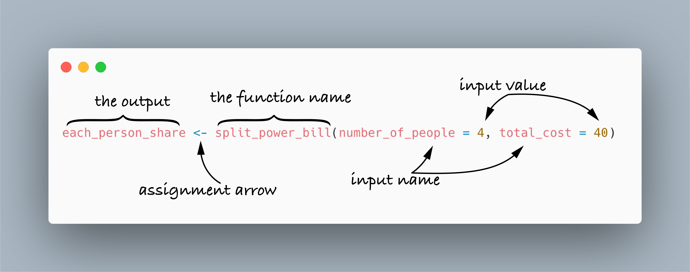
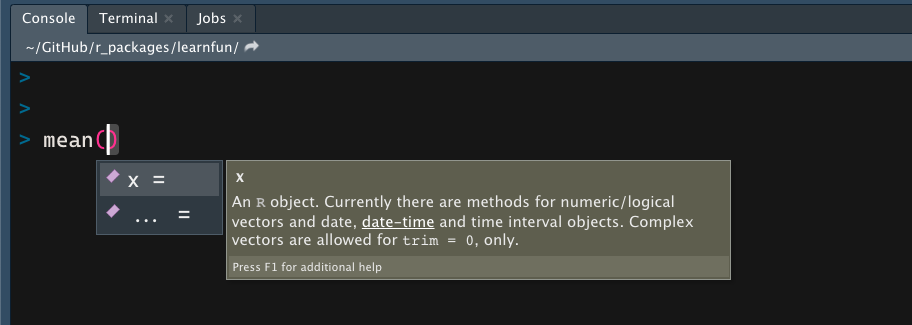

```{r xaringan-themer, include=FALSE, warning=FALSE}
library(xaringanthemer)

style_duo_accent(
  primary_color = "#003b49",
  secondary_color = "#1d4289",
  header_font_google = google_font("Cabin"),
  text_font_google = google_font("Noto Sans", "300", "300i"),
  code_font_google = google_font("Fira Mono"),
  colors = c(
    red = "#d3003f",
    purple = "#3e2f5b",
    orange = "#ff8811",
    green = "green",
    white = "#FFFFFF",
    blue = "blue"
  )
)

xaringanthemer::style_extra_css(
  list(
    ".title-slide" = list(
      "background-image" =
        paste0(
          "url(https://upload.wikimedia.org/wikipedia/commons/thumb/3/34/",
          "University_of_Sussex_Logo.svg/",
          "480px-University_of_Sussex_Logo.svg.png)"
        ),
      "background-position" = "95% 95%",
      "background-size" = "180px",
      "border" = "10px solid #013035",
      "background-color" = "#FFFFFF"
    ),
    ".title-slide h1" = list(
      "padding-top" = "0px",
      "font-size" = "60px",
      "text-align" = "left",
      "padding-bottom" = "18px",
      "margin-bottom" = "18px",
      "margin-top" = "0px",
      "color" = "#003b49"
    ),
    ".title-slide h2" = list(
      "font-size" = "40px",
      "text-align" = "left",
      "padding-top" = "10px",
      "margin-top" = "0px",
      "color" = "#003b49"
    ),
    ".title-slide h3" = list(
      "font-size" = "30px",
      "color" = "#26272A",
      "text-align" = "left",
      "text-shadow" = "none",
      "padding" = "0px",
      "margin" = "0px",
      "line-height" = "1"
    ),
    ".big" = list("font-size" = "40px"),
    "pre" = list(
      "background" = "#f8f8f8",
      "padding" = "10px",
      "border" = "1px",
      "border-color" = "#666",
      "border-style" = "solid",
      "border-radius" = "2px"
    ),
    ".footnote" = list(
      "font-size" = ".6em",
      "border-top" = "1px solid #007935"
    )
  )
)


xaringanExtra::use_editable(expires = 1)
```

```{css echo=FALSE}
  kbd {
      padding: 2px 4px;
      font-size: 90%;
      color: rgb(var(--font-col));
          background-color: #efefef;
      border-radius: 3px;
      box-shadow: none;
      border: solid 1px;
  }
```

```{r, echo=FALSE}
library(metathis)

content_type <- "intro_slides"
meta() %>%
  meta_description("In this practical we'll learn how to extend `R` using packages and how to use functions") %>%
  meta_tag("week" = "07") %>%
  meta_tag("conteqqqnt_type" = content_type)
```

## Plan for today

- Questions about last weeks practical

- Attendance pin

- Introduction to this week's topic

- This week's worksheet

---


# Attendance 

<br>

.middle[
.center[

## Attendance pin.can-edit[: ]


<br>
<br>
<br>
<br>
<br>
<br>
<br>

**Go to www.sussex.ac.uk/mobile OR use the SussexMobile app to input the pin**

]]


---

## A tip before we start!

As we start writing more and more code, we'll have to make sure we always spell
the commands **correctly**

This might seem obvious, but it's easy to make mistakes<sup>1</sup>

But you can use the power of **RStudio** to help you!

If you **start typing** the name of a command, then you can just hit the
<kbd>Tab</kbd> key and **RStudio** will show an autocomplete pop-up

Then you can use the arrow keys to select the command you want

This works for functions and for variable names!

If you make a lot of spelling mistakes, then learning to use the autocomplete
can save you **a lot of time** by preventing hard to find errors


.footnote[<sup>1</sup>One of us (Lincoln) is particularly bad at spelling and so makes a 
lot of mistakes misspelling even simple words!]

---

## Functions and Packages

In the practical this week we will learn about **functions** and **packages**
in `R`. 

- We'll learn how to use **functions** in `R`

- We'll learn how to install **packages** including:

  - How to install packages from the **CRAN**

  - How to install packages that are not on the **CRAN**

  - And how to **update** packages

- We'll learn how packages allow us to access new **functions**

- And we'll learn a couple of useful packages

---

### Functions

**Functions** are just rules (or algorithms) that turn **inputs** into **outputs**.

```{r echo=FALSE}
DiagrammeR::mermaid("
                    graph LR
    A[INPUT] --> B{FUNCTION}
    B --> C[OUTPUT]", height = 150)
```

For example, we could have a simple function that implemented the following
algorithm.

```md
1. Take input of a number
2. Multiply number by 5
3. Output result
```
---

Running the function with different inputs will produce different results

For example, if we used the number **5** as the **input** then our *function*
would produce  **25** as the **output**

```{r echo=FALSE}
DiagrammeR::mermaid("
                    graph LR
    A[INPUT] -->|5| B{FUNCTION}
    B -->|25| C[OUTPUT]", height = 150)
```

But if we changed the **input** to the number **2** then our *function* would
produce **10** as the **ouput**

```{r echo=FALSE}
DiagrammeR::mermaid("
                    graph LR
    A[INPUT] -->|2| B{FUNCTION}
    B -->|10| C[OUTPUT]", height = 150)
```

---

### Multiple inputs, but only one output


**Functions** in `R` can take many inputs. Each input is called a **parameter**
or an **argument** or sometimes simply just an **input**

But **Functions** in `R` can only produce **one** output. 

For example, you might have a **function** that implements the following
algorithm.

```md
1. Take an input of a number [Input1]
2. Take an input of a numnber [Input2]
3. Add Input1 and Input2
4. Output result
```

```{r echo=FALSE}

DiagrammeR::mermaid("
                    graph LR
    A[INPUT 1] -->|5| B{Add}
    C[INPUT 2] -->|5| B{Add}
    B -->|10| D[OUTPUT]", height = 150)
```

---

### Functions in `R`

Now that we understand **functions** at a conceptual level, let's take a look
at what they look like in `R`.

</img>


---

#### Inputs and Outputs

**Inputs**

- Functions can take lots of different kinds of inputs. Some functions take
  *character* vectors as inputs, some take *numbers*, and some take a
  combination

- Functions can also take *objects* as inputs. In this case, the function will
  operate on the **content** of the object

- Inputs usually have names. To find the names of the inputs to the function
  just hit the <kbd>Tab</kbd> key when the cursor is inside the `()` 

**Output**

- If the *output* of a function **isn't** assigned to an *object* then the
  output will just be printed out. 

- Usually you'll want to **use** the **output** of a function for something
  else, so you'll almost always be assigning it to an object

---

#### Working with inputs 

- When you're just learning how to use a **function** it can sometimes be
  helpful to try it out at the **console**

- After you've typed the function name you can add the `()` and then hit
  <kbd>Tab</kbd>

- This will show you the **names** of the inputs and will even tell you what
  the **inputs** are for

</img>


---

#### Working with multiple inputs

- When a function takes **multiple** **inputs** then they have an **order**
  that is *specified* by the *programmer* that **made** the function.

- But you **don't** have to use that order

For example, if the programmer specified `number` first and `letter` second
then you could run the function as follows:

```r
pretend_function(number = 1, letter = "A")
```

But you could also run it as follows:

```r
pretend_function(letter = "A", number = 1)
```

---

#### Working with multiple inputs

**So why does it matter?**  

When you leave the **name** of the input out, then the inputs go into the
*input slots* in the order **specified** by the programmer

```r
pretend_function("A",1)  #  number = "A",  letter = 1
```

To stay on the *safe side* it's a good habit to always specify the **input
name**

- However, in the coming weeks we'll learn about a family of functions that
  **always** take a **tibble** as their first input

- With these functions we'll usually leave out the name of the first input,
  which is usually either `data` or `.data`


---

## Installing packages

.center[</img>]

Most of the packages we'll be installing will come from the CRAN (The <u>C</u>omprehensive <u>R</u> <u>A</u>rchive <u>N</u>etwork)

To install packages from the CRAN we'll use a function called `install.packages()`

This function takes one input, which is a letter string with the name of the package.

```r
install.packages("pack") # install a package call pack
```

---

## Installing non-CRAN packages

Sometimes you'll want to install packages that aren't on the CRAN.

To do this, you'll first need to install a package(!) called **remotes**

**remotes** will allow you to access two functions

- `remotes::install_github(repo = ...)` for installing packages from a repository called **GitHub**

- `remotes::install_url(url = ...)` for installing packages from web addresses (called **URL**s)

<pre><code class="r hljs remark-code" style="font-size:.75em;">remotes::install_github(repo = "ljcolling/learnfun")

remotes::install_url(url = "https://files.mindsci.net/pkgs/learnfun_0.1.0.tar.gz")
</code></pre>

Way back in Week 1 (without realising it!) you ran one of these functions to
install the tutorials for  this course

---

## Using functions **from** packages

- `R` comes with a lot of functions built in to it. Some of these include
  functions like: 

  - `install.packages()` for installing packages

  - `library()` for loading packages

  - statistical functions like `mean()`, `sd()`, `min()`, `max()` for working
  out averages, standard deviations, minimum values, and maximum values<sup>1</sup>

  - various utility functions like `length()` (tells you the length of a
  vector), `class()` (tells you the class of a variable) etc


But most of the **functions** we'll use will come from packages...


---

## Using functions **from** packages

.center[</img>]

- If you want to use functions from a **package** you need to first install the
  package using `install.packages()` (or the equivalent for non-CRAN packages)

- You only need to **install** a package **once**

- But whenever you use it you'll need to **load** the package using the
  `library()` function

---

### Where to install and load packages

**Installing packages**

- Installing packages are one-off commands, so you'll type the command to
  install the package into the console

**Loading packages**

-  You need to load a package every time you want to use a function from that
  package, so it's a good idea to load them in a code chunk in your  `.Rmd`
  file

.pull-left[
<small>
<pre style="font-size:65%;margin-right:-3em"><code>&#45;&#45;&#45;
title: "Untitled"
output: html_document
&#45;&#45;&#45;

&#96;&#96;&#96;{r setup, include=FALSE}
knitr::opts_chunk$set(echo = TRUE)
library("mypackage") 
&#96;&#96;&#96;
</code></pre>

</small>
]

.pull-right[<span style="font-size:.75em">You should load your packages in the code chunk labelled
**setup**. By default, RStudio creates this code chunk, so you don't need to
add it.</span>

<span style="font-size:.75em">We discovered the **setup** chunk in [practical
4](https://paas.netlify.app/practicals/05/worksheets). It's special, because
it automatically runs when you run any other code chunk.</span>

<span style="font-size:.75em">Loading packages in the **setup** chunk makes sure they're always loaded before
using them</span>] 

---

### Using functions from packages

- When you use functions that are built in to `R`, like the
  `install.packages()` function, the `library()` function, or the `mean()`
  function etc then you can just use the function name by itself.

- But when you use functions that are part of **packages** that you've
  installed then you should put the **package name** before the **function
  name** with `::` between them.

- For example, to run a function called **function_name** from a package called
  **packagename** you'd type something like the following:

```r
packagename::function_name() 
```

---

## Some helpful packages and functions

We've spent a lot of time talking about file paths, because they can be tricky
to understand. 

We learned about how we can use **relative paths** to give directions to files
using our project folder (**HERE**) as a starting point

For example, if we had a file called `my_dog.png` in the `images` sub-folder of
our **project folder** we'd write the directions as:

```md
images/my_dog.png
```

But that by itself isn't very useful... we need to **translate** those
directions into something `R` can understand... 

For this we'll use a package called **here** that contains a function called
`here()`

---

### The **here** package 

The `here()` function from the **here** package takes the directions to the
file (as a character string) and **translates** it into something `R` can use

For example, 

```r
here::here("images/my_dog.png")
```

would translate the relative path into something `R` can use

- **Importantly** `here::here()` doesn't check whether the file actually
  exists, so it won't tell you if your directions are wrong. It just translates
  it **as if** they were correct

Usually you'll want to use those translated instructions for some other purpose
(e.g., to read in a data file or an image), so you'll usually save the output
to an object

```r
my_dog_file <- here::here("images/my_dog.png")
```

---

### Including images again

In the **markdown** practical we did a task where we inserted an image into
  a **R Markdown** document, but we actually learn how it worked.

Do this, we used the `include_graphics()` function from the **knitr** package

This function takes an input called **path** which is a file path to an image file

```r
knitr::include_graphics(path = ...)
```

To generate that `path` input we used the `here::here()` function to translate
our directions from **HERE** into a path that `R` can use

---

### Including images again

We include the image we could do something like this:

```r
john_travolta_file <- here::here("images/john_travolta.png")

knitr::include_graphics(path = john_travolta_file)
```

This is using the **output** from `here::here()`, now stored in a object called
`john_travolta_file` as the **input** for `knitr::include_graphics()`

But, we could also do something like:

<pre><code class="r hljs remark-code" style="font-size:.85em;">knitr::include_graphics(path = here::here("images/john_travolta.png"))</code></pre>

Here we can see the call to `here::here()` used as one of the arguments for
`knitr::include_graphics()`

So apart from using **character strings**, **numbers**, 
or **objects**/**variables** as inputs to functions, we can also use **other functions**

