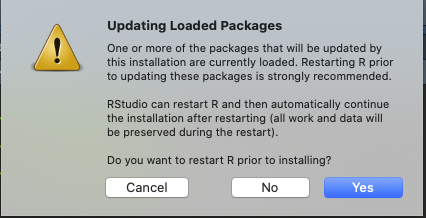

```{r setup, include=FALSE} 
ex_class <- function() {
  this_env <- environment()

  me <- list(
    thisEnv = this_env,
    getEnv = function() {
      return(get("thisEnv", this_env))
    },
    init = function() {
      return(assign("exs", 0, this_env))
    },
    Ex = function(label) {
      require(glue)
      exs <- get("exs", this_env)
      exs <- exs + 1
      assign("exs", exs, this_env)
      return(exs)
    }
  )

  assign("this", me, envir = this_env)

  class(me) <- append(class(me), "Exs")
  return(me)
}

ex_int <- ex_class()
ex_int$init()
prob <- function() glue::glue('<h3 style="font-size:130%;font-weight: bold;">Task {ex_int$Ex()}</h3>')


knitr::opts_chunk$set(echo = TRUE)
library(tidyverse)
library(metathis)
library(DiagrammeR)
```  


```{r echo=FALSE}

week <- "07"
content_type <- "worksheet"
meta() %>%
  meta_description(paste0(
    "In this practical we'll learn how to extend `R` ",
    "using packages and how to use functions"
  )) %>%
  meta_tag("week" = "07") %>%
  meta_tag("content_type" = content_type)
```

```{js, echo=FALSE}
function hideer() {
    const queryString = window.location.search;
    const urlParams = new URLSearchParams(queryString)

    if (urlParams.get("solutions") != "true") {

        console.log("tutor version...")

        let answers = document.querySelectorAll(".tutor")
        answers.forEach(x => x.style.display = 'none')

    }
}

window.onload = hideer
```

\


## Installing packages 

In today’s practical we'll learn how to extend the functionality of `R` by
using **packages** and we'll learn how to use **functions** in `R`.

### Installing packages from CRAN

We'll start off with a refresher on installing packages by installing a package
called `here`. The `here` package will give you access to a function called
`here()`. Like most of the packages that we'll be working with, this package is
on the CRAN.

To install packages on the CRAN we'll use a **function** called
`install.packages()`. The `install.packages()` function only takes one input.
This input is a *string of characters* giving the **package name**.

To install the **here** package you'd run the following command:

```{r, eval=FALSE, class.source="noselect"}
install.packages("here")
```

**Where do you run this command?**    

When you want to run commands to *install `R` packages* you run them in the
**Console** pane. Run the command above by typing it into the **Console**. 

If a dialogue box like the one below pops up then just click **No**



If you're able to install the package successfully then you should see something like the output below.


```md
> install.packages("here")
trying URL 'https://cran.rstudio.com/bin/macosx/contrib/4.0/here_0.1.tgz'
Content type 'application/x-gzip' length 18008 bytes (17 KB)
==================================================
downloaded 17 KB


The downloaded binary packages are in
	/var/folders/71/svr64pcx1mn0rq9141lk4dgw001d5z/T//Rtmp03fU6r/downloaded_packages
```

::: {.hint label="Spotting installation errors [Info Box]" type="infobox"}

When installing new packages the easiest way to check whether the package has
been *installed correctly* is to try *loading* it.

For example, if you've just tried to install a package called `nonpackage`,
then you can check whether it is installed correctly by loading it with the
`library()` function. If you don't get an error message then everything is OK!
However, if you get an error message like the one below, then that means the
package hasn't been installed correctly.  

```md
> library("nonpackage")
Error in library("nonpackage") : there is no package called ‘nonpackage’
```

\

You can also spot installation errors by looking at the messages at the end of
the installation process. 

For example, if a package doesn't install because you've typed the package name
in incorrectly then you'll see a message telling you the package **is not
available**:

```md
> install.packages("doesnotexist")
Warning message:
package ‘doesnotexist’ is not available (for R version 4.0.2)
```

\

If you've typed the name in correctly but the installation has failed for some
other reasons then you'll see a message telling you that the installation **had
a non-zero exit status**:

```md
The downloaded source packages are in
‘/private/var/folders/71/svr64pcx1mn0rq9141lk4dgw001d5z/T/RtmpLO2yBg/downloaded_packages’
Warning message:
In install.packages("rJava") :
installation of package ‘rJava’ had non-zero exit status
```

:::

### Installing not on the CRAN

A minority of packages that we'll be using are not on the CRAN. To install
these packages we'll use a function from the **remotes** package called
`remotes::install_url()` or `remotes::install_github()`. 

The `remotes::install_url()` function just takes one input. This is a character
string that is a URL (that is, a web address starting with `http://` or
`https://`). 

The `remotes::install_github()` function also takes one input. This is a
character string that will be the location of a **GitHub** repository. It's
input will look something like this: `SussexPsychMethods/paas`. Notice that it
doesn't have any `http://` or `https://` at the start. You'll almost always be
told by the package developer whether you should use **install_url** or
**install_github**. 


### Updating packages

Sometimes the people that make `R` packages will *update* them. This might be
because they want to correct errors in them or because they've added some new
functionality. **Updating** packages is just as easy as **installing** them. To
update a package all you need to do is run the install command again.

For example, if you used the following command to install a package:

```{r, eval=FALSE, class.source="noselect"}
install.packages("here")
```

You'd use the exact same command to update it. 

And if you used the following command to install a package:

```{r, eval=FALSE, class.source="noselect"}
remotes::install_url(url = "https://files.mindsci.net/pkgs/paas_0.1.0.tar.gz")
```

You'd also use the exact same command to update it.


## Using packages and functions

Once you've installed a package you can start using the functions that it
brings with it. To do this, you should first load the package using the
`library()` function. The `library()` function just takes one input. This is a
character string with the name of the package. 


For example, the command below would load the **here** package.

```{r, eval=FALSE, class.source="noselect"}
library("here")
```

When you want to use a function from a package, you should put the **package
name** before the **function name**. For example, if I wanted to use the
`install_url()` function from the **remotes** package I would write:

```{r, eval=FALSE, class.source="noselect"}
remotes::install_url(url = ...)
```

## Getting help on functions

The easiest way to get help on a function is to use the `?`. To get help, you
just put a `?` before the function call. Remember, don't forget the `()`!

To get help on the `here()` function from the **here** package, you'd write the
following at the **console**

```{r, eval=FALSE, class.source="noselect"}
?here::here()
```


## Tasks

Now that you've had a bit of a refresher on functions and packages we'll put
that knowledge to use to solve the following tasks.

`r prob()`

First, create a new **R Studio** project. You can call it whatever you want,
but `prac_07` is probably a good name.

`r prob()`

Next up, create a **new** **RMarkdown** (`.Rmd`) file and save it in the
`rdocs` folder of your current project folder. You'll be writing your solutions
into this file. You can give it whatever name you want. 

`r prob()`

Next, clear out the `.Rmd` file by deleting everything below the first code
chunk (the **setup** chunk).

`r prob()`

We'll be using three packages for today's tasks. Two packages will be installed
from **CRAN** and the third will be a **non-CRAN** package.

1. First install the **here** package and the **knitr** package from **CRAN**. 

2. Next install the **non-CRAN** package called **learnfun** from the **URL**
   `https://files.mindsci.net/pkgs/learnfun_0.1.0.tar.gz`
 
Make sure to install these packages by running the commands in the correct way. 

:::{.warn} 

Some people using older MacBooks might see an error when they try to
install the **non-CRAN** pacakge.

The erorr message will say something about a `CA Certificate` error. If you get
this message then install this pacakge from the **GitHub** repository
`ljcolling/learnfun`

:::


:::{.hint label="Hint 1"}
The commands should be run at the **console**.
:::

:::{.hint label="Hint 2"}

```{r, eval=FALSE, class.source="copy"}
install.packages("here")
install.packages("knitr")
remotes::install_url(url = "https://files.mindsci.net/pkgs/learnfun_0.1.0.tar.gz")
```
::: 

:::{.tutor}

```{r, eval=FALSE, class.source="copy"}
install.packages("here")
install.packages("knitr")
remotes::install_url(url = "https://paas.netlify.app/packages/learnfun.zip")
```

:::

`r prob()`


We'll be using the **here**, the **knitr**, and the **learnfun** packages, so
add some code to the **setup** chunk of your `.Rmd` file so that these packages
will be loaded whenever you **knit** the document.


:::{.hint}
use the `library()` function to load a package. 

Put this code in the very first code chunk (the **setup** chunk).
:::


:::{.tutor}
```{r eval=FALSE, class.source="copy"}
library("knitr")
library("here")
library("learnfun")
```
:::

`r prob()`

Now create a new **code chunk** in your `.Rmd` file.

Copy the code below and paste it into the **code chunk**

```{r, eval=FALSE, class.source="copy"}
rnorm(n = 100, mean = 0, sd = 1)
```

This function simply generates 100 random numbers from the **normal
distribution** with a mean ($\mu$) of 0 and a standard deviation ($\sigma$) of
1.

Edit the line of code so that the output is assigned to a variable called
`my_random_numbers`.

:::{.hint} 
You just need to add the object name (`my_random_numbers`) and the
assignment arrow (`<-`) to the start of the line before the `rnorm()` function
is called. 
:::

:::{.tutor}
```{r, eval=FALSE, class.source="copy"}
my_random_numbers <- rnorm(n = 100, mean = 0, sd = 1)
```
:::

`r prob()`

Next we'll use the object we created in the previous step (`my_random_numbers`)
as the input to the `mean()` function. 

If you're unsure of how to use a function then you can ask `R` for **help**. To
do this, you just use a `?` before the function name and then call the function
without any inputs. Because this is just a one-off command you'd type it at the
console. (Putting it in the `.Rmd` would mean asking for help every time you
**knit** your file!)

For example, if you wanted help about the `mean()` function, then you'd type
the following into the console

```{r, eval=FALSE, class.source="noselect"}
?mean()
```

Now try accessing the help on the **mean** function, and see where it appears
in your **help** pane.

`r prob()`

Use the `mean()` function to work out the mean of the vector of numbers you
just created. Add this code to the code chunk. 

:::{.tutor}
```{r, eval=FALSE, class.source="copy"}
mean(x = my_random_numbers)
```
:::


`r prob()`

Another common statistical function that you'll use is the `sd()` function, 
for working out the standard deviation of a list of numbers. Use the help to read
the information about the `sd()` function, and then use it to work out the 
standard deviation of the `my_random_numbers` vector.


:::{.tutor}
```{r, eval=FALSE, class.source="copy"}
sd(x = my_random_numbers)
```
:::

`r prob()`

Both the `mean()` function and the `sd()` don't produce the result you might 
expect when there's missing values (represented by `NA` in R) in the list. 

Create a new code chunk, and insert this code snippet, which will create a 
vector called `numbers_with_missing`.


```{r, eval=FALSE, class.source="copy"}
numbers_with_missing <- c(98, 192, 198, 19, NA, 10, 102)
```

Work out the mean and sd of this vector, as before. Notice that the result in
both cases is `NA`. Have a read through the help to see if you can figure out
how to make these functions ignore the `NA` values before doing the computation. 

:::{.hint}
Check the help section labelled **Arguments**
:::

:::{.tutor}
```{r, eval=FALSE, class.source="copy"}
sd(numbers_with_missing, na.rm = TRUE)
mean(numbers_with_missing, na.rm = TRUE)
```
:::


`r prob()`

This problem is for people that want to try implement the algorithm for a 
standard deviation themselves. To work out the standard deviation of a list of
numbers perform the following steps.

1. Work out the difference between each element of the vector and the mean of 
   vector

2. Square of these numbers

3. Work out the sum of these numbers

4. Divide this value by N - 1, where N is the number of elements in the vector.

5. Work out the square root of this value

You can use the `sum()` function to work out the sum of a vector, and the 
`length()` function to work out the number of elements in a vector. 

If you're more comfortable with an equation, then formula for the standard
deviation $\sigma$ is as follows, where $\mu$ is the mean, and $N$ is the
number of elements in the vector.

$$\sigma={\sqrt{\frac{\sum(x_{i}-{\mu})^{2}}{N - 1}}}$$

Work out the standard deviation for `my_random_numbers` and `numbers_with_missing`
and check whether you get the same result as above.


:::{.tutor}
```{r, eval=FALSE, class.source="copy"}
sqrt(sum((my_random_numbers - mean(my_random_numbers))^2) / (length(my_random_numbers) - 1)) 
sqrt(sum((numbers_with_missing - mean(numbers_with_missing))^2) / (length(numbers_with_missing) - 1)) 
```
:::

`r prob()`

Now that you know how to get help, try accessing the help for the **rankitems**
function from the **learnfun** package.

:::{.tutor}
```{r, eval=FALSE, class.source="copy"}
?learnfun::rankitems()
```
:::

`r prob()`

After you've read the help on the **rankitems** function, add a new code chunk
to your `.Rmd` file and use the **rankitems** function to do something sensible
with it. 

:::{.tutor}
```{r, eval=FALSE, class.source="copy"}
learnfun::rankitems(
  fav = "Pizza",
  second = "Sushi",
  hated = "Coriander"
)
```
:::

`r prob()`

Next we will try and include an image into our `.Rmd` file. We will do this in
a few steps. 

First, we'll need an image. To download the image click `r xfun::embed_file(path = "./assets/r_rollercoaster_small.png", text = "HERE", name="rollercoaster.png")`.

Either save the image directly into the `images` sub-folder of you project or
move it from your downloads folder to the `images` sub-folder of your project.

:::{.hint}
If you're having trouble downloading the file and then uploading to
`RStudio` cloud then you can try using the `download.file()` function. First
create your `images` folder, and then run the following command:

```{r, eval=FALSE, class.source="copy"}
 download.file(url = "https://files.mindsci.net/rollercoaster.png", destfile = "./images/rollercoaster.png")       
```
:::

:::{.tutor}

For people using chromebooks/the cloud version of `R` it might be easier for
them to use the `download.file()` function. 

```{r, eval=FALSE, class.source="copy"}
 download.file(url = "https://files.mindsci.net/rollercoaster.png", destfile = "./images/rollercoaster.png")       
```

:::


`r prob()`

Create a new code chunk. In this code chunk use the `here::here()` function to
give the directions to the image file that you've just downloaded. Make sure
you assign the directions to an object called `imagefile`

:::{.hint}
You'll write the directions to the file in the same way you did in [Week 3](https://paas.netlify.app/practicals/02_project_files/worksheets), in the section *Finding the path to a file*.
:::

::: {.tutor}
```{r eval=FALSE, class.source="copy"}
imagefile <- here::here("images/rollercoaster.png")
```
:::

`r prob()`

In the same code chunk as before, use the `knitr::include_graphics()` function
to include the image in your document. Use the `imagefile` object as the input
for the **include_graphics** function.


:::{.tutor}
```{r eval=FALSE, class.source="copy"}
imagefile <- here::here("images/rollercoaster.png")
knitr::include_graphics(path = imagefile)
```
:::

`r prob()`

You've just included an image in your document, but it took **2** lines of
code. See if you can streamline it, so that you only use **1** line of code.


:::{.tutor}
```{r eval=FALSE, class.source="copy"}
knitr::include_graphics(path = here::here("images/rollercoaster.png"))
```
:::


`r prob()`

An important skill to learn is how to diagnose **problems** with your code.
Create a new code chunk in your `.Rmd` file and insert the code below into the
code chunk. 


```{r eval=FALSE, class.source="copy"}

a_number <- "10"
learnfun::number_and_word(number = a_number, word = a_word)
```

Before running the code chunk, read the help for the function using the `?` 
command, and see if you can fix the error.

:::{.tutor}
```{r eval=FALSE, class.source="copy"}
a_number <- 10 # shouldn't have quotes
learnfun::number_and_word(number = a_number, word = a_word)
```
:::

\

`r prob()`

Now try running the **code chunk**. You'll notice that it produces an error.
Make some changes to the **code chunk** so that it produces the following
output.

```md
The number is  10  and the word is  cat
```

Don't edit the line that starts with `learnfun::`

:::{.tutor}
```{r eval=FALSE, class.source="copy"}
a_number <- 10
a_word <- "cat" # this object wasn't defined
learnfun::number_and_word(number = a_number, word = a_word)
```
:::


`r prob()`

I hope the last one was easy, so we'll make it a little more complicated now.

Create a new **code chunk** and copy the code below into the code chunk. Take a
look at the comments in the code to give you an idea of what different bits of
the code are doing.

```{r eval=FALSE, class.source='copy'}

# Create an object with an animal name
animal <- "Elephant"

# Create an object with a location
lives_in <- "Africa"

# Create an object with an age
age <- "70"

# get information about an animal
learnfun::animal_info(name = animl, where = lives_in, lifespan = age)
```

This code will produce an error (or two), so you'll have to fix it so that it
works correctly. When it works correctly it should print out the following
message


```md
Elephant  live in  Africa and live for  70  years

# A tibble: 1 x 4
  name     where  lifespan_years lifespan_months
  <chr>    <chr>           <dbl>           <dbl>
1 Elephant Africa             70             770
```

:::{.tutor}
```{r eval=FALSE, class.source="copy"}
# Create an object with an animal name
animal <- "Elephant"

# Create an object with a location
lives_in <- "Africa"

# Create an object with an age
age <- 70 # should be a number

# get information about an animal
learnfun::animal_info(
  name = animal, # spelling error
  where = lives_in,
  lifespan = age
)
```
:::

`r prob()`

The `learnfun::animal_info()` function prints out a message, but it also
outputs a new object (a tibble). But only if you assign the output to an
object.

Edit the code chunk so that the output of the `learnfun::animal_info()`
function is assigned to an object called `elephant_info`.


:::{.tutor}
```{r eval=FALSE, class.source="copy"}


elephant_info <- learnfun::animal_info(name = animal, where = lives_in, lifespan = age)
```
:::

`r prob()`

Now take a look at the `elephant_info` object. You'll notice that it has two
columns that have numbers in them. One is called `lifespan_years` and the other
is called `lifespan_months`.

Do you notice anything weird? That's right, the value in `lifespan_months` is 
incorrect.

Write some code to check whether the value in `lifespan_months` is 12 times the
values in `lifespan_years`. Essentially, just check whether the conversion from
life span in years to life span in months has been done correctly!

You'll need to use the logical operators (one of `==`, `!=`, `>`, `<`, `>=`,
`<=`, etc)

:::{.hint}
Remember to use the `$` to select a column of a tibble. 

To check whether one object/value is equal to another you'd use `==`.
:::

:::{.tutor}
```{r eval=FALSE, class.source="copy"}

elephant_info$lifespan_years * 12 == elephant_info$lifespan_months

# or

elephant_info$lifespan_months / 12 == elephant_info$lifespan_years
```
:::

\

\

\
