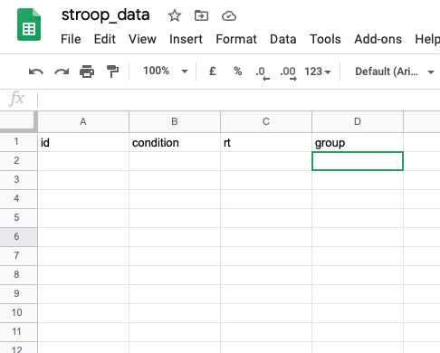

```{r xaringan-themer, include=FALSE, warning=FALSE}
library(xaringanthemer)

style_duo_accent(
  primary_color = "#003b49",
  secondary_color = "#1d4289",
  header_font_google = google_font("Cabin"),
  text_font_google = google_font("Noto Sans", "300", "300i"),
  code_font_google = google_font("Fira Mono"),
  colors = c(
    red = "#d3003f",
    purple = "#3e2f5b",
    orange = "#ff8811",
    green = "green",
    white = "#FFFFFF",
    blue = "blue"
  )
)

xaringanthemer::style_extra_css(
  list(
    ".title-slide" = list(
      "background-image" =
        paste0(
          "url(https://upload.wikimedia.org/wikipedia/commons/thumb/3/34/",
          "University_of_Sussex_Logo.svg/",
          "480px-University_of_Sussex_Logo.svg.png)"
        ),
      "background-position" = "95% 95%",
      "background-size" = "180px",
      "border" = "10px solid #013035",
      "background-color" = "#FFFFFF"
    ),
    ".title-slide h1" = list(
      "padding-top" = "0px",
      "font-size" = "60px",
      "text-align" = "left",
      "padding-bottom" = "18px",
      "margin-bottom" = "18px",
      "margin-top" = "0px",
      "color" = "#003b49"
    ),
    ".title-slide h2" = list(
      "font-size" = "40px",
      "text-align" = "left",
      "padding-top" = "10px",
      "margin-top" = "0px",
      "color" = "#003b49"
    ),
    ".title-slide h3" = list(
      "font-size" = "30px",
      "color" = "#26272A",
      "text-align" = "left",
      "text-shadow" = "none",
      "padding" = "0px",
      "margin" = "0px",
      "line-height" = "1"
    ),
    ".big" = list("font-size" = "40px"),
    "pre" = list(
      "background" = "#f8f8f8",
      "padding" = "10px",
      "border" = "1px",
      "border-color" = "#666",
      "border-style" = "solid",
      "border-radius" = "2px"
    ),
    ".footnote" = list(
      "font-size" = ".6em",
      "border-top" = "1px solid #007935"
    )
  )
)


xaringanExtra::use_editable(expires = 1)
```

```{css echo=FALSE}

  kbd {
      padding: 2px 4px;
      font-size: 90%;
      color: rgb(var(--font-col));
          background-color: #efefef;
      border-radius: 3px;
      box-shadow: none;
      border: solid 1px;
  }

.inset {

    margin-left:auto;
    margin-right:auto;
    display:flex;
    width: 100%;
    border: 0;
    -ms-transform: scale(0.65);
    -moz-transform: scale(0.65);
    -o-transform: scale(0.65);
    -webkit-transform: scale(0.65);
    transform: scale(0.65);

    -ms-transform-origin: 0 0;
    -moz-transform-origin: 0 0;
    -o-transform-origin: 0 0;
    -webkit-transform-origin: 0 0;
    transform-origin: 0 0;
}
```

```{r, echo=FALSE}
library(metathis)
week <- "08"
content_type <- "intro_slides"
meta() %>%
  meta_description(paste0(
    "In this practical we'll learn how to organise",
    "data in the tidy way"
  )) %>%
  meta_tag("week" = week) %>%
  meta_tag("content_type" = content_type)
```

## Plan for today

- Questions about last weeks practical

- Attendance pin

- Learning how to organise data

- Organising the data the **tidy** way

- Running a little experiment to **generate some data**

- Entering the data into a spreadsheet

- Reading that data into *R**

---


# Attendance 

<br>

.middle[
.center[

## Attendance pin.can-edit[: ]


<br>
<br>
<br>
<br>
<br>
<br>
<br>

**Go to www.sussex.ac.uk/mobile OR use the SussexMobile app to input the pin**

]]


---

## Organizing data

In today's practical we're going to learn how to organize data in a **tidy**
way


---

We organise data in a **tidy** way, because it makes it easier to work with.

From next week, we'll be learning how to work with **tidy** data, so the aim
for this week is to learn **what tidy data is...**


---

### What is **tidy** data?


---

### Generating some data

In today's practical we're going to run a short experiment to generate some data. We'll then enter that data into a spreadsheet in a **tidy** way. 

**The Experiment**

We'll be run a short Stroop task. In the Stroop task you'll see colour words printed in different colours. The words are presented under two conditions:


In the **congruent condition** the colour will match the word. 


In the **incongruent condition** there will be a mismatch between the colour and the word. 

<br />

Your task is to identify the **colour the word is printed in**. At the end of the task, you'll be presented with **two** numbers. How quickly you could identify the colour in the **congruent** condition, and how quickly you could identify the colour in the **incongruent** condition. 

---

### Organizing the data

Once everyone has done the experiment then we'll need to enter it into the computer and organize it somehow. 

**Identifiers**

When we collect data we will have **identifiers** that might tell us something about:

1. Who the data was collected from (subject IDs)

2. Which group the person was part of (group ID)<sup>1</sup>

3. Which condition the data was collected in (condition ID)<sup>2</sup>


You'll always have subject IDs, but whether you'll also have group IDs and condition IDs will depend on whether you're employing a repeated-measures, between-subjects, or mixed design.

.footnote[<sup>1</sup>We'll only need this if we have a *between-groups* or **mixed-design** design.

<sup>2</sup>We'll only need this if we have a *repeated-measures* or **mixed-design** design.]


---

#### Rules for identifiers

There are some general rules that should be followed when *creating* identifiers. Many of these rules are the same as those that should be followed when naming *files* and *folders*.

1. Identifiers should **not** contain spaces (use underscores instead i.e., _)

1. Identifiers should all be the same number of characters long
This means that if you're using sequential numbers you should pad the numbers with extra zeros i.e., 001, 002, 003, 011, 100 and not 1, 2, 3, 11, 100

1. Identifies must never start with a number (e.g., use *cond01* instead of *01*)

1. No special characters e.g., ü, é, ø, ā, æ, å, !, #, *, ~ etc

1. Try to keep the names are short as practically possible

1. Very important: **Identifiers must be unique**


---

#### Some example identifiers


.pull-left[
**Bad Identifies**

Subject_1  
Subject_10

01  
02

bill smith  
roger bannister]


.pull-right[
**Better Identifiers**

subject_001  
subject_002


p10292  
p10293]

You'll be able to use the worksheet to generate a unique participant ID and a group ID for yourself.

---

#### Entering the data

At the end of the experiment, and once you're generated your participant ID and group ID, you'll have four bits of data:

1. A number (a reaction time) for the **congruent condition**

1. A number (a reaction time) for the **incongruent condition**

1. Your **participant ID**

1. Your **group ID**

We'll also need **condition identifiers**. For this we'll use:

- `con`

- `inc`

For the **congruent** and **incongruent** conditions, respectively.

---

### **Tidy** data vs **messy** data

When we enter the data into the spreadsheet, we're going to use the **tidy** format.

.pull-left[
**Wide format**

| id   | con | inc | group |
| ---- | ------ | ------ | -----|
| p001 | 3042   | 4234   | G1 |
| p002 | 4674   | 6244   | G2|
| p003 | 3346   | 6048   | G1|
| p004 | 3467   | 4055   | G1 |

Each **row** represents one **person**]
    
.pull-right[
**Tidy format**
    
| id  | condition | rt | group |
| ---- | --------- | ----- |
| p001 | con   | 3042  | G1 |
| p001 | inc    | 4234  | G1 |
| p002 | con    | 4674  | G2 |
| p002 | inc    | 6244  | G2 |
    
Each **row** represents one **measurement**]

In the **tidy** format, each **row** holds a **measurement**, and the **columns** hold information **about that measurement**


---

### Generating data

To generate the data, we'll perform a short Stroop task

You can find the task, and instructions on how to do the task on the worksheet
under the heading **Creating some data**


<p align="center"><iframe width="700px" height="650px" class="inset" src="assets/paas_stroop.html" scrolling="no"></iframe></p>

---

#### Getting the date into a file

We're going to put our data into a Google Sheet.

.pull-left[

- Put your participant ID in the **id** column. 

- Put the appropriate condition ID (**con** or **inc**) in the **condition** column

- Put the measurement in the **rt** column 

- Put your group ID in the **group** column

]


.pull-right[
]

---

#### Downloading the data

Now that the data has been entered into the spreadsheet we can download it!

1. Go to the **File** menu

2. Select **Download**

3. Select **Comma-separated values (.csv, current sheet)**

4. Save the file as `stroop.csv` 

4. Save (or move) this file to the `data` sub-folder of your project folder

---

## Working through the worksheet

To work through the worksheet we'll be using a few **packages**. They should all already be installed on your computer, so you'll just need to load them.

1. **here** for working with file paths

2. **readr** for reading in the data 

3. and **tibble**, because when we read the data in we'll read it into a **tibble**

---

### The `here` package

The **here** package gives us access to the **here** function...

Remember, we give file paths by tracing out the steps we need to take to 
get to a file. 


.pull-left[
<span>
<pre><code>
.
├── 📁data
│   <mark>└── data.csv</mark>
├── 📁r_docs
└── week_08.RProj


 
   


</code></pre>
</span>
]

.pull-right[
If we wanted to get to the highlighted file (`data.csv`), we'd
take the following steps.

1. go to `data`

2. then go to the file called `data.csv`

Putting those two steps together we get `data/data.csv`
]

We give these steps to `here::here()` as a **string**

```r
here::here("data/data.csv")
```

---

### The `readr` package

The **readr** package gives us access to the **read_csv** function

`rear::read_csv()` can take several inputs, but the only one that we care about
is one called **file**

**file** is just the file path (i.e., the directions to a file). Something that
we're generated with `here::here()`

So if wanted to read in our file from the previous example, we'd write something 
like this

```r
readr::read_csv(file = here::here("data/data.csv"))
```

The output of this will be a **tibble**, so we'll want to assign that output to
an object (that is, put the output in a little labelled box so we can use it
later)

```r
my_data <- readr::read_csv(file = here::here("data/data.csv"))
```

---

### The `tibble` package

We won't use the **tibble** package directly ourselves, but it's used by the
**readr** package, which is why we also need load it

As mentioned a couple of weeks ago, almost all the **tibbles** we use will be
created by reading in data files rather than by writing the **R** code to
construct the **tibble** directly.
