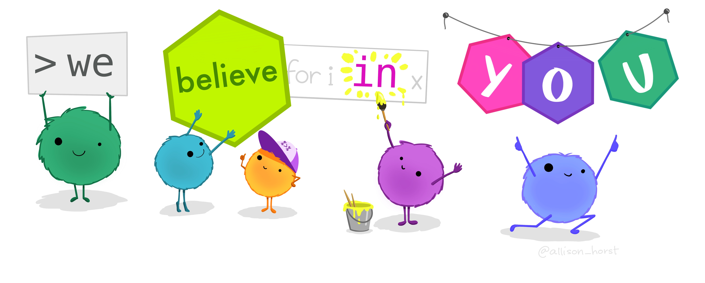

<!-- ~/iCloud/teaching/PAAS2020/practical08/slides/index.Rmd -->
<!-- ~/GitHub/teaching/worktree/PAAS2021/practical-08/src/practicals/07/slides/index.Rmd -->


```{r xaringan-themer, include=FALSE, warning=FALSE}
library(xaringanthemer)
library(dplyr)
library(palmerpenguins)
penguins2 <- penguins %>% select(species, island, sex, year)
style_duo_accent(
  primary_color = "#003b49",
  secondary_color = "#1d4289",
  header_font_google = google_font("Cabin"),
  text_font_google = google_font("Noto Sans", "300", "300i"),
  code_font_google = google_font("Fira Mono"),
  colors = c(
    red = "#d3003f",
    purple = "#3e2f5b",
    orange = "#ff8811",
    green = "green",
    white = "#FFFFFF",
    blue = "blue"
  )
)

xaringanthemer::style_extra_css(
  list(
    ".title-slide" = list(
      "background-image" =
        paste0(
          "url(https://upload.wikimedia.org/wikipedia/commons/thumb/3/34/",
          "University_of_Sussex_Logo.svg/",
          "480px-University_of_Sussex_Logo.svg.png)"
        ),
      "background-position" = "95% 95%",
      "background-size" = "180px",
      "border" = "10px solid #013035",
      "background-color" = "#FFFFFF"
    ),
    ".title-slide h1" = list(
      "padding-top" = "0px",
      "font-size" = "60px",
      "text-align" = "left",
      "padding-bottom" = "18px",
      "margin-bottom" = "18px",
      "margin-top" = "0px",
      "color" = "#003b49"
    ),
    ".title-slide h2" = list(
      "font-size" = "40px",
      "text-align" = "left",
      "padding-top" = "10px",
      "margin-top" = "0px",
      "color" = "#003b49"
    ),
    ".title-slide h3" = list(
      "font-size" = "30px",
      "color" = "#26272A",
      "text-align" = "left",
      "text-shadow" = "none",
      "padding" = "0px",
      "margin" = "0px",
      "line-height" = "1"
    ),
    ".big" = list("font-size" = "40px"),
    "pre" = list(
      "background" = "#f8f8f8",
      "padding" = "10px",
      "border" = "1px",
      "border-color" = "#666",
      "border-style" = "solid",
      "border-radius" = "2px"
    ),
    ".footnote" = list(
      "font-size" = ".6em",
      "border-top" = "1px solid #007935"
    )
  )
)


xaringanExtra::use_editable(expires = 1)
```
```{css echo=FALSE}

  kbd {
      padding: 2px 4px;
      font-size: 90%;
      color: rgb(var(--font-col));
          background-color: #efefef;
      border-radius: 3px;
      box-shadow: none;
      border: solid 1px;
  }
```

```{r, echo=FALSE}
library(metathis)
week <- "09"

description <- paste0(c(
  "In this week's practical we're going to learn ",
  "how to manipulate the transform data with the `dplyr` package."
))

content_type <- "intro_slides"
meta() %>%
  meta_description(description) %>%
  meta_tag("week" = "09") %>%
  meta_tag("content_type" = content_type)
```

## Plan for today

- Questions about last week's practical 

- Attendance pin 

- Manipulating and transforming data with `dplyr`

  - the `mutate()` function

  - the `select()` function

  - the `filter()` function

---


# Attendance 

<br>

.middle[
.center[

## Attendance pin.can-edit[: ]


<br>
<br>
<br>
<br>
<br>
<br>
<br>

**Go to www.sussex.ac.uk/mobile OR use the SussexMobile app to input the pin**

]]


---

Things might feel hard this week, but remember...

<br>
<br>
<br>
<br>
<br>



---


## Recap on functions and assignment

Before we start, I just wanted to recap a few concepts that will come in handy
for this week's task:

The first is assigning the output of a function to an object

To assign the output of a function to an **object** the structure is as
follows:

```r
objectname <- function_producing_output()
```

**objectname** is just a placeholder for the name of the object that will hold
the output. This can be any name you want. Choose something short and
meaningful because it'll help you keep track of things.

**function_producing_output** is just a placeholder for the function that is
producing the output. 

The assignment operator `<-` points to the object that **will hold the
output**, and away from the command (or commands) that will **produce** the
output

---

## Recap on objects/variables


Once you have some value assigned to an **object**, then you can use that
content just by using the object name. 

This means you can use that object as the input to another function. 

The other thing worth remembering is that if you want to view the **content**
of an object, then you can just use the object name by itself. 

E.g., running the following at the console will print out the content of the
object:

```r
objectname
```

putting it is a code chunk and running it will do the same:

<pre class="md"><code>&#96;&#96;&#96;{r}
objectname
&#96;&#96;&#96;
</code></pre>

---

## Tibbles

A **tibble** really just is a **table** with *rows* and *columns* and *columns
headers* just like a regular table.

Whenever we work with data in `R` we'll be working with it in the form of
**tibbles**

Here's some penguins data in a tibble:

```{r echo=FALSE, results='markup'}
palmerpenguins::penguins %>%
  slice(1:5) %>%
  select(1:4)
```

This **tibble** has 5 rows and 4 columns 

---

### Using `dplyr` to work with **tibbles** 

Today's session is about about working with **tibbles** and using the power of
`R` to bend data to our will!

We're going to cover three functions from the `dplyr` package. These are:

.pull-left[
- `dplyr::select()` for **selecting** specific **columns**

- `dplyr::filter()` for **selecting** specific **rows**

- `dplyr::mutate()` for **creating** new **columns**
]

.pull-right[

]

---

### The structure of `dplyr` functions 

All the `dplyr` functions work in very similar ways, so once you learn the
pattern you'll be able to work with them with ease. 

All the `dplyr` functions take a **tibble** as the input, and produce another
**tibble** as an output. 

```r
output_tibble <- dplyr::select(.data = input_tibble, ...

output_tibble <- dplyr::filter(.data = input_tibble, ...

output_tibble <- dplyr::mutate(.data = input_tibble, ...
```

You'll just replace the `...` the operation that you want to perform. 

---
class: smoller
#### The `dplyr::select()` function

The first function we'll cover is `dplyr::select()`, because it's the easiest
to get your head around!

The `dplyr::select()` function is for **selecting** columns. To use it you
  just need to give it a list of the columns you want

```{css, echo=FALSE}
.smoller .remark-code {
  font-size: 85%;
}
```

```{r}
output_result <- dplyr::select(.data = penguins, island)
output_result
```


---

Selecting multiple columns is just as easy as selecting one

```{r}
output_result <- dplyr::select(.data = penguins, island, sex)
output_result
```

Just make sure that the column exists in the tibble and that you've spelled it
correctly or you'll get an error that says `Column ... doesn't exist`

---
class: smoller


If you want to **delete**/**drop** columns instead of **selecting** them then
just add a `-` before the column name

```{r}
output_result <- dplyr::select(.data = penguins, -island, -sex, -year)
output_result
```

---
class: smoller

#### The `dplyr::filter()` function


The `dplyr::filter()` allows us to keep rows that match a specific condition

---
class: smoller

#### The `dplyr::filter()` function

The power the `dplyr::filter()` is only limited by your imagination! 

You can come up with all sorts of conditions:

Here's an example of matching a character string

```{r}
dplyr::filter(.data = penguins2, island == "Dream")
```

All the penguins from **Dream** island 

---

Here's an example of (un)matching a character string
```{r}
dplyr::filter(.data = penguins2, island != "Dream")
```

All the penguins **not** from **Dream** island

---


Here's an example with numbers 
```{r}

dplyr::filter(.data = penguins2, year > 2008)
```

All the penguins measured after 2008

Once you learn the **structure** it'll become easier. So practice and stick
with it until it clicks!

---

#### The `dplyr::mutate()` function


.center[]

The `dplyr::mutate()` function allows us to create new columns 

---


#### The `dplyr::mutate()` function

The `mutate()` function is used for **creating** new **columns**

The general format is as follows:

```r
dplyr::mutate(.data = input_tibble, new_col = `operation`)
```

Where **new_col** is just a placeholder for the name of our new column (it can
be whatever we want it to be), and **`operation`** is just a placeholder for
the operation that creates the new column (e.g., `col_a + col_b`, or something
like that)

We'll take a look at in action, and then it'll make more sense!

---

#### The `dplyr::mutate()` function

```{r, echo=FALSE, include=FALSE}

data <- tibble::tibble(item = c("Apples", "Bananas", "Oranges"), price = c(1.00, 2.00, 2.40))
```

Let's say we have a tibble called `fruit_prices`, and we want to discount all
the fruit by 10%

.pull-left[
Our original tibble with fruit prices

```{r, include=TRUE, echo=FALSE}
data
```
]


.pull-right[
Our tibble with the new prices 

```{r, include=TRUE, echo=FALSE}
dplyr::mutate(.data = data, new_price = price * .90)
```
]

To create a new column called `new_price` which is equal to 90% of the the
`price` column we'd write

```r
dplyr::mutate(.data = fruit_prices, new_price = price * .90)
```

---

#### The `dplyr::mutate()` function

The power of the `dplyr::mutate()` function is only limited our imagination!

Let's say we want to create a new column called `average_price`, which contains
the average of the values in the price column. 

```{r, echo=FALSE, include=FALSE}

fruit_prices <- tibble::tibble(
  item = c("Apples", "Bananas", "Oranges"), price
  = c(1.00, 2.00, 2.40)
)
```

.pull-left[
Our original tibble with fruit prices

```{r, include=TRUE, echo=FALSE}
data
```
]


.pull-right[
Our tibble with the average price column

```{r, include=TRUE, echo=FALSE}
dplyr::mutate(.data = fruit_prices, average_price = mean(price))
```
]

We'd run this command:

```r
dplyr::mutate(.data = fruit_prices, average_price = mean(price))
```

Again, the tick to learning this function is to learn the pattern. Once you
learn the pattern then things will become easier. 


---

.center[]


