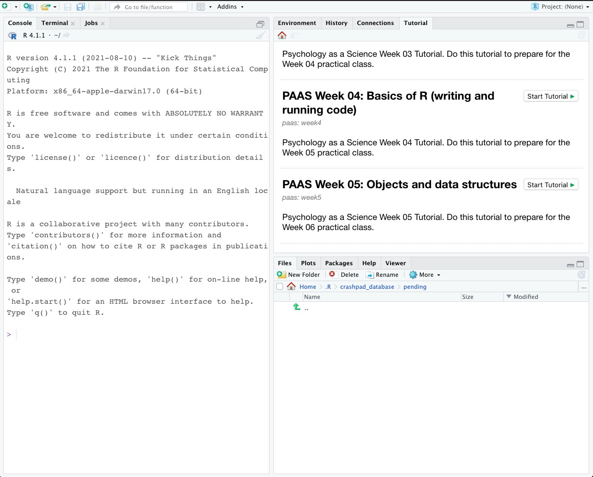

 


```{r, include=FALSE}
library(metathis)
library(niceQuiz)

knitr::opts_chunk$set(echo = FALSE)
meta() %>%
  meta_description("Week 3 Tutorial") %>%
  meta_tag(
    "content_type" = "tutorial",
    "week" = "08"
  )
```

You can run Tutorial 8 by going to the tutorials pane in R Studio.



\

If you can't see the tutorials, then make sure you have installed the tutorials
package. To do this, run the code below.

```r
source("https://files.mindsci.net/install.r")
```
